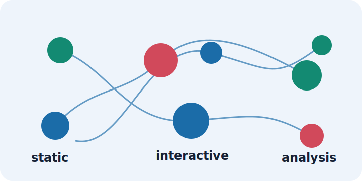

# DataViz

<p align="center">
  
</p>

A comprehensive Python toolkit for data visualization organized by chart category and analysis type. **Each chart is available in both static (matplotlib/seaborn) and interactive (plotly) versions**.

## Features

- **10+ Chart Categories** organized by visualization type and analysis purpose
- **Dual Visualization Modes**: Static (matplotlib/seaborn) and Interactive (plotly)
- **Easy-to-use API** with consistent interface across all chart types
- **Data Science Ready** with built-in support for pandas, numpy, and scikit-learn
- **Customizable** themes and styling options
- **ML-Focused** visualization modules for regression, classification, clustering, and XAI
- **Modular Structure** with each chart in its own file for easy maintenance

## Installation

### From a GitHub release (recommended for pinned installs)

```bash
pip install "dataviz @ git+https://github.com/anedezquerra/data-viz.git@v0.1.0"
```

### From the latest `main` branch

```bash
pip install "git+https://github.com/anedezquerra/data-viz.git@main"
```

### From a local checkout (for development)

```bash
git clone https://github.com/anedezquerra/data-viz.git
cd data-viz
pip install -e ".[dev,docs]"
```

### Optional extras

| Extra      | Adds                                                     |
| ---------- | -------------------------------------------------------- |
| `dev`      | `pytest`, `pytest-cov`, `black`, `flake8`, `mypy`, `build`, `twine` |
| `docs`     | `sphinx`, `sphinx-rtd-theme`, `sphinx-copybutton`, `sphinx-design` |
| `export`   | `kaleido` for Plotly static-image export                 |

```bash
pip install "dataviz[export] @ git+https://github.com/anedezquerra/data-viz.git@v0.1.0"
```

## Quick Start

### Static Charts (matplotlib - default)
```python
import dataviz as dv
import matplotlib.pyplot as plt
import pandas as pd

# Histogram
ax = dv.histogram(df['column_name'], bins=30)

# Scatter plot
ax = dv.scatter_plot(df['x'], df['y'])

# ROC curve
ax = dv.roc_curve(fpr, tpr, auc_score)
plt.show()
```

### Interactive Charts (plotly)
```python
import dataviz as dv

# Interactive histogram
fig = dv.histogram_interactive(df['column_name'], bins=30)
fig.show()

# Interactive scatter plot
fig = dv.scatter_plot_interactive(df['x'], df['y'])
fig.show()

# Interactive ROC curve
fig = dv.roc_curve_interactive(fpr, tpr, auc_score)
fig.show()
```

### Bivariate Analysis
```python
# Static version (default)
ax = dv.correlation_heatmap(df.select_dtypes(include=['number']))

# Interactive version
fig = dv.correlation_heatmap_interactive(df.select_dtypes(include=['number']))
```

### Classification Metrics
```python
# Static confusion matrix
ax = dv.confusion_matrix_plot(cm, labels=['Class 0', 'Class 1'])

# Interactive confusion matrix
fig = dv.confusion_matrix_plot_interactive(cm, labels=['Class 0', 'Class 1'])
```

### Regression Analysis
```python
# Static versions
ax = dv.residual_plot(y_true, y_pred)
ax = dv.learning_curve(train_sizes, train_scores, val_scores)

# Interactive versions
fig = dv.residual_plot_interactive(y_true, y_pred)
fig = dv.learning_curve_interactive(train_sizes, train_scores, val_scores)
```

### Feature Importance & XAI
```python
# Static feature importance
ax = dv.xai.feature_importance(importances_series, top_n=10)

# Interactive feature importance
fig = dv.xai.feature_importance_interactive(importances_series, top_n=10)

# SHAP values
ax = dv.xai.shap_plot(shap_values, feature_names)
fig = dv.xai.shap_plot_interactive(shap_values, feature_names)
```

## Project Structure

`	ext
dataviz/
|-- spc/                    # Statistical Process Control charts
|-- univariate/             # Single-variable analysis and visualization
|-- bivariate/              # Two-variable relationships and diagnostics
|-- multivariate/           # Pair plots, heatmaps, and parallel coordinates
|-- eda/                    # Exploratory data analysis
|-- xai/                    # Explainable AI visualizations
|-- regression/             # Regression diagnostics
|-- classification/         # Classification evaluation
|-- clustering/             # Cluster analysis and diagnostics
-- utils/                  # Shared helpers and validation
`

## Documentation

For detailed documentation, visit the
[DataViz GitHub Pages site](https://anedezquerra.github.io/data-viz/).

## Development

### Setup

```bash
git clone https://github.com/anedezquerra/data-viz.git
cd data-viz
pip install -e ".[dev,docs]"
```

### Running Tests

```bash
pytest
pytest --cov=dataviz  # with coverage
```

### Code Style

This project uses `black` for code formatting and `flake8` for linting.

```bash
black dataviz tests
flake8 dataviz tests
mypy dataviz  # type checking
```

### Adding New Chart Types

1. Create a new module in `dataviz/` (e.g., `dataviz/new_category/`)
2. Create `__init__.py` and `charts.py` files
3. Import chart functions in module `__init__.py`
4. Update main `dataviz/__init__.py` to expose new functions
5. Add tests in `tests/`

## License

MIT License - see LICENSE file for details

## Contributing

Contributions are welcome! Please feel free to submit a Pull Request.
