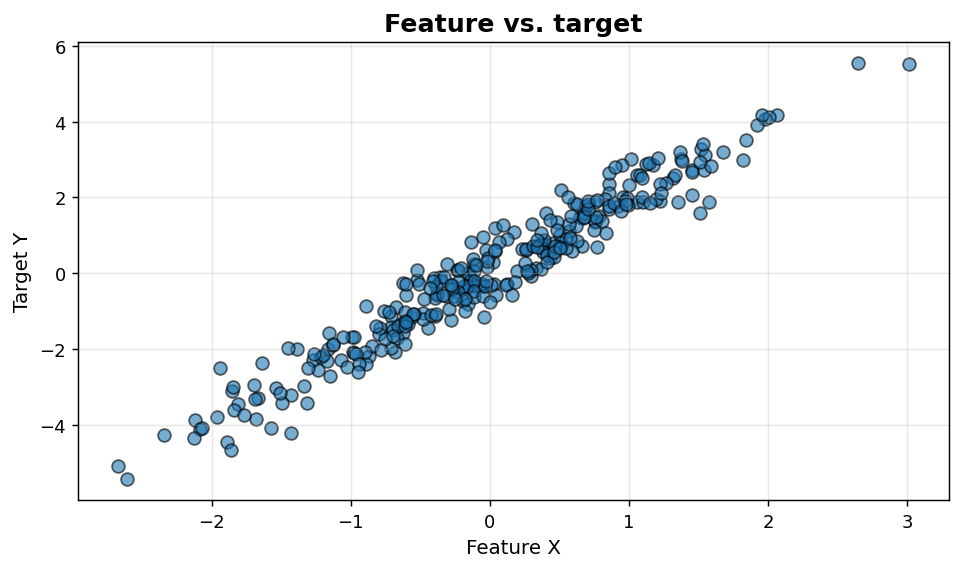
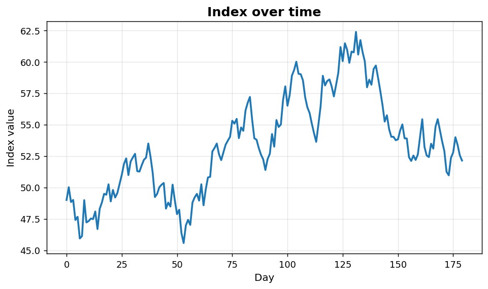

Bivariate I: Scatter and line
=============================

Two-variable plots for the most common analytic patterns.

.. contents::
   :local:
   :depth: 1

Scatter plot of feature vs. target
----------------------------------

:Function: ``dv.scatter_plot_static``
:Example slug: ``bivariate_scatter``

Situation
~~~~~~~~~

A modeller assesses the relationship between a numeric feature and a continuous target before fitting a regression model.

Requirements
~~~~~~~~~~~~

* ``dataviz`` (this package)
* ``numpy``, ``pandas`` and ``matplotlib`` (installed as ``dataviz`` dependencies)
* No additional services or data files — the example uses a deterministic
  synthetic dataset generated from ``numpy.random.default_rng(0)``.

Code (copy-paste ready)
~~~~~~~~~~~~~~~~~~~~~~~

.. code-block:: python
   :linenos:

   import numpy as np
   import pandas as pd
   import matplotlib.pyplot as plt
   import dataviz as dv

   rng = np.random.default_rng(0)

   x = pd.Series(rng.normal(size=300), name="Feature X")
   y = pd.Series(2.0 * x + rng.normal(scale=0.5, size=300), name="Target Y")
   ax = dv.scatter_plot_static(x, y, title="Feature vs. target")

   plt.show()

Sample chart
~~~~~~~~~~~~

Notes
~~~~~

Add ``alpha`` for large samples to mitigate overplotting; switch to a hexbin or 2-D histogram beyond ~5000 points.

Line chart of a time series
---------------------------

:Function: ``dv.line_plot_static``
:Example slug: ``bivariate_line``

Situation
~~~~~~~~~

A business analyst tracks the daily evolution of an index over six months and needs a clean line chart to share with stakeholders.

Requirements
~~~~~~~~~~~~

* ``dataviz`` (this package)
* ``numpy``, ``pandas`` and ``matplotlib`` (installed as ``dataviz`` dependencies)
* No additional services or data files — the example uses a deterministic
  synthetic dataset generated from ``numpy.random.default_rng(0)``.

Code (copy-paste ready)
~~~~~~~~~~~~~~~~~~~~~~~

.. code-block:: python
   :linenos:

   import numpy as np
   import pandas as pd
   import matplotlib.pyplot as plt
   import dataviz as dv

   rng = np.random.default_rng(0)

   t = pd.Series(np.arange(180), name="Day")
   y = pd.Series(np.cumsum(rng.normal(0, 1, size=180)) + 50, name="Index value")
   ax = dv.line_plot_static(t, y, title="Index over time")

   plt.show()

Sample chart
~~~~~~~~~~~~

Notes
~~~~~

Pass ``pandas`` time-indexed ``Series`` directly — matplotlib will format the x-axis with date locators automatically.

