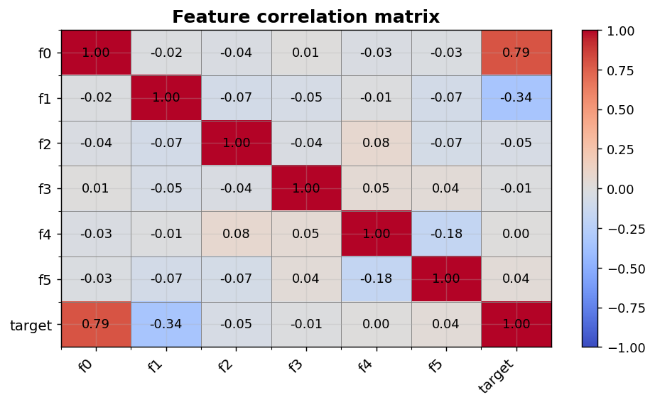
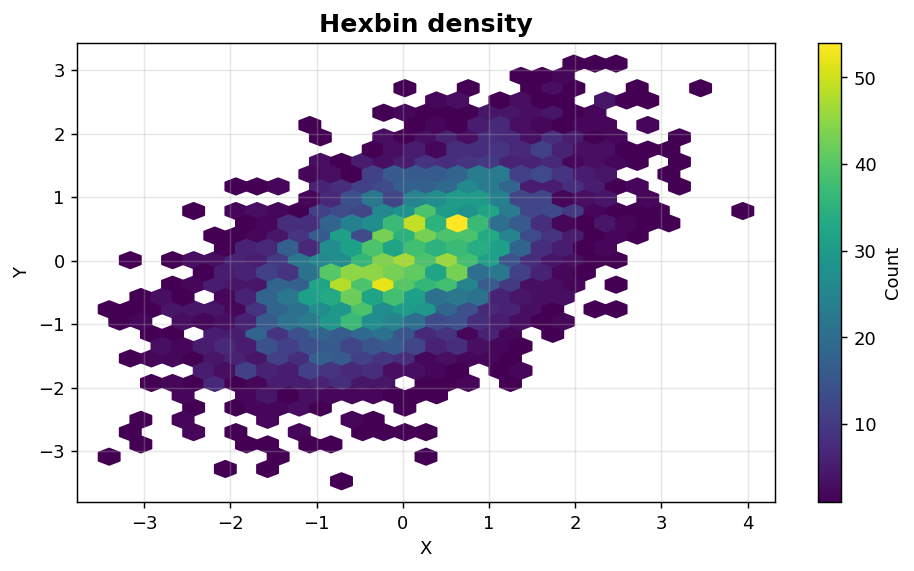

Bivariate II: Correlation and density
=====================================

Pairwise correlation summaries and dense 2-D scatter alternatives.

.. contents::
   :local:
   :depth: 1

Correlation heatmap
-------------------

:Function: ``dv.correlation_heatmap_static``
:Example slug: ``bivariate_correlation``

Situation
~~~~~~~~~

A data scientist inspects pairwise linear correlations across six engineered features and a target column to spot strong drivers and potential collinearities.

Requirements
~~~~~~~~~~~~

* ``dataviz`` (this package)
* ``numpy``, ``pandas`` and ``matplotlib`` (installed as ``dataviz`` dependencies)
* No additional services or data files — the example uses a deterministic
  synthetic dataset generated from ``numpy.random.default_rng(0)``.

Code (copy-paste ready)
~~~~~~~~~~~~~~~~~~~~~~~

.. code-block:: python
   :linenos:

   import numpy as np
   import pandas as pd
   import matplotlib.pyplot as plt
   import dataviz as dv

   rng = np.random.default_rng(0)

   df = pd.DataFrame(rng.normal(size=(200, 6)),
                     columns=[f"f{i}" for i in range(6)])
   df["target"] = df["f0"] * 1.5 + df["f1"] * -0.7 + rng.normal(size=200)
   ax = dv.correlation_heatmap_static(df, title="Feature correlation matrix")

   plt.show()

Sample chart
~~~~~~~~~~~~

Notes
~~~~~

The helper computes Pearson correlations by default. For non-linear or rank-based associations, pre-compute with ``df.corr(method='spearman')`` and pass the resulting matrix.

Hexbin density plot
-------------------

:Function: ``dv.hexbin_plot_static``
:Example slug: ``bivariate_hexbin``

Situation
~~~~~~~~~

An analyst inspects a 5000-point joint distribution where a standard scatter plot would saturate due to overplotting.

Requirements
~~~~~~~~~~~~

* ``dataviz`` (this package)
* ``numpy``, ``pandas`` and ``matplotlib`` (installed as ``dataviz`` dependencies)
* No additional services or data files — the example uses a deterministic
  synthetic dataset generated from ``numpy.random.default_rng(0)``.

Code (copy-paste ready)
~~~~~~~~~~~~~~~~~~~~~~~

.. code-block:: python
   :linenos:

   import numpy as np
   import pandas as pd
   import matplotlib.pyplot as plt
   import dataviz as dv

   rng = np.random.default_rng(0)

   x = pd.Series(rng.normal(size=5000), name="X")
   y = pd.Series(0.5 * x + rng.normal(scale=0.8, size=5000), name="Y")
   ax = dv.hexbin_plot_static(x, y, gridsize=30, title="Hexbin density")

   plt.show()

Sample chart
~~~~~~~~~~~~

Notes
~~~~~

``gridsize`` controls cell resolution. Larger grids show finer structure but become noisy on small samples.

