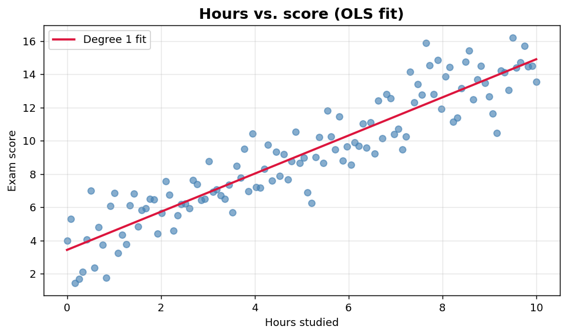
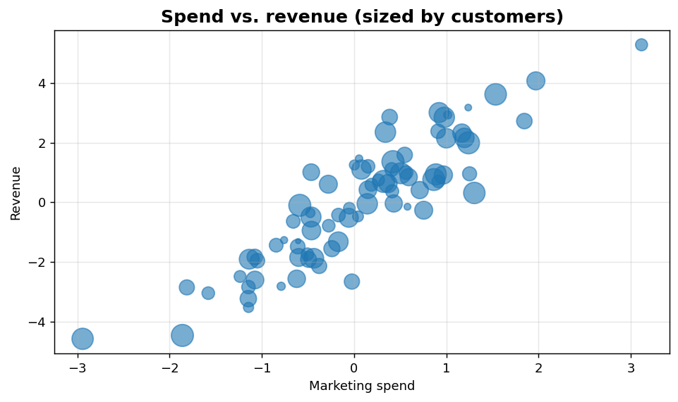

Bivariate III: Regression fit and bubble chart
==============================================

Annotated linear fits and three-variable bubble views.

.. contents::
   :local:
   :depth: 1

Regression fit overlay
----------------------

:Function: ``dv.regression_plot_static``
:Example slug: ``bivariate_regression``

Situation
~~~~~~~~~

An educator visualises the linear relationship between study hours and exam scores together with the fitted regression line for a classroom demo.

Requirements
~~~~~~~~~~~~

* ``dataviz`` (this package)
* ``numpy``, ``pandas`` and ``matplotlib`` (installed as ``dataviz`` dependencies)
* No additional services or data files — the example uses a deterministic
  synthetic dataset generated from ``numpy.random.default_rng(0)``.

Code (copy-paste ready)
~~~~~~~~~~~~~~~~~~~~~~~

.. code-block:: python
   :linenos:

   import numpy as np
   import pandas as pd
   import matplotlib.pyplot as plt
   import dataviz as dv

   rng = np.random.default_rng(0)

   x = pd.Series(np.linspace(0, 10, 120), name="Hours studied")
   y = pd.Series(3 + 1.2 * x + rng.normal(scale=1.5, size=120), name="Exam score")
   ax = dv.regression_plot_static(x, y, title="Hours vs. score (OLS fit)")

   plt.show()

Sample chart
~~~~~~~~~~~~

Notes
~~~~~

The helper fits an ordinary least-squares line. For non-linear relationships, pre-transform the predictor (log, square) before plotting.

Bubble chart sized by a third variable
--------------------------------------

:Function: ``dv.bubble_plot_static``
:Example slug: ``bivariate_bubble``

Situation
~~~~~~~~~

A marketing team plots spend versus revenue and encodes customer count as the bubble size to convey three dimensions in a single static chart.

Requirements
~~~~~~~~~~~~

* ``dataviz`` (this package)
* ``numpy``, ``pandas`` and ``matplotlib`` (installed as ``dataviz`` dependencies)
* No additional services or data files — the example uses a deterministic
  synthetic dataset generated from ``numpy.random.default_rng(0)``.

Code (copy-paste ready)
~~~~~~~~~~~~~~~~~~~~~~~

.. code-block:: python
   :linenos:

   import numpy as np
   import pandas as pd
   import matplotlib.pyplot as plt
   import dataviz as dv

   rng = np.random.default_rng(0)

   x = pd.Series(rng.normal(size=80), name="Marketing spend")
   y = pd.Series(2 * x + rng.normal(size=80), name="Revenue")
   sizes = rng.integers(20, 500, size=80).astype(float)
   ax = dv.bubble_plot_static(x, y, size=sizes,
                              title="Spend vs. revenue (sized by customers)")

   plt.show()

Sample chart
~~~~~~~~~~~~

Notes
~~~~~

Scale ``size`` to a reasonable range (e.g. 20-500). Very large bubbles can mask underlying density.

