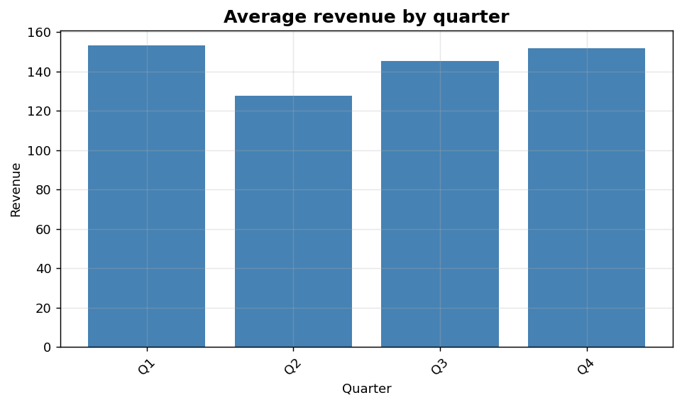
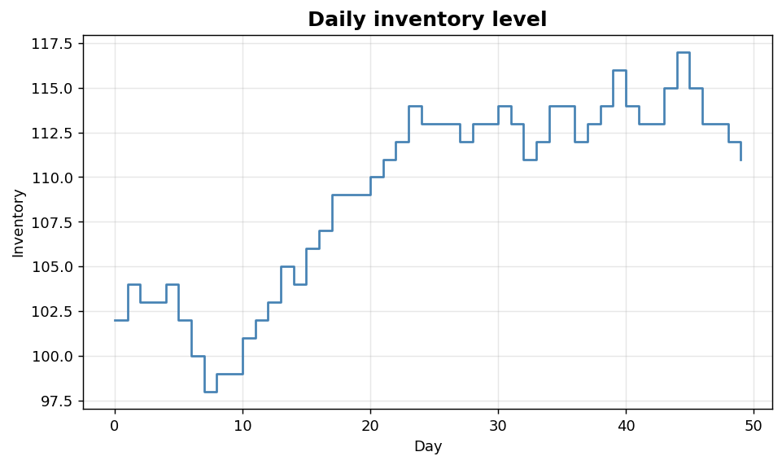

Bivariate IV: Grouped bars and step plots
=========================================

Categorical aggregations and piecewise-constant time series.

.. contents::
   :local:
   :depth: 1

Aggregated bar chart by category
--------------------------------

:Function: ``dv.grouped_bar_static``
:Example slug: ``bivariate_grouped_bar``

Situation
~~~~~~~~~

A finance analyst aggregates revenue per quarter across multiple stores using the mean and presents the results as a bar chart.

Requirements
~~~~~~~~~~~~

* ``dataviz`` (this package)
* ``numpy``, ``pandas`` and ``matplotlib`` (installed as ``dataviz`` dependencies)
* No additional services or data files — the example uses a deterministic
  synthetic dataset generated from ``numpy.random.default_rng(0)``.

Code (copy-paste ready)
~~~~~~~~~~~~~~~~~~~~~~~

.. code-block:: python
   :linenos:

   import numpy as np
   import pandas as pd
   import matplotlib.pyplot as plt
   import dataviz as dv

   rng = np.random.default_rng(0)

   category = pd.Series(["Q1", "Q2", "Q3", "Q4"] * 12, name="Quarter")
   values = pd.Series(rng.integers(80, 200, size=48), name="Revenue")
   ax = dv.grouped_bar_static(category, values,
                              title="Average revenue by quarter")

   plt.show()

Sample chart
~~~~~~~~~~~~

Notes
~~~~~

Pass ``aggfunc='median'`` (or any callable) to switch the aggregation. The helper automatically labels the y-axis with the aggregation name.

Step plot for stock levels
--------------------------

:Function: ``dv.step_plot_static``
:Example slug: ``bivariate_step``

Situation
~~~~~~~~~

A warehouse operator plots daily inventory level where the value only changes at discrete time points; a step chart better reflects the underlying piecewise-constant process than a line chart.

Requirements
~~~~~~~~~~~~

* ``dataviz`` (this package)
* ``numpy``, ``pandas`` and ``matplotlib`` (installed as ``dataviz`` dependencies)
* No additional services or data files — the example uses a deterministic
  synthetic dataset generated from ``numpy.random.default_rng(0)``.

Code (copy-paste ready)
~~~~~~~~~~~~~~~~~~~~~~~

.. code-block:: python
   :linenos:

   import numpy as np
   import pandas as pd
   import matplotlib.pyplot as plt
   import dataviz as dv

   rng = np.random.default_rng(0)

   t = pd.Series(np.arange(50), name="Day")
   y = pd.Series(np.cumsum(rng.integers(-2, 3, size=50)) + 100, name="Inventory")
   ax = dv.step_plot_static(t, y, title="Daily inventory level")

   plt.show()

Sample chart
~~~~~~~~~~~~

Notes
~~~~~

Use step plots whenever the underlying process is piecewise-constant (inventory, queue length, event counts).

