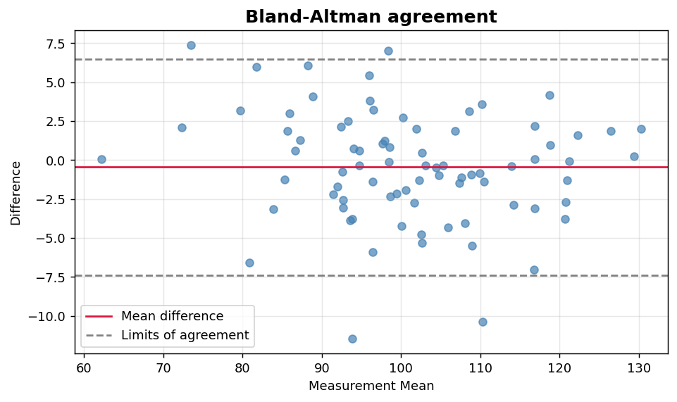
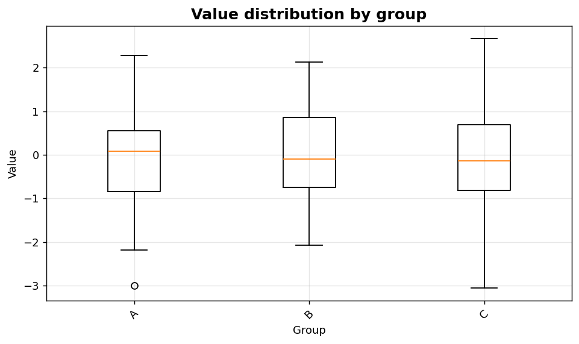

Bivariate V: Method comparison and group-wise boxes
===================================================

Agreement plots and grouped distributional comparisons.

.. contents::
   :local:
   :depth: 1

Bland-Altman agreement plot
---------------------------

:Function: ``dv.bland_altman_static``
:Example slug: ``bivariate_bland_altman``

Situation
~~~~~~~~~

A clinical engineer compares two measurement devices and wants to assess whether they agree across the measurement range, not merely whether they correlate.

Requirements
~~~~~~~~~~~~

* ``dataviz`` (this package)
* ``numpy``, ``pandas`` and ``matplotlib`` (installed as ``dataviz`` dependencies)
* No additional services or data files — the example uses a deterministic
  synthetic dataset generated from ``numpy.random.default_rng(0)``.

Code (copy-paste ready)
~~~~~~~~~~~~~~~~~~~~~~~

.. code-block:: python
   :linenos:

   import numpy as np
   import pandas as pd
   import matplotlib.pyplot as plt
   import dataviz as dv

   rng = np.random.default_rng(0)

   a = pd.Series(rng.normal(100, 15, size=80), name="Device A")
   b = a + rng.normal(0, 3, size=80)
   ax = dv.bland_altman_static(a, b, title="Bland-Altman agreement")

   plt.show()

Sample chart
~~~~~~~~~~~~

Notes
~~~~~

The horizontal axis is the mean of the two measurements and the vertical axis is their difference. The reference lines mark mean ± 1.96 SD of the differences.

Box plot split by category
--------------------------

:Function: ``dv.box_by_category_static``
:Example slug: ``bivariate_box_by_category``

Situation
~~~~~~~~~

An analyst compares the distribution of a continuous variable across three categorical groups to assess whether group means and spreads differ.

Requirements
~~~~~~~~~~~~

* ``dataviz`` (this package)
* ``numpy``, ``pandas`` and ``matplotlib`` (installed as ``dataviz`` dependencies)
* No additional services or data files — the example uses a deterministic
  synthetic dataset generated from ``numpy.random.default_rng(0)``.

Code (copy-paste ready)
~~~~~~~~~~~~~~~~~~~~~~~

.. code-block:: python
   :linenos:

   import numpy as np
   import pandas as pd
   import matplotlib.pyplot as plt
   import dataviz as dv

   rng = np.random.default_rng(0)

   category = pd.Series(rng.choice(["A", "B", "C"], size=300), name="Group")
   values = pd.Series(rng.normal(size=300), name="Value")
   ax = dv.box_by_category_static(category, values,
                                  title="Value distribution by group")

   plt.show()

Sample chart
~~~~~~~~~~~~

Notes
~~~~~

For more than ~10 groups the chart becomes crowded — consider a violin or strip plot, or sort groups by median.

