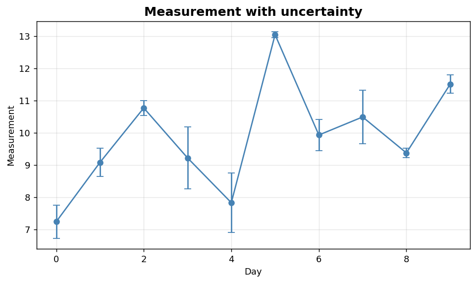
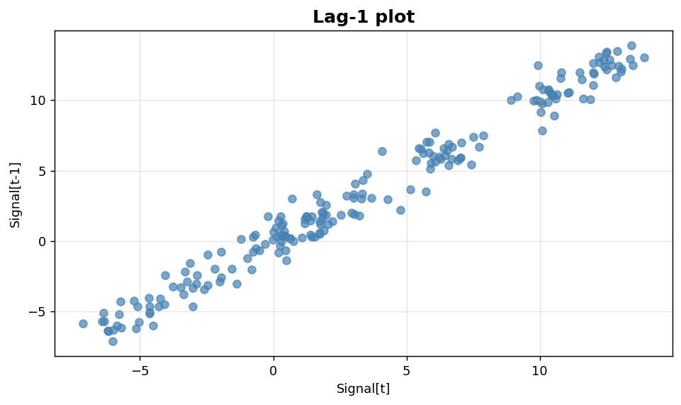

Bivariate VI: Error bars and lag plots
======================================

Uncertainty annotation and time-series autocorrelation views.

.. contents::
   :local:
   :depth: 1

Error bar plot with uncertainty
-------------------------------

:Function: ``dv.errorbar_plot_static``
:Example slug: ``bivariate_errorbar``

Situation
~~~~~~~~~

A scientist plots a daily measurement together with its measurement uncertainty to communicate both the value and its confidence.

Requirements
~~~~~~~~~~~~

* ``dataviz``
* ``numpy``, ``pandas`` and ``matplotlib`` (installed as ``dataviz`` dependencies)
* No additional services or data files — the example uses a deterministic
  synthetic dataset generated from ``numpy.random.default_rng(0)``.

Code (copy-paste ready)
~~~~~~~~~~~~~~~~~~~~~~~

.. code-block:: python
   :linenos:

   import numpy as np
   import pandas as pd
   import matplotlib.pyplot as plt
   import dataviz as dv

   rng = np.random.default_rng(0)

   x = pd.Series(np.arange(10), name="Day")
   y = pd.Series(rng.normal(loc=10, scale=1.5, size=10), name="Measurement")
   err = pd.Series(np.abs(rng.normal(scale=0.5, size=10)), name="Error")
   ax = dv.errorbar_plot_static(x, y, yerr=err,
                                title="Measurement with uncertainty")

   plt.show()

Sample chart
~~~~~~~~~~~~

Notes
~~~~~

Use symmetric error bars when the error is roughly Gaussian. For skewed or bounded quantities, prefer asymmetric error bars (pass ``yerr`` as a 2-row array).

Lag plot for autocorrelation
----------------------------

:Function: ``dv.lag_plot_static``
:Example slug: ``bivariate_lag``

Situation
~~~~~~~~~

A time-series analyst diagnoses serial dependence in a signal by plotting each observation against its predecessor — a tight diagonal indicates strong lag-1 autocorrelation.

Requirements
~~~~~~~~~~~~

* ``dataviz``
* ``numpy``, ``pandas`` and ``matplotlib`` (installed as ``dataviz`` dependencies)
* No additional services or data files — the example uses a deterministic
  synthetic dataset generated from ``numpy.random.default_rng(0)``.

Code (copy-paste ready)
~~~~~~~~~~~~~~~~~~~~~~~

.. code-block:: python
   :linenos:

   import numpy as np
   import pandas as pd
   import matplotlib.pyplot as plt
   import dataviz as dv

   rng = np.random.default_rng(0)

   series = pd.Series(np.cumsum(rng.normal(size=200)), name="Signal")
   ax = dv.lag_plot_static(series, series, lag=1, title="Lag-1 plot")

   plt.show()

Sample chart
~~~~~~~~~~~~

Notes
~~~~~

A diffuse cloud suggests white noise; a clear linear pattern indicates strong autocorrelation. Vary ``lag`` to probe different lags.

