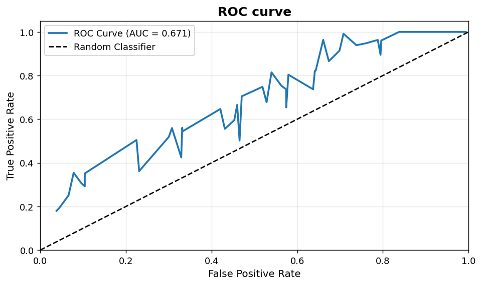
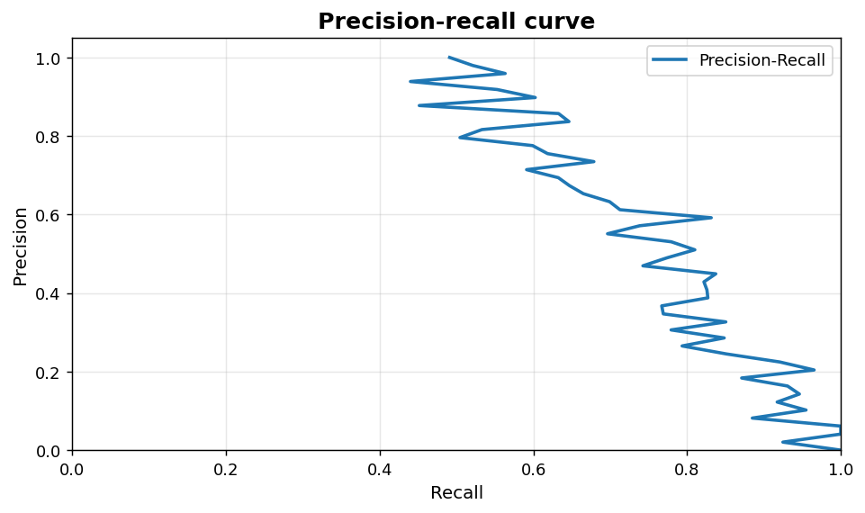

Classification diagnostics: ROC and precision-recall
====================================================

Threshold-free quality views for binary and one-vs-rest classifiers.

.. contents::
   :local:
   :depth: 1

ROC curve with AUC
------------------

:Function: ``dv.roc_curve_static``
:Example slug: ``classification_roc``

Situation
~~~~~~~~~

A team reports the trade-off between true positive rate and false positive rate of a binary classifier across all decision thresholds.

Requirements
~~~~~~~~~~~~

* ``dataviz`` (this package)
* ``numpy``, ``pandas`` and ``matplotlib`` (installed as ``dataviz`` dependencies)
* No additional services or data files — the example uses a deterministic
  synthetic dataset generated from ``numpy.random.default_rng(0)``.

Code (copy-paste ready)
~~~~~~~~~~~~~~~~~~~~~~~

.. code-block:: python
   :linenos:

   import numpy as np
   import pandas as pd
   import matplotlib.pyplot as plt
   import dataviz as dv

   rng = np.random.default_rng(0)

   fpr = np.sort(rng.random(50))
   tpr = np.clip(fpr + 0.2 + rng.normal(scale=0.05, size=50), 0, 1)
   auc_val = float(np.trapezoid(tpr, fpr))
   ax = dv.roc_curve_static(fpr, tpr, auc=auc_val, title="ROC curve")

   plt.show()

Sample chart
~~~~~~~~~~~~

Notes
~~~~~

The ROC curve is threshold-agnostic; pair it with a precision-recall curve when the positive class is rare.

Precision-recall curve
----------------------

:Function: ``dv.precision_recall_curve_static``
:Example slug: ``classification_pr``

Situation
~~~~~~~~~

A modelling team works with a heavily imbalanced binary problem (e.g. fraud detection) where ROC-AUC overstates performance.

Requirements
~~~~~~~~~~~~

* ``dataviz`` (this package)
* ``numpy``, ``pandas`` and ``matplotlib`` (installed as ``dataviz`` dependencies)
* No additional services or data files — the example uses a deterministic
  synthetic dataset generated from ``numpy.random.default_rng(0)``.

Code (copy-paste ready)
~~~~~~~~~~~~~~~~~~~~~~~

.. code-block:: python
   :linenos:

   import numpy as np
   import pandas as pd
   import matplotlib.pyplot as plt
   import dataviz as dv

   rng = np.random.default_rng(0)

   recall = np.linspace(0, 1, 50)
   precision = np.clip(1 - 0.5 * recall + rng.normal(scale=0.05, size=50), 0, 1)
   ax = dv.precision_recall_curve_static(recall, precision,
                                         title="Precision-recall curve")

   plt.show()

Sample chart
~~~~~~~~~~~~

Notes
~~~~~

On imbalanced problems, the area under the precision-recall curve (PR-AUC) is more informative than ROC-AUC.

