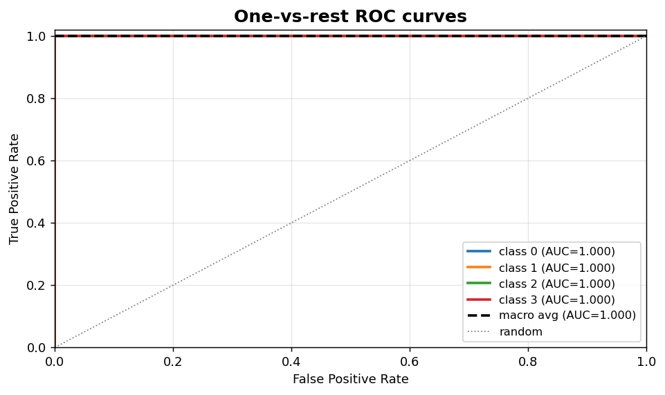
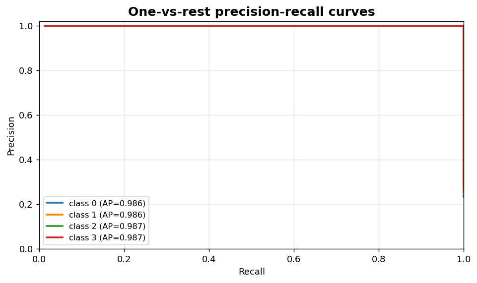

Classification II: Multiclass ROC and PR
========================================

One-vs-rest curves and per-class summary for multiclass problems.

.. contents::
   :local:
   :depth: 1

One-vs-rest ROC curves
----------------------

:Function: ``dv.classification.multiclass_roc_curve_static``
:Example slug: ``classification_multiclass_roc``

Situation
~~~~~~~~~

A multiclass model is evaluated by computing one-vs-rest ROC curves for each class so individual class trade-offs can be compared on a single panel.

Requirements
~~~~~~~~~~~~

* ``dataviz`` (this package)
* ``numpy``, ``pandas`` and ``matplotlib`` (installed as ``dataviz`` dependencies)
* No additional services or data files — the example uses a deterministic
  synthetic dataset generated from ``numpy.random.default_rng(0)``.

Code (copy-paste ready)
~~~~~~~~~~~~~~~~~~~~~~~

.. code-block:: python
   :linenos:

   import numpy as np
   import pandas as pd
   import matplotlib.pyplot as plt
   import dataviz as dv

   rng = np.random.default_rng(0)

   y_true, P = _multiclass_scores()
   curves = {}
   for c in range(P.shape[1]):
       yt = (y_true == c).astype(int)
       order = np.argsort(-P[:, c])
       yt_o = yt[order]
       tpr = np.cumsum(yt_o) / max(yt_o.sum(), 1)
       fpr = np.cumsum(1 - yt_o) / max((1 - yt_o).sum(), 1)
       curves[f"class {c}"] = (np.r_[0, fpr], np.r_[0, tpr])
   ax = dv.classification.multiclass_roc_curve_static(
       curves, title="One-vs-rest ROC curves")

   plt.show()

Sample chart
~~~~~~~~~~~~

Notes
~~~~~

The helper accepts a mapping of class label to ``(fpr, tpr)`` arrays so any upstream computation (scikit-learn ``roc_curve``, custom rank-based code, etc.) can feed the plot.

One-vs-rest precision-recall curves
-----------------------------------

:Function: ``dv.classification.multiclass_pr_curve_static``
:Example slug: ``classification_multiclass_pr``

Situation
~~~~~~~~~

On a multiclass problem with imbalanced classes, the team prefers per-class precision-recall curves over ROC because PR is more sensitive to the minority class.

Requirements
~~~~~~~~~~~~

* ``dataviz`` (this package)
* ``numpy``, ``pandas`` and ``matplotlib`` (installed as ``dataviz`` dependencies)
* No additional services or data files — the example uses a deterministic
  synthetic dataset generated from ``numpy.random.default_rng(0)``.

Code (copy-paste ready)
~~~~~~~~~~~~~~~~~~~~~~~

.. code-block:: python
   :linenos:

   import numpy as np
   import pandas as pd
   import matplotlib.pyplot as plt
   import dataviz as dv

   rng = np.random.default_rng(0)

   y_true, P = _multiclass_scores()
   curves = {}
   for c in range(P.shape[1]):
       yt = (y_true == c).astype(int)
       order = np.argsort(-P[:, c])
       yt_o = yt[order]
       tp = np.cumsum(yt_o)
       precision = tp / np.arange(1, len(yt_o) + 1)
       recall = tp / max(yt_o.sum(), 1)
       curves[f"class {c}"] = (recall, precision)
   ax = dv.classification.multiclass_pr_curve_static(
       curves, title="One-vs-rest precision-recall curves")

   plt.show()

Sample chart
~~~~~~~~~~~~

Notes
~~~~~

Pair this view with ``per_class_auc_bar`` or ``per_class_ap_bar`` to summarise the curves in a single scalar per class.

