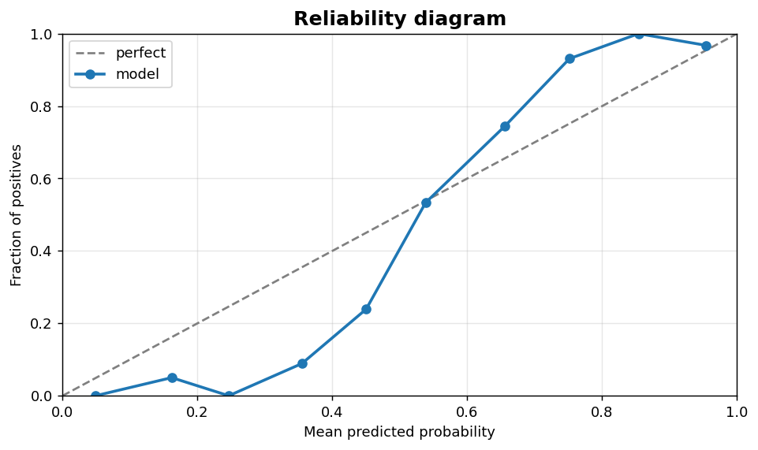
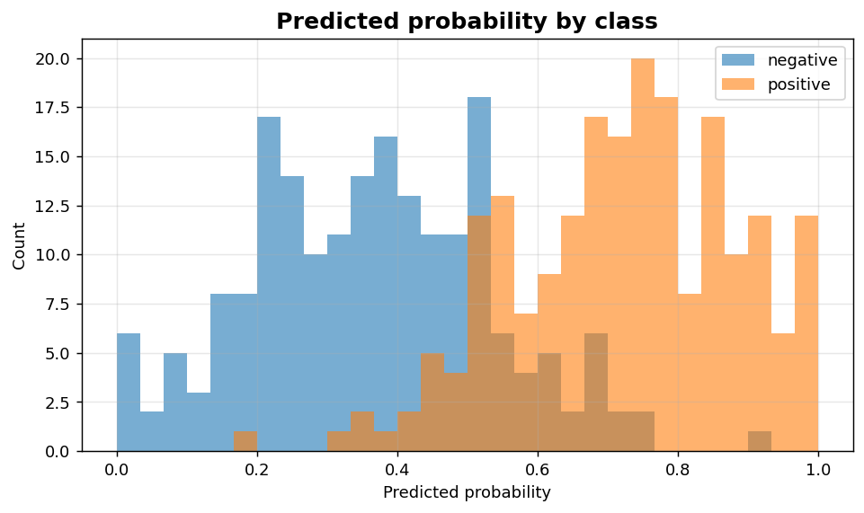

Classification III: Probability calibration
===========================================

Reliability diagrams and probability histograms for well-calibrated scoring.

.. contents::
   :local:
   :depth: 1

Reliability diagram (calibration curve)
---------------------------------------

:Function: ``dv.classification.calibration_curve_static``
:Example slug: ``classification_calibration``

Situation
~~~~~~~~~

A risk-scoring team needs to know whether predicted probabilities are well calibrated so that downstream decision rules (thresholds, expected-cost calculations) are reliable.

Requirements
~~~~~~~~~~~~

* ``dataviz`` (this package)
* ``numpy``, ``pandas`` and ``matplotlib`` (installed as ``dataviz`` dependencies)
* No additional services or data files — the example uses a deterministic
  synthetic dataset generated from ``numpy.random.default_rng(0)``.

Code (copy-paste ready)
~~~~~~~~~~~~~~~~~~~~~~~

.. code-block:: python
   :linenos:

   import numpy as np
   import pandas as pd
   import matplotlib.pyplot as plt
   import dataviz as dv

   rng = np.random.default_rng(0)

   y_true, y_prob = _binary_scores()
   ax = dv.classification.calibration_curve_static(
       y_true, y_prob, n_bins=10, title="Reliability diagram")

   plt.show()

Sample chart
~~~~~~~~~~~~

Notes
~~~~~

Use ``strategy='quantile'`` when scores are skewed so each bin contains a comparable number of samples. Pair with ``calibration_with_confidence`` to add bootstrap confidence bands.

Probability histogram by class
------------------------------

:Function: ``dv.classification.probability_histogram_static``
:Example slug: ``classification_prob_hist``

Situation
~~~~~~~~~

A team inspects whether the score distributions for positives and negatives are well separated, which directly determines whether a single threshold can achieve high precision and high recall simultaneously.

Requirements
~~~~~~~~~~~~

* ``dataviz`` (this package)
* ``numpy``, ``pandas`` and ``matplotlib`` (installed as ``dataviz`` dependencies)
* No additional services or data files — the example uses a deterministic
  synthetic dataset generated from ``numpy.random.default_rng(0)``.

Code (copy-paste ready)
~~~~~~~~~~~~~~~~~~~~~~~

.. code-block:: python
   :linenos:

   import numpy as np
   import pandas as pd
   import matplotlib.pyplot as plt
   import dataviz as dv

   rng = np.random.default_rng(0)

   y_true, y_prob = _binary_scores()
   ax = dv.classification.probability_histogram_static(
       y_true, y_prob, bins=30, title="Predicted probability by class")

   plt.show()

Sample chart
~~~~~~~~~~~~

Notes
~~~~~

If the two histograms strongly overlap the model has weak discrimination — invest in features rather than threshold tuning.

