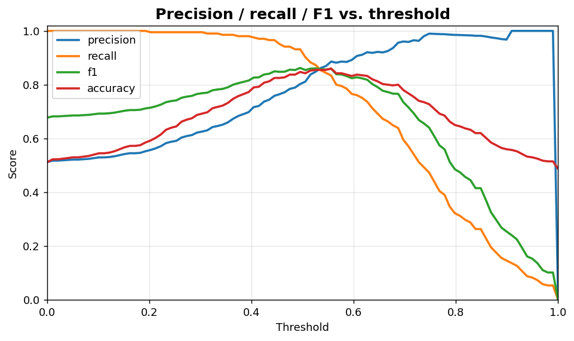
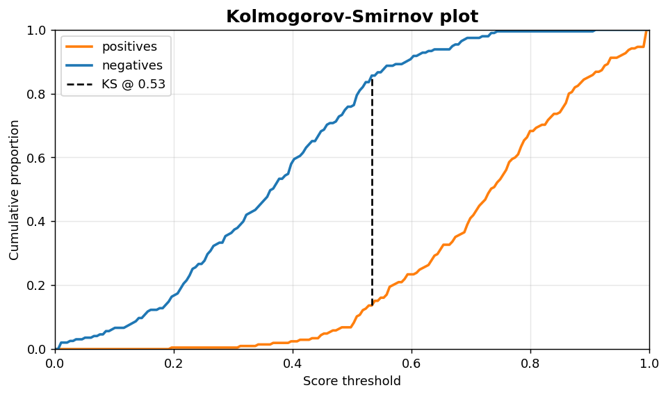

Classification IV: Threshold metric and KS
==========================================

Threshold sweeps and the Kolmogorov-Smirnov separation statistic.

.. contents::
   :local:
   :depth: 1

Precision / recall / F1 vs. threshold
-------------------------------------

:Function: ``dv.classification.threshold_metric_curve_static``
:Example slug: ``classification_threshold``

Situation
~~~~~~~~~

An ML engineer needs to pick an operating threshold and wants to see precision, recall, F1 and accuracy plotted simultaneously over the full threshold range.

Requirements
~~~~~~~~~~~~

* ``dataviz``
* ``numpy``, ``pandas`` and ``matplotlib`` (installed as ``dataviz`` dependencies)
* No additional services or data files — the example uses a deterministic
  synthetic dataset generated from ``numpy.random.default_rng(0)``.

Code (copy-paste ready)
~~~~~~~~~~~~~~~~~~~~~~~

.. code-block:: python
   :linenos:

   import numpy as np
   import pandas as pd
   import matplotlib.pyplot as plt
   import dataviz as dv

   rng = np.random.default_rng(0)

   y_true, y_prob = _binary_scores()
   ax = dv.classification.threshold_metric_curve_static(
       y_true, y_prob, title="Precision / recall / F1 vs. threshold")

   plt.show()

Sample chart
~~~~~~~~~~~~

Notes
~~~~~

Pick the threshold from the validation set, not the test set, to avoid information leakage. Combine with ``discrimination_threshold_dashboard`` for the queue-rate view.

Kolmogorov-Smirnov plot
-----------------------

:Function: ``dv.classification.ks_statistic_plot_static``
:Example slug: ``classification_ks``

Situation
~~~~~~~~~

A credit-scoring analyst reports the maximum vertical gap between the cumulative score distributions of positives and negatives (the KS statistic) — a standard benchmark in scoring problems.

Requirements
~~~~~~~~~~~~

* ``dataviz``
* ``numpy``, ``pandas`` and ``matplotlib`` (installed as ``dataviz`` dependencies)
* No additional services or data files — the example uses a deterministic
  synthetic dataset generated from ``numpy.random.default_rng(0)``.

Code (copy-paste ready)
~~~~~~~~~~~~~~~~~~~~~~~

.. code-block:: python
   :linenos:

   import numpy as np
   import pandas as pd
   import matplotlib.pyplot as plt
   import dataviz as dv

   rng = np.random.default_rng(0)

   y_true, y_prob = _binary_scores()
   ax = dv.classification.ks_statistic_plot_static(
       y_true, y_prob, title="Kolmogorov-Smirnov plot")

   plt.show()

Sample chart
~~~~~~~~~~~~

Notes
~~~~~

KS is correlated with AUC but emphasises the threshold where the two populations are most separated. A KS below 0.20 is typically considered weak in credit risk applications.

