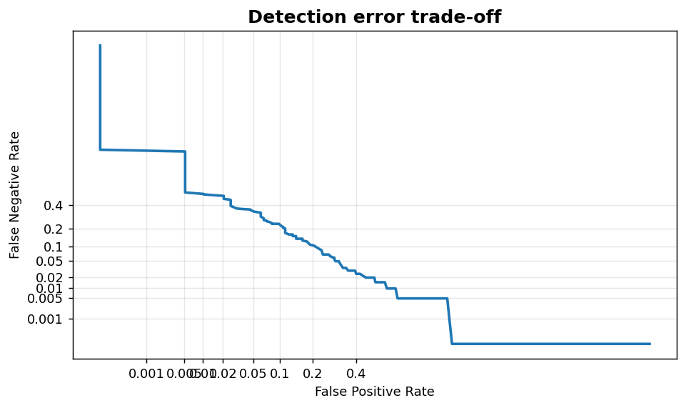
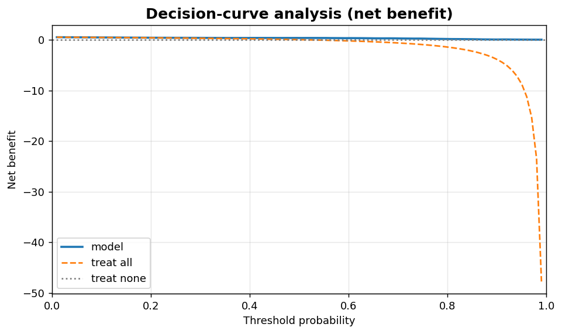

Classification V: DET and decision-curve analysis
=================================================

Detection error trade-off and net-benefit views for operating-point selection.

.. contents::
   :local:
   :depth: 1

Detection error trade-off (DET) curve
-------------------------------------

:Function: ``dv.classification.det_curve_static``
:Example slug: ``classification_det``

Situation
~~~~~~~~~

A speaker-verification or biometric team prefers a DET plot (FNR vs. FPR on a normal-deviate scale) over ROC because the operating region of interest contains very small error rates.

Requirements
~~~~~~~~~~~~

* ``dataviz``
* ``numpy``, ``pandas`` and ``matplotlib`` (installed as ``dataviz`` dependencies)
* No additional services or data files — the example uses a deterministic
  synthetic dataset generated from ``numpy.random.default_rng(0)``.

Code (copy-paste ready)
~~~~~~~~~~~~~~~~~~~~~~~

.. code-block:: python
   :linenos:

   import numpy as np
   import pandas as pd
   import matplotlib.pyplot as plt
   import dataviz as dv

   rng = np.random.default_rng(0)

   y_true, y_prob = _binary_scores()
   ax = dv.classification.det_curve_static(
       y_true, y_prob, title="Detection error trade-off")

   plt.show()

Sample chart
~~~~~~~~~~~~

Notes
~~~~~

The normal-deviate axes spread the low-error region so small differences are visible. No external dependency on scipy: the inverse-erf approximation is implemented in pure NumPy.

Decision-curve analysis (net benefit)
-------------------------------------

:Function: ``dv.classification.net_benefit_curve_static``
:Example slug: ``classification_net_benefit``

Situation
~~~~~~~~~

A clinical team applies decision-curve analysis to compare ``treat all`` and ``treat none`` strategies against the model across the full range of clinically plausible threshold probabilities.

Requirements
~~~~~~~~~~~~

* ``dataviz``
* ``numpy``, ``pandas`` and ``matplotlib`` (installed as ``dataviz`` dependencies)
* No additional services or data files — the example uses a deterministic
  synthetic dataset generated from ``numpy.random.default_rng(0)``.

Code (copy-paste ready)
~~~~~~~~~~~~~~~~~~~~~~~

.. code-block:: python
   :linenos:

   import numpy as np
   import pandas as pd
   import matplotlib.pyplot as plt
   import dataviz as dv

   rng = np.random.default_rng(0)

   y_true, y_prob = _binary_scores()
   ax = dv.classification.net_benefit_curve_static(
       y_true, y_prob, title="Decision-curve analysis (net benefit)")

   plt.show()

Sample chart
~~~~~~~~~~~~

Notes
~~~~~

Net benefit explicitly trades true positives against false positives using the threshold probability as the exchange rate. Reasonable thresholds in clinical contexts span 0.05 to 0.30.

