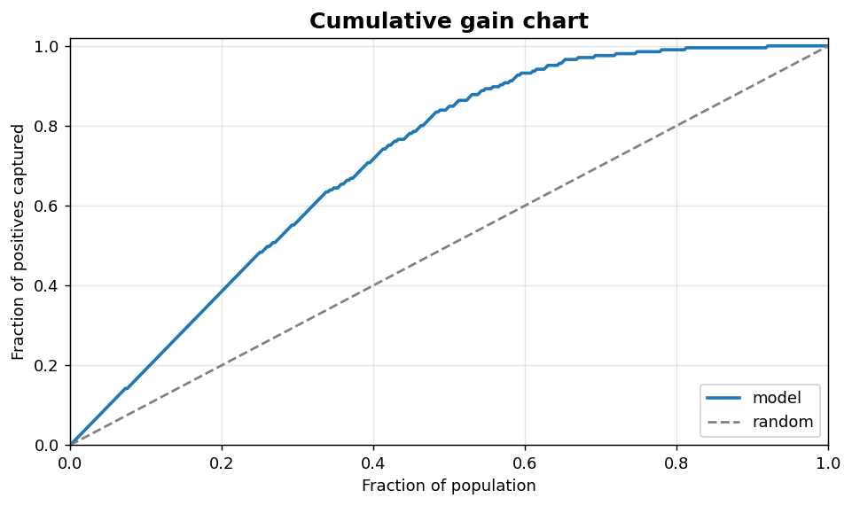
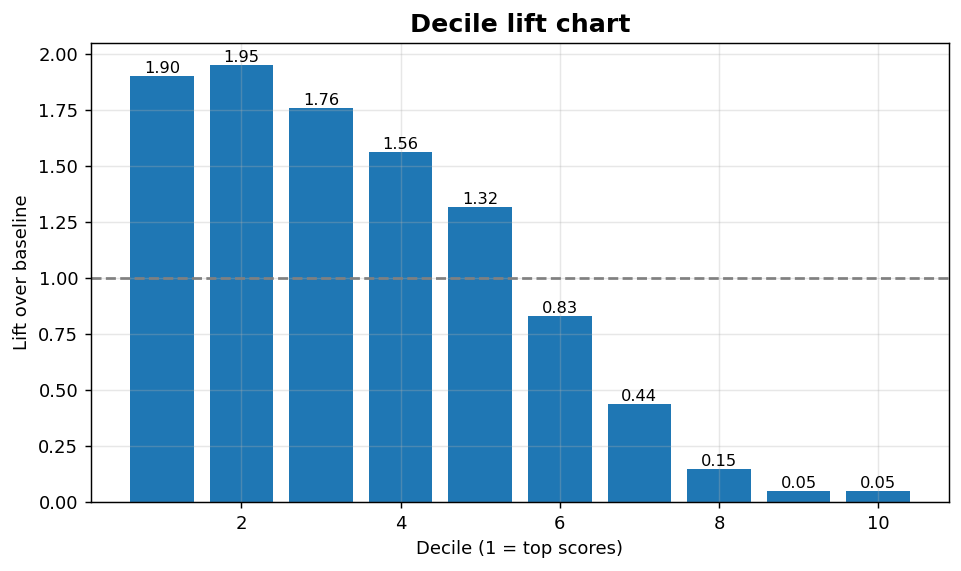

Classification VI: Gain and lift
================================

Cumulative gain and decile lift charts for ranked-list targeting.

.. contents::
   :local:
   :depth: 1

Cumulative gain chart
---------------------

:Function: ``dv.classification.gain_chart_static``
:Example slug: ``classification_gain``

Situation
~~~~~~~~~

A marketing team ranks customers by predicted purchase probability and asks: if we contact the top-30 % of the ranked list, what fraction of all positives do we capture?

Requirements
~~~~~~~~~~~~

* ``dataviz``
* ``numpy``, ``pandas`` and ``matplotlib`` (installed as ``dataviz`` dependencies)
* No additional services or data files — the example uses a deterministic
  synthetic dataset generated from ``numpy.random.default_rng(0)``.

Code (copy-paste ready)
~~~~~~~~~~~~~~~~~~~~~~~

.. code-block:: python
   :linenos:

   import numpy as np
   import pandas as pd
   import matplotlib.pyplot as plt
   import dataviz as dv

   rng = np.random.default_rng(0)

   y_true, y_prob = _binary_scores()
   ax = dv.classification.gain_chart_static(
       y_true, y_prob, title="Cumulative gain chart")

   plt.show()

Sample chart
~~~~~~~~~~~~

Notes
~~~~~

The diagonal is the random-targeting baseline; the closer the gain curve is to the top-left corner, the better the ranking.

Decile lift chart
-----------------

:Function: ``dv.classification.lift_chart_static``
:Example slug: ``classification_lift``

Situation
~~~~~~~~~

The same marketing team also wants the multiplicative gain over random targeting in each decile of the ranked list — a direct campaign-ROI input.

Requirements
~~~~~~~~~~~~

* ``dataviz``
* ``numpy``, ``pandas`` and ``matplotlib`` (installed as ``dataviz`` dependencies)
* No additional services or data files — the example uses a deterministic
  synthetic dataset generated from ``numpy.random.default_rng(0)``.

Code (copy-paste ready)
~~~~~~~~~~~~~~~~~~~~~~~

.. code-block:: python
   :linenos:

   import numpy as np
   import pandas as pd
   import matplotlib.pyplot as plt
   import dataviz as dv

   rng = np.random.default_rng(0)

   y_true, y_prob = _binary_scores()
   ax = dv.classification.lift_chart_static(
       y_true, y_prob, n_bins=10, title="Decile lift chart")

   plt.show()

Sample chart
~~~~~~~~~~~~

Notes
~~~~~

``n_bins`` defaults to 10 (deciles). Use 20 for finer granularity on large lists.

