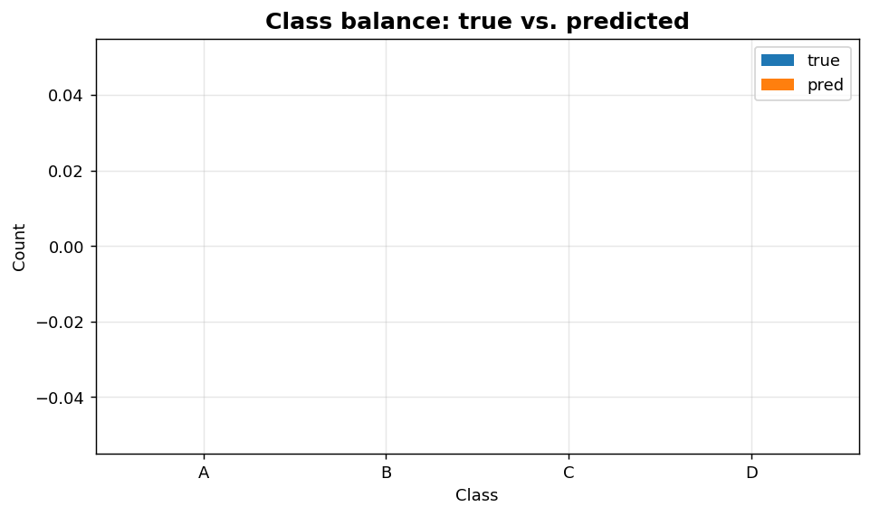
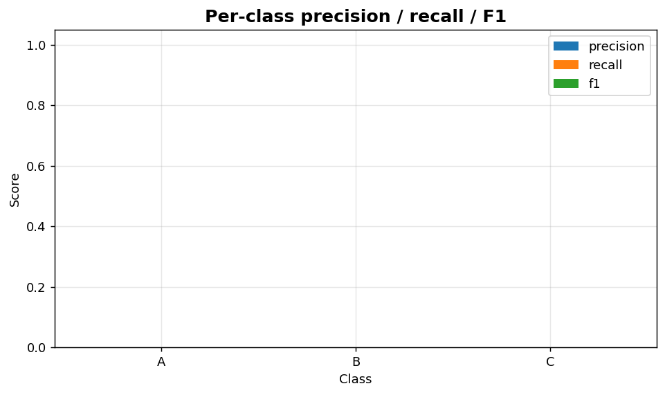

Classification VII: Class balance and per-class metrics
=======================================================

Group composition and per-class quality summary for multiclass models.

.. contents::
   :local:
   :depth: 1

Class balance: true vs. predicted
---------------------------------

:Function: ``dv.classification.class_balance_bar_static``
:Example slug: ``classification_class_balance``

Situation
~~~~~~~~~

An ML engineer audits a fresh model and wants to confirm that the predicted-class distribution matches the true-class distribution closely enough for downstream consumers.

Requirements
~~~~~~~~~~~~

* ``dataviz``
* ``numpy``, ``pandas`` and ``matplotlib`` (installed as ``dataviz`` dependencies)
* No additional services or data files — the example uses a deterministic
  synthetic dataset generated from ``numpy.random.default_rng(0)``.

Code (copy-paste ready)
~~~~~~~~~~~~~~~~~~~~~~~

.. code-block:: python
   :linenos:

   import numpy as np
   import pandas as pd
   import matplotlib.pyplot as plt
   import dataviz as dv

   rng = np.random.default_rng(0)

   y_true = rng.choice([0, 1, 2, 3], size=400, p=[0.5, 0.25, 0.15, 0.1])
   y_pred = y_true.copy()
   flip = rng.random(400) < 0.18
   y_pred[flip] = rng.choice([0, 1, 2, 3], size=flip.sum())
   ax = dv.classification.class_balance_bar_static(
       y_true, y_pred, labels=["A", "B", "C", "D"],
       title="Class balance: true vs. predicted")

   plt.show()

Sample chart
~~~~~~~~~~~~

Notes
~~~~~

Large deviations between the two bars indicate threshold mis-calibration or strong class-prior shift between training and the audit window.

Per-class precision / recall / F1
---------------------------------

:Function: ``dv.classification.per_class_metrics_bar_static``
:Example slug: ``classification_per_class_metrics``

Situation
~~~~~~~~~

A multiclass model is profiled to identify the weakest class so engineering effort (more data, better features, re-balancing) can be focused where it matters.

Requirements
~~~~~~~~~~~~

* ``dataviz``
* ``numpy``, ``pandas`` and ``matplotlib`` (installed as ``dataviz`` dependencies)
* No additional services or data files — the example uses a deterministic
  synthetic dataset generated from ``numpy.random.default_rng(0)``.

Code (copy-paste ready)
~~~~~~~~~~~~~~~~~~~~~~~

.. code-block:: python
   :linenos:

   import numpy as np
   import pandas as pd
   import matplotlib.pyplot as plt
   import dataviz as dv

   rng = np.random.default_rng(0)

   y_true = rng.choice([0, 1, 2], size=300, p=[0.5, 0.3, 0.2])
   y_pred = y_true.copy()
   flip = rng.random(300) < 0.20
   y_pred[flip] = rng.choice([0, 1, 2], size=flip.sum())
   ax = dv.classification.per_class_metrics_bar_static(
       y_true, y_pred, labels=["A", "B", "C"],
       title="Per-class precision / recall / F1")

   plt.show()

Sample chart
~~~~~~~~~~~~

Notes
~~~~~

Combine with ``classification_report_heatmap`` for a one-page artefact suitable for model-review meetings.

