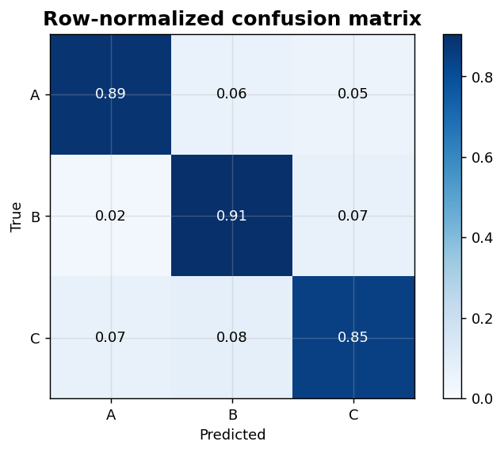
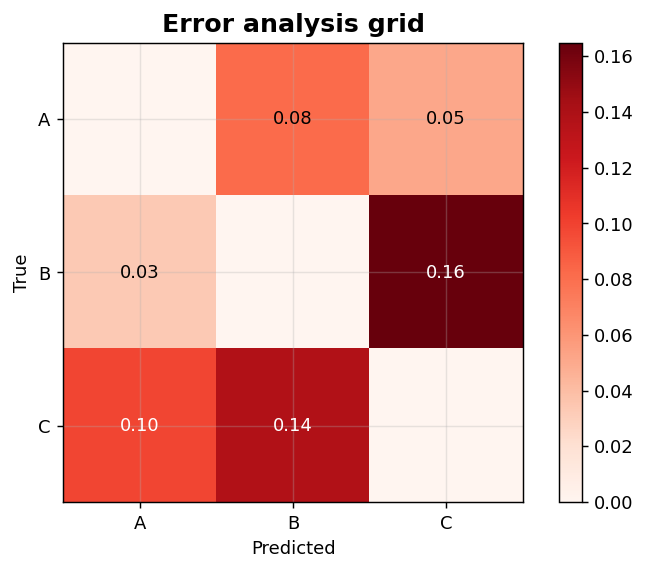

Classification VIII: Confusion-matrix extensions
================================================

Row-normalized confusion matrix and error-analysis grid.

.. contents::
   :local:
   :depth: 1

Row-normalized confusion matrix
-------------------------------

:Function: ``dv.classification.normalized_confusion_matrix_static``
:Example slug: ``classification_normalized_cm``

Situation
~~~~~~~~~

On an imbalanced multiclass problem, raw counts in a confusion matrix are dominated by the majority class. Row-normalising turns each row into recall per class.

Requirements
~~~~~~~~~~~~

* ``dataviz``
* ``numpy``, ``pandas`` and ``matplotlib`` (installed as ``dataviz`` dependencies)
* No additional services or data files — the example uses a deterministic
  synthetic dataset generated from ``numpy.random.default_rng(0)``.

Code (copy-paste ready)
~~~~~~~~~~~~~~~~~~~~~~~

.. code-block:: python
   :linenos:

   import numpy as np
   import pandas as pd
   import matplotlib.pyplot as plt
   import dataviz as dv

   rng = np.random.default_rng(0)

   y_true = rng.choice([0, 1, 2], size=240, p=[0.4, 0.35, 0.25])
   y_pred = y_true.copy()
   flip = rng.random(240) < 0.22
   y_pred[flip] = rng.choice([0, 1, 2], size=flip.sum())
   cm = np.zeros((3, 3), dtype=int)
   for t, p in zip(y_true, y_pred):
       cm[t, p] += 1
   ax = dv.classification.normalized_confusion_matrix_static(
       cm, labels=["A", "B", "C"], normalize="true",
       title="Row-normalized confusion matrix")

   plt.show()

Sample chart
~~~~~~~~~~~~

Notes
~~~~~

Use ``normalize='pred'`` for per-prediction precision or ``normalize='all'`` for global fractions.

Error analysis grid
-------------------

:Function: ``dv.classification.error_analysis_grid_static``
:Example slug: ``classification_error_grid``

Situation
~~~~~~~~~

An ML engineer drills into the off-diagonal cells of the confusion matrix to identify systematic confusion patterns (e.g. class ``B`` and ``C`` are routinely swapped).

Requirements
~~~~~~~~~~~~

* ``dataviz``
* ``numpy``, ``pandas`` and ``matplotlib`` (installed as ``dataviz`` dependencies)
* No additional services or data files — the example uses a deterministic
  synthetic dataset generated from ``numpy.random.default_rng(0)``.

Code (copy-paste ready)
~~~~~~~~~~~~~~~~~~~~~~~

.. code-block:: python
   :linenos:

   import numpy as np
   import pandas as pd
   import matplotlib.pyplot as plt
   import dataviz as dv

   rng = np.random.default_rng(0)

   y_true = rng.choice([0, 1, 2], size=240, p=[0.4, 0.35, 0.25])
   y_pred = y_true.copy()
   flip = rng.random(240) < 0.25
   y_pred[flip] = rng.choice([0, 1, 2], size=flip.sum())
   cm = np.zeros((3, 3), dtype=int)
   for t, p in zip(y_true, y_pred):
       cm[t, p] += 1
   ax = dv.classification.error_analysis_grid_static(
       cm, labels=["A", "B", "C"], title="Error analysis grid")

   plt.show()

Sample chart
~~~~~~~~~~~~

Notes
~~~~~

The error grid masks the diagonal so the visual emphasis is fully on mistakes. Pair with ``misclassification_cluster_heatmap`` to slice errors by score bin.

