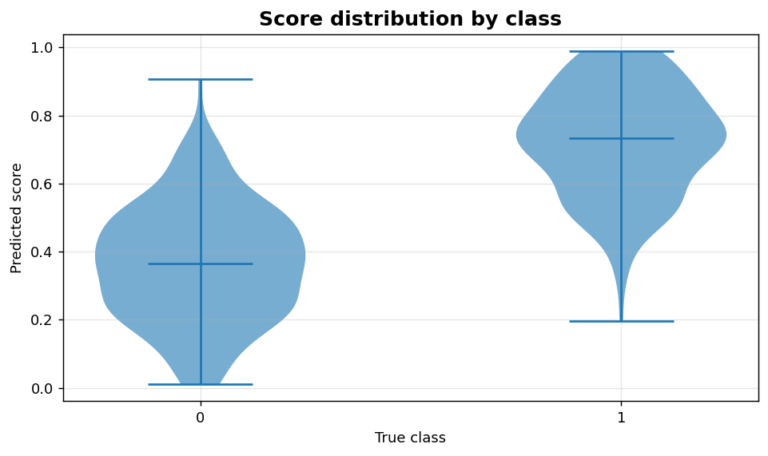
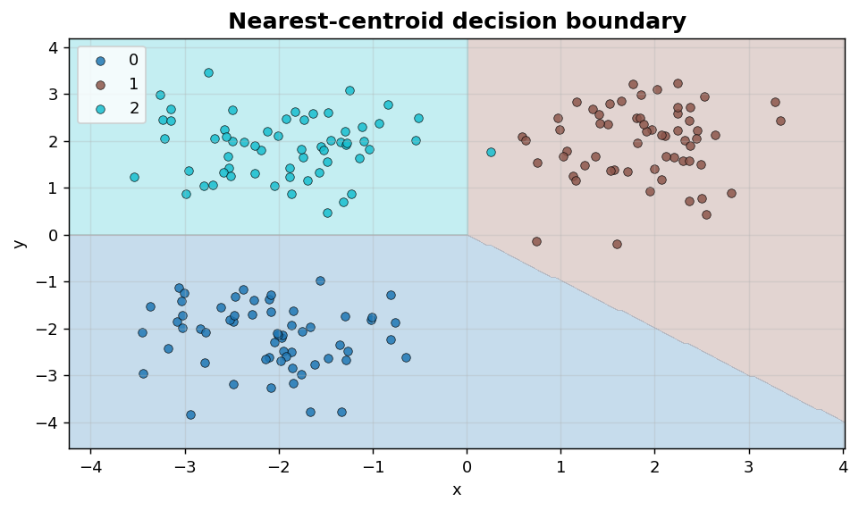

Classification IX: Score distributions and decision regions
===========================================================

Score separation by class and 2-D decision-boundary visualisation.

.. contents::
   :local:
   :depth: 1

Score distribution by class
---------------------------

:Function: ``dv.classification.score_distribution_by_class_static``
:Example slug: ``classification_score_dist``

Situation
~~~~~~~~~

A team inspects how cleanly the positive and negative populations separate in score space — a stronger diagnostic than a histogram when one class is rare.

Requirements
~~~~~~~~~~~~

* ``dataviz`` (this package)
* ``numpy``, ``pandas`` and ``matplotlib`` (installed as ``dataviz`` dependencies)
* No additional services or data files — the example uses a deterministic
  synthetic dataset generated from ``numpy.random.default_rng(0)``.

Code (copy-paste ready)
~~~~~~~~~~~~~~~~~~~~~~~

.. code-block:: python
   :linenos:

   import numpy as np
   import pandas as pd
   import matplotlib.pyplot as plt
   import dataviz as dv

   rng = np.random.default_rng(0)

   y_true, y_prob = _binary_scores()
   ax = dv.classification.score_distribution_by_class_static(
       y_true, y_prob, title="Score distribution by class")

   plt.show()

Sample chart
~~~~~~~~~~~~

Notes
~~~~~

Set ``kind='box'`` for a more compact summary on dashboards or ``kind='strip'`` for sample sizes below 100.

2-D decision boundary
---------------------

:Function: ``dv.classification.decision_boundary_plot_static``
:Example slug: ``classification_decision_boundary``

Situation
~~~~~~~~~

A practitioner inspects how a 2-D classifier carves up feature space — useful for teaching, debugging or comparing model families on the same dataset.

Requirements
~~~~~~~~~~~~

* ``dataviz`` (this package)
* ``numpy``, ``pandas`` and ``matplotlib`` (installed as ``dataviz`` dependencies)
* No additional services or data files — the example uses a deterministic
  synthetic dataset generated from ``numpy.random.default_rng(0)``.

Code (copy-paste ready)
~~~~~~~~~~~~~~~~~~~~~~~

.. code-block:: python
   :linenos:

   import numpy as np
   import pandas as pd
   import matplotlib.pyplot as plt
   import dataviz as dv

   rng = np.random.default_rng(0)

   centers = np.array([[-2, -2], [2, 2], [-2, 2]])
   labels = np.repeat([0, 1, 2], 60)
   pts = np.vstack([rng.normal(c, 0.7, (60, 2)) for c in centers])

   def predict(P):
       d = np.stack([np.linalg.norm(P - c, axis=1) for c in centers], axis=1)
       return d.argmin(axis=1)

   ax = dv.classification.decision_boundary_plot_static(
       pts[:, 0], pts[:, 1], labels, predict_fn=predict,
       title="Nearest-centroid decision boundary")

   plt.show()

Sample chart
~~~~~~~~~~~~

Notes
~~~~~

The helper accepts any ``predict_fn`` callable taking an ``(n, 2)`` array, so it works with scikit-learn estimators (``model.predict``), custom decision rules, or kernel-density classifiers.

