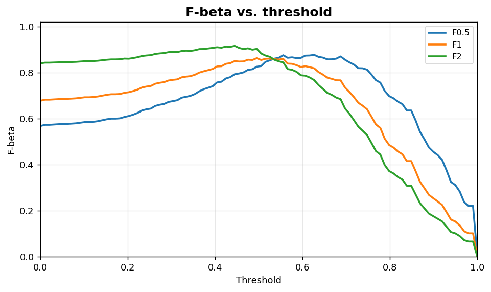
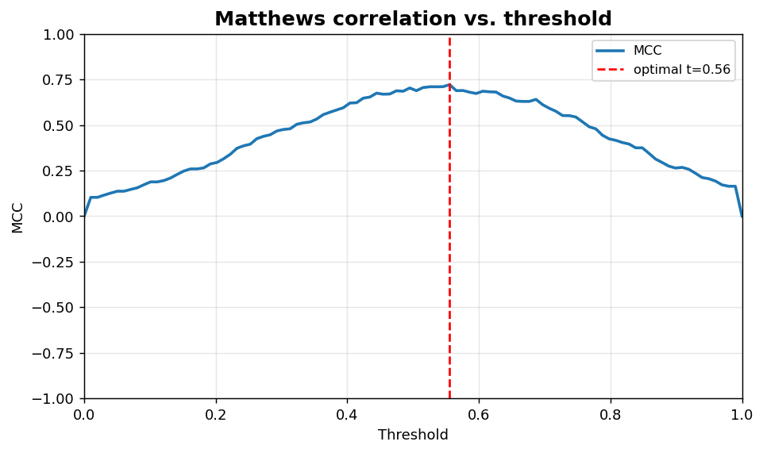

Classification X: F-beta and MCC threshold curves
=================================================

Asymmetric and imbalance-robust threshold scoring curves.

.. contents::
   :local:
   :depth: 1

F-beta vs. threshold
--------------------

:Function: ``dv.classification.f_beta_curve_static``
:Example slug: ``classification_f_beta``

Situation
~~~~~~~~~

A team weighs precision and recall asymmetrically (e.g. recall twice as important as precision) and reads the optimum threshold straight from the F-beta curve.

Requirements
~~~~~~~~~~~~

* ``dataviz``
* ``numpy``, ``pandas`` and ``matplotlib`` (installed as ``dataviz`` dependencies)
* No additional services or data files — the example uses a deterministic
  synthetic dataset generated from ``numpy.random.default_rng(0)``.

Code (copy-paste ready)
~~~~~~~~~~~~~~~~~~~~~~~

.. code-block:: python
   :linenos:

   import numpy as np
   import pandas as pd
   import matplotlib.pyplot as plt
   import dataviz as dv

   rng = np.random.default_rng(0)

   y_true, y_prob = _binary_scores()
   ax = dv.classification.f_beta_curve_static(
       y_true, y_prob, betas=(0.5, 1.0, 2.0),
       title="F-beta vs. threshold")

   plt.show()

Sample chart
~~~~~~~~~~~~

Notes
~~~~~

``beta < 1`` emphasises precision; ``beta > 1`` emphasises recall. F1 (``beta = 1``) is the symmetric default.

Matthews correlation vs. threshold
----------------------------------

:Function: ``dv.classification.mcc_curve_static``
:Example slug: ``classification_mcc``

Situation
~~~~~~~~~

On heavily imbalanced problems MCC is widely preferred to F1 because it accounts for all four cells of the confusion matrix. The team reads the MCC-maximising threshold off the curve.

Requirements
~~~~~~~~~~~~

* ``dataviz``
* ``numpy``, ``pandas`` and ``matplotlib`` (installed as ``dataviz`` dependencies)
* No additional services or data files — the example uses a deterministic
  synthetic dataset generated from ``numpy.random.default_rng(0)``.

Code (copy-paste ready)
~~~~~~~~~~~~~~~~~~~~~~~

.. code-block:: python
   :linenos:

   import numpy as np
   import pandas as pd
   import matplotlib.pyplot as plt
   import dataviz as dv

   rng = np.random.default_rng(0)

   y_true, y_prob = _binary_scores()
   ax = dv.classification.mcc_curve_static(
       y_true, y_prob, title="Matthews correlation vs. threshold")

   plt.show()

Sample chart
~~~~~~~~~~~~

Notes
~~~~~

MCC ranges from -1 (perfectly wrong) through 0 (random) to +1 (perfect). Values near zero on imbalanced data often correspond to ``always predict majority``.

