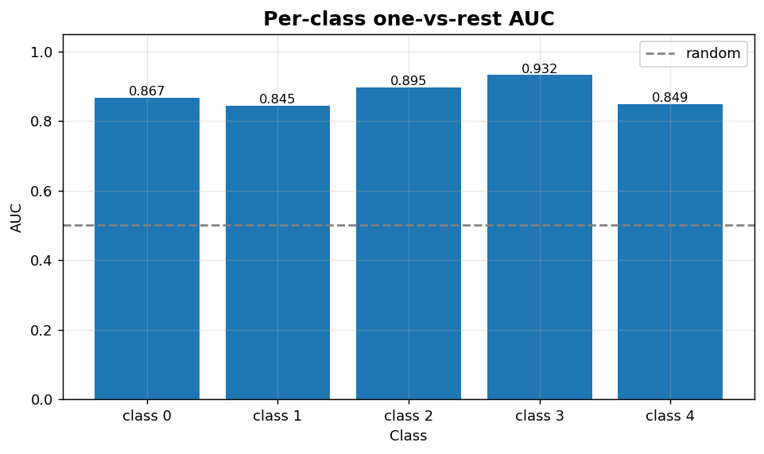
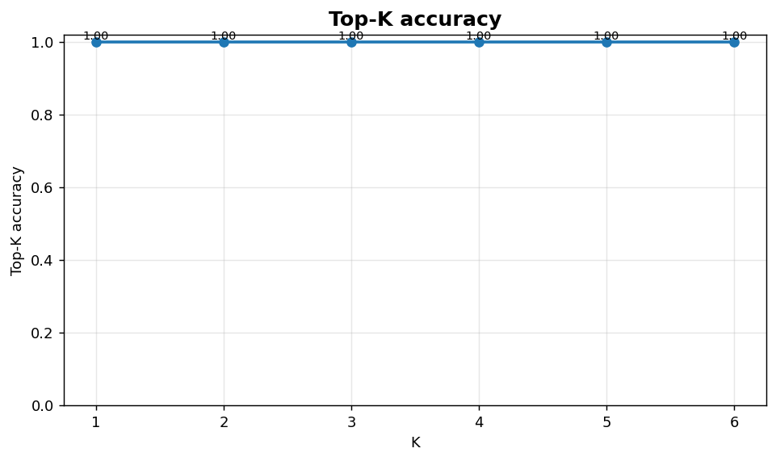

Classification XI: Per-class AUC and top-K
==========================================

Per-class one-vs-rest AUC bars and top-K accuracy curve.

.. contents::
   :local:
   :depth: 1

Per-class one-vs-rest AUC
-------------------------

:Function: ``dv.classification.per_class_auc_bar_static``
:Example slug: ``classification_per_class_auc``

Situation
~~~~~~~~~

A multiclass model is summarised by collapsing each ROC curve to its AUC and ranking classes from worst to best — a fast triage for follow-up modelling.

Requirements
~~~~~~~~~~~~

* ``dataviz`` (this package)
* ``numpy``, ``pandas`` and ``matplotlib`` (installed as ``dataviz`` dependencies)
* No additional services or data files — the example uses a deterministic
  synthetic dataset generated from ``numpy.random.default_rng(0)``.

Code (copy-paste ready)
~~~~~~~~~~~~~~~~~~~~~~~

.. code-block:: python
   :linenos:

   import numpy as np
   import pandas as pd
   import matplotlib.pyplot as plt
   import dataviz as dv

   rng = np.random.default_rng(0)

   aucs = {f"class {c}": float(rng.uniform(0.75, 0.95)) for c in range(5)}
   ax = dv.classification.per_class_auc_bar_static(
       aucs, title="Per-class one-vs-rest AUC")

   plt.show()

Sample chart
~~~~~~~~~~~~

Notes
~~~~~

The function expects a precomputed ``{class: auc}`` mapping so any AUC implementation (sklearn, NumPy ``np.trapezoid``, custom rank-based) can feed the chart.

Top-K accuracy curve
--------------------

:Function: ``dv.classification.top_k_accuracy_curve_static``
:Example slug: ``classification_top_k``

Situation
~~~~~~~~~

On problems with many classes (image classification, product recommendation) the team reports the fraction of times the true class falls inside the model's top-K predictions, not only the top-1.

Requirements
~~~~~~~~~~~~

* ``dataviz`` (this package)
* ``numpy``, ``pandas`` and ``matplotlib`` (installed as ``dataviz`` dependencies)
* No additional services or data files — the example uses a deterministic
  synthetic dataset generated from ``numpy.random.default_rng(0)``.

Code (copy-paste ready)
~~~~~~~~~~~~~~~~~~~~~~~

.. code-block:: python
   :linenos:

   import numpy as np
   import pandas as pd
   import matplotlib.pyplot as plt
   import dataviz as dv

   rng = np.random.default_rng(0)

   y_true, P = _multiclass_scores(n=400, k=6)
   ax = dv.classification.top_k_accuracy_curve_static(
       y_true, P, max_k=6, title="Top-K accuracy")

   plt.show()

Sample chart
~~~~~~~~~~~~

Notes
~~~~~

Top-K is a strict monotone-increasing function of K. Report top-1 alongside top-5 for vision tasks and top-3 alongside top-10 for retrieval tasks.

