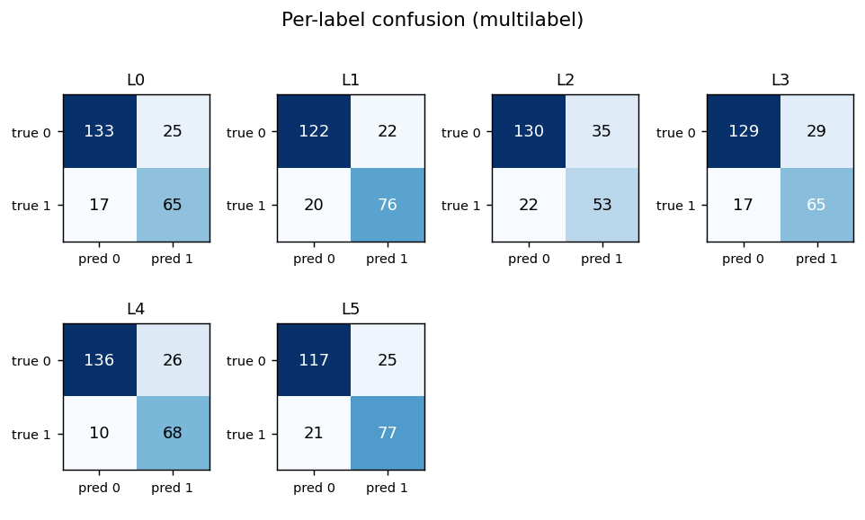
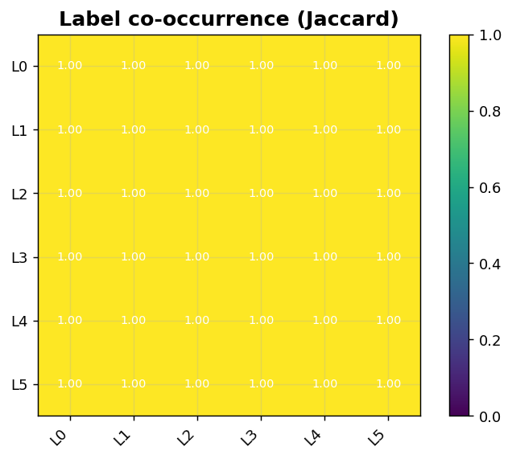

Classification XII: Multilabel diagnostics
==========================================

Per-label confusion grid and Jaccard co-occurrence heatmap.

.. contents::
   :local:
   :depth: 1

Per-label confusion grid (multilabel)
-------------------------------------

:Function: ``dv.classification.multilabel_confusion_grid_static``
:Example slug: ``classification_multilabel_grid``

Situation
~~~~~~~~~

A multilabel model (tags, attributes) is audited label-by-label by laying out one 2×2 confusion matrix per label in a grid so the per-label trade-off is visible at a glance.

Requirements
~~~~~~~~~~~~

* ``dataviz``
* ``numpy``, ``pandas`` and ``matplotlib`` (installed as ``dataviz`` dependencies)
* No additional services or data files — the example uses a deterministic
  synthetic dataset generated from ``numpy.random.default_rng(0)``.

Code (copy-paste ready)
~~~~~~~~~~~~~~~~~~~~~~~

.. code-block:: python
   :linenos:

   import numpy as np
   import pandas as pd
   import matplotlib.pyplot as plt
   import dataviz as dv

   rng = np.random.default_rng(0)

   n, L = 240, 6
   Y_true = (rng.random((n, L)) > 0.65).astype(int)
   Y_pred = Y_true.copy()
   flip = rng.random((n, L)) < 0.18
   Y_pred[flip] = 1 - Y_pred[flip]
   labels = [f"L{i}" for i in range(L)]
   axes = dv.classification.multilabel_confusion_grid_static(
       Y_true, Y_pred, labels=labels,
       title="Per-label confusion (multilabel)")
   fig = np.asarray(axes).ravel()[0].figure

   plt.show()

Sample chart
~~~~~~~~~~~~

Notes
~~~~~

The function returns a ``numpy.ndarray`` of matplotlib Axes — call ``.ravel()[0].figure`` to grab the parent figure if you need to save it.

Label co-occurrence (Jaccard)
-----------------------------

:Function: ``dv.classification.label_cooccurrence_heatmap_static``
:Example slug: ``classification_label_cooccurrence``

Situation
~~~~~~~~~

A taxonomy lead inspects how often pairs of multilabel tags co-occur in the dataset — pairs with high Jaccard suggest redundant labels or a hierarchical structure.

Requirements
~~~~~~~~~~~~

* ``dataviz``
* ``numpy``, ``pandas`` and ``matplotlib`` (installed as ``dataviz`` dependencies)
* No additional services or data files — the example uses a deterministic
  synthetic dataset generated from ``numpy.random.default_rng(0)``.

Code (copy-paste ready)
~~~~~~~~~~~~~~~~~~~~~~~

.. code-block:: python
   :linenos:

   import numpy as np
   import pandas as pd
   import matplotlib.pyplot as plt
   import dataviz as dv

   rng = np.random.default_rng(0)

   n, L = 300, 6
   Y = (rng.random((n, L)) > 0.6).astype(int)
   labels = [f"L{i}" for i in range(L)]
   ax = dv.classification.label_cooccurrence_heatmap_static(
       Y, labels=labels, title="Label co-occurrence (Jaccard)")

   plt.show()

Sample chart
~~~~~~~~~~~~

Notes
~~~~~

Toggle ``normalize=False`` to display absolute co-occurrence counts. The diagonal is always 1.0 (Jaccard of a set with itself).

