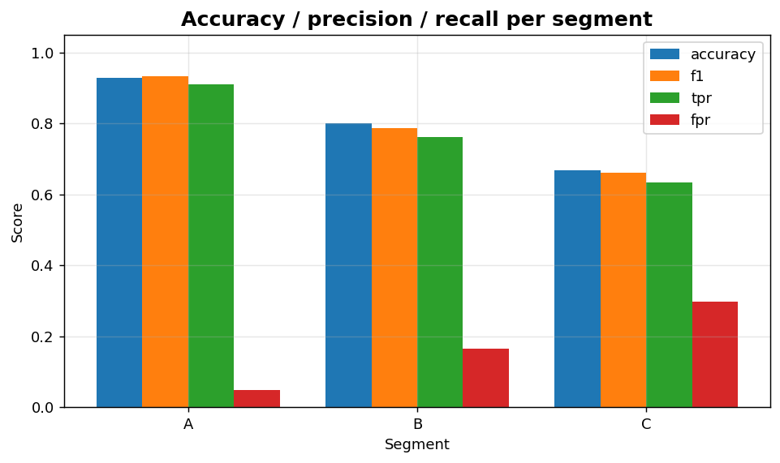
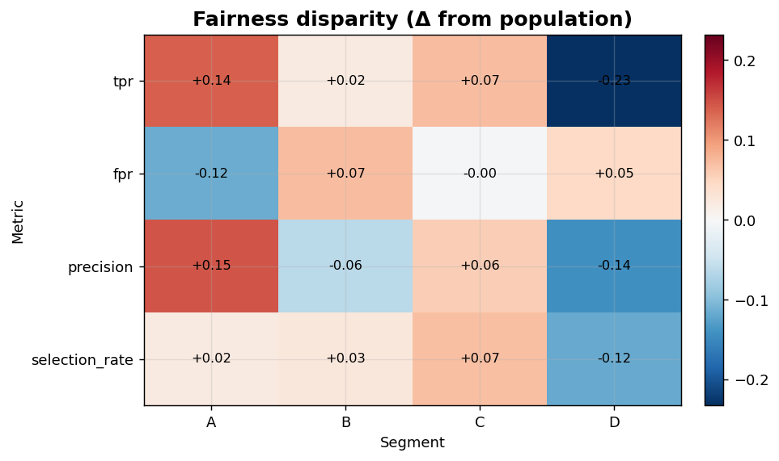

Classification XIII: Fairness and segments
==========================================

Per-segment metrics and population-relative disparity heatmap.

.. contents::
   :local:
   :depth: 1

Per-segment accuracy / precision / recall
-----------------------------------------

:Function: ``dv.classification.per_segment_metric_bar_static``
:Example slug: ``classification_segment_metric``

Situation
~~~~~~~~~

A fairness lead computes accuracy, precision and recall for each demographic segment (or business segment) to surface performance gaps.

Requirements
~~~~~~~~~~~~

* ``dataviz`` (this package)
* ``numpy``, ``pandas`` and ``matplotlib`` (installed as ``dataviz`` dependencies)
* No additional services or data files — the example uses a deterministic
  synthetic dataset generated from ``numpy.random.default_rng(0)``.

Code (copy-paste ready)
~~~~~~~~~~~~~~~~~~~~~~~

.. code-block:: python
   :linenos:

   import numpy as np
   import pandas as pd
   import matplotlib.pyplot as plt
   import dataviz as dv

   rng = np.random.default_rng(0)

   n = 400
   y_true = rng.integers(0, 2, n)
   y_pred = y_true.copy()
   groups = rng.choice(["A", "B", "C"], n)
   rate = {"A": 0.10, "B": 0.20, "C": 0.30}
   flip = rng.random(n) < np.array([rate[g] for g in groups])
   y_pred[flip] = 1 - y_pred[flip]
   ax = dv.classification.per_segment_metric_bar_static(
       y_true, y_pred, groups, title="Accuracy / precision / recall per segment")

   plt.show()

Sample chart
~~~~~~~~~~~~

Notes
~~~~~

``groups`` can be any array of categorical labels (strings, ints). Pair with ``fairness_disparity_heatmap`` for the relative-deviation view.

Fairness disparity heatmap
--------------------------

:Function: ``dv.classification.fairness_disparity_heatmap_static``
:Example slug: ``classification_fairness_disparity``

Situation
~~~~~~~~~

A team quantifies how much each segment deviates from the population-level metric across multiple metrics (accuracy, FPR, FNR) on a single heatmap.

Requirements
~~~~~~~~~~~~

* ``dataviz`` (this package)
* ``numpy``, ``pandas`` and ``matplotlib`` (installed as ``dataviz`` dependencies)
* No additional services or data files — the example uses a deterministic
  synthetic dataset generated from ``numpy.random.default_rng(0)``.

Code (copy-paste ready)
~~~~~~~~~~~~~~~~~~~~~~~

.. code-block:: python
   :linenos:

   import numpy as np
   import pandas as pd
   import matplotlib.pyplot as plt
   import dataviz as dv

   rng = np.random.default_rng(0)

   n = 500
   y_true = rng.integers(0, 2, n)
   y_pred = y_true.copy()
   groups = rng.choice(["A", "B", "C", "D"], n)
   rate = {"A": 0.05, "B": 0.15, "C": 0.10, "D": 0.30}
   flip = rng.random(n) < np.array([rate[g] for g in groups])
   y_pred[flip] = 1 - y_pred[flip]
   ax = dv.classification.fairness_disparity_heatmap_static(
       y_true, y_pred, groups, title="Fairness disparity (Δ from population)")

   plt.show()

Sample chart
~~~~~~~~~~~~

Notes
~~~~~

Cells far from zero indicate disparity. The sign convention is segment_value - population_value, so positive cells mean the segment outperforms the average.

