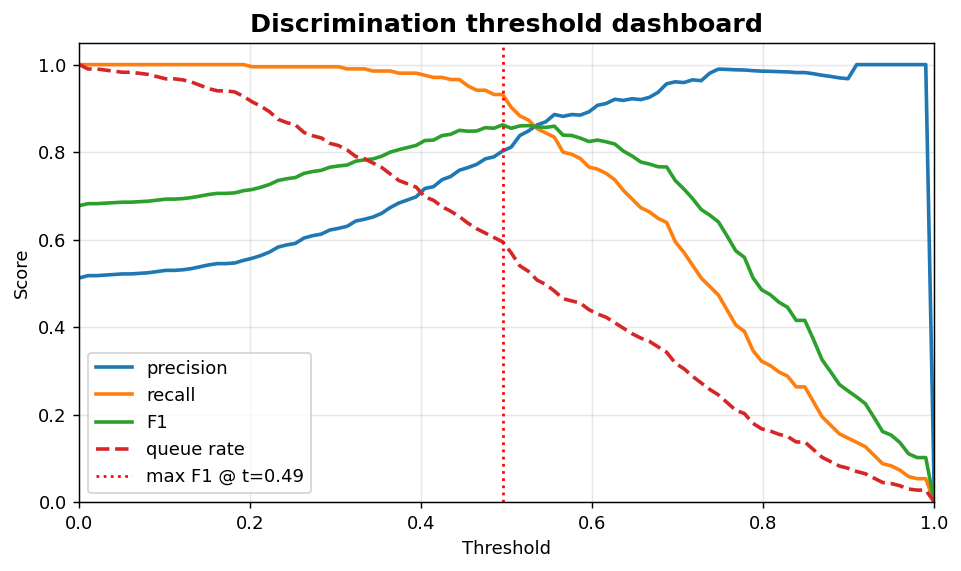
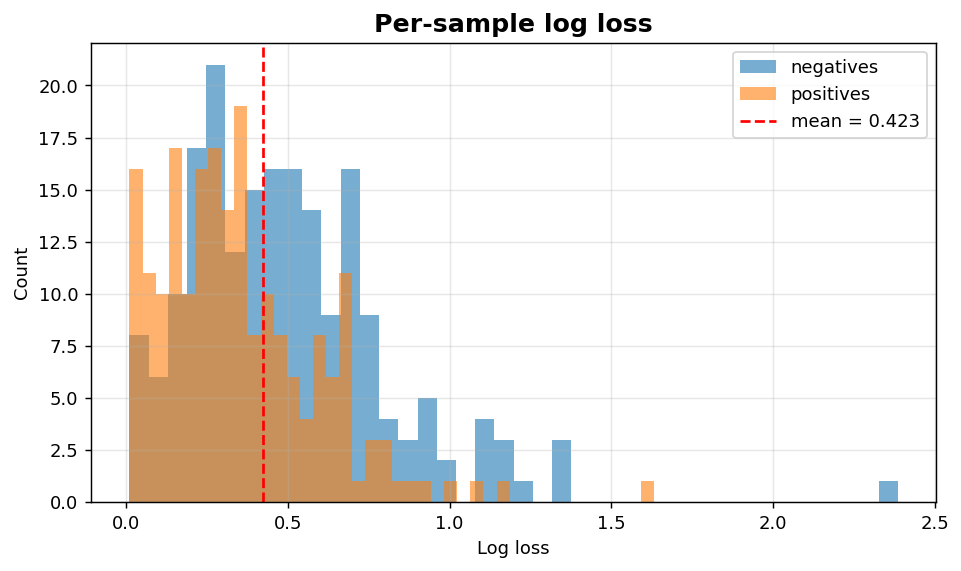

Classification XIV: Errors and losses
=====================================

Discrimination threshold dashboard and per-sample log-loss distribution.

.. contents::
   :local:
   :depth: 1

Discrimination threshold dashboard
----------------------------------

:Function: ``dv.classification.discrimination_threshold_dashboard_static``
:Example slug: ``classification_discrimination``

Situation
~~~~~~~~~

A team picks an operating threshold by simultaneously balancing precision, recall, F1 and queue rate (the fraction of samples flagged).

Requirements
~~~~~~~~~~~~

* ``dataviz`` (this package)
* ``numpy``, ``pandas`` and ``matplotlib`` (installed as ``dataviz`` dependencies)
* No additional services or data files — the example uses a deterministic
  synthetic dataset generated from ``numpy.random.default_rng(0)``.

Code (copy-paste ready)
~~~~~~~~~~~~~~~~~~~~~~~

.. code-block:: python
   :linenos:

   import numpy as np
   import pandas as pd
   import matplotlib.pyplot as plt
   import dataviz as dv

   rng = np.random.default_rng(0)

   y_true, y_prob = _binary_scores()
   ax = dv.classification.discrimination_threshold_dashboard_static(
       y_true, y_prob, title="Discrimination threshold dashboard")

   plt.show()

Sample chart
~~~~~~~~~~~~

Notes
~~~~~

Inspired by the Yellowbrick ``DiscriminationThreshold``. The red dotted line marks the F1-maximising threshold.

Per-sample log-loss distribution
--------------------------------

:Function: ``dv.classification.loss_distribution_plot_static``
:Example slug: ``classification_loss_distribution``

Situation
~~~~~~~~~

An ML engineer hunts for high-loss outliers — samples that contribute disproportionately to the average loss — to investigate label noise or covariate shift.

Requirements
~~~~~~~~~~~~

* ``dataviz`` (this package)
* ``numpy``, ``pandas`` and ``matplotlib`` (installed as ``dataviz`` dependencies)
* No additional services or data files — the example uses a deterministic
  synthetic dataset generated from ``numpy.random.default_rng(0)``.

Code (copy-paste ready)
~~~~~~~~~~~~~~~~~~~~~~~

.. code-block:: python
   :linenos:

   import numpy as np
   import pandas as pd
   import matplotlib.pyplot as plt
   import dataviz as dv

   rng = np.random.default_rng(0)

   y_true, y_prob = _binary_scores()
   ax = dv.classification.loss_distribution_plot_static(
       y_true, y_prob, title="Per-sample log loss")

   plt.show()

Sample chart
~~~~~~~~~~~~

Notes
~~~~~

Samples in the right tail are the highest priority for manual review. Combine with ``confidence_by_correctness_histogram`` for a complementary view.

