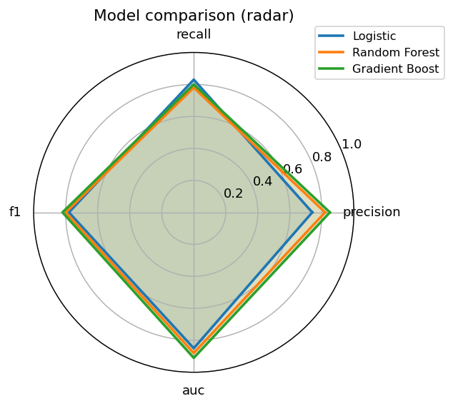
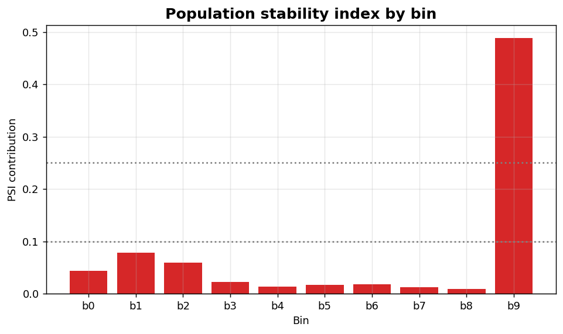

Classification XV: Model comparison and monitoring
==================================================

Multi-model radar comparison and Population Stability Index for score drift.

.. contents::
   :local:
   :depth: 1

Model comparison radar
----------------------

:Function: ``dv.classification.metrics_radar_chart_static``
:Example slug: ``classification_metrics_radar``

Situation
~~~~~~~~~

A team compares three candidate models across precision, recall, F1 and AUC on a single radar so trade-offs are obvious to non-technical reviewers.

Requirements
~~~~~~~~~~~~

* ``dataviz``
* ``numpy``, ``pandas`` and ``matplotlib`` (installed as ``dataviz`` dependencies)
* No additional services or data files — the example uses a deterministic
  synthetic dataset generated from ``numpy.random.default_rng(0)``.

Code (copy-paste ready)
~~~~~~~~~~~~~~~~~~~~~~~

.. code-block:: python
   :linenos:

   import numpy as np
   import pandas as pd
   import matplotlib.pyplot as plt
   import dataviz as dv

   rng = np.random.default_rng(0)

   metrics = {
       "Logistic":     {"precision": 0.74, "recall": 0.83, "f1": 0.78, "auc": 0.85},
       "Random Forest":{"precision": 0.82, "recall": 0.78, "f1": 0.80, "auc": 0.88},
       "Gradient Boost":{"precision":0.85, "recall": 0.80, "f1": 0.82, "auc": 0.91},
   }
   ax = dv.classification.metrics_radar_chart_static(
       metrics, title="Model comparison (radar)")

   plt.show()

Sample chart
~~~~~~~~~~~~

Notes
~~~~~

Keep all metrics on a common ``[0, 1]`` scale. For non-bounded metrics, normalise upstream before plotting.

Population Stability Index (PSI)
--------------------------------

:Function: ``dv.classification.psi_bar_static``
:Example slug: ``classification_psi``

Situation
~~~~~~~~~

A production monitoring team flags drift by comparing the current score distribution against a reference window and reporting the PSI contribution of each bin.

Requirements
~~~~~~~~~~~~

* ``dataviz``
* ``numpy``, ``pandas`` and ``matplotlib`` (installed as ``dataviz`` dependencies)
* No additional services or data files — the example uses a deterministic
  synthetic dataset generated from ``numpy.random.default_rng(0)``.

Code (copy-paste ready)
~~~~~~~~~~~~~~~~~~~~~~~

.. code-block:: python
   :linenos:

   import numpy as np
   import pandas as pd
   import matplotlib.pyplot as plt
   import dataviz as dv

   rng = np.random.default_rng(0)

   ref = rng.normal(0.4, 0.15, 800).clip(0, 1)
   cur = rng.normal(0.55, 0.2, 600).clip(0, 1)
   ax = dv.classification.psi_bar_static(
       ref, cur, n_bins=10, title="Population stability index by bin")

   plt.show()

Sample chart
~~~~~~~~~~~~

Notes
~~~~~

Rule of thumb: PSI < 0.10 stable, 0.10-0.25 moderate shift, > 0.25 major shift requiring investigation.

