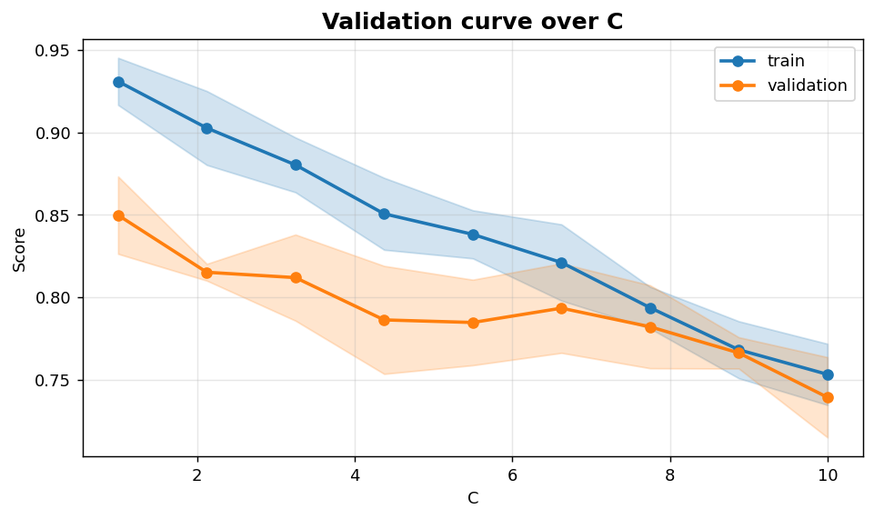
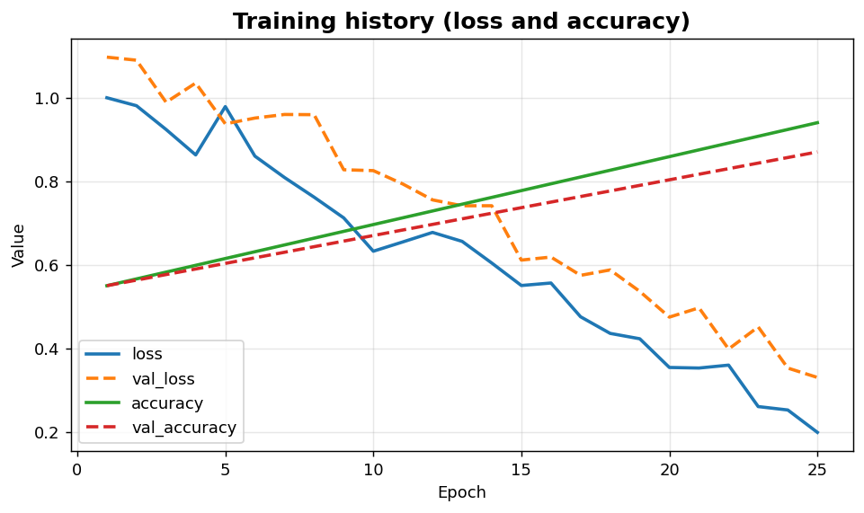

Classification XVI: Training diagnostics
========================================

Validation curve over a hyperparameter and per-epoch training-history curves.

.. contents::
   :local:
   :depth: 1

Validation curve with std bands
-------------------------------

:Function: ``dv.classification.validation_curve_static``
:Example slug: ``classification_validation_curve``

Situation
~~~~~~~~~

A practitioner sweeps a single hyperparameter (regularisation strength ``C``, tree depth, ...) across cross-validation folds and looks for the sweet spot between under- and over-fitting.

Requirements
~~~~~~~~~~~~

* ``dataviz`` (this package)
* ``numpy``, ``pandas`` and ``matplotlib`` (installed as ``dataviz`` dependencies)
* No additional services or data files — the example uses a deterministic
  synthetic dataset generated from ``numpy.random.default_rng(0)``.

Code (copy-paste ready)
~~~~~~~~~~~~~~~~~~~~~~~

.. code-block:: python
   :linenos:

   import numpy as np
   import pandas as pd
   import matplotlib.pyplot as plt
   import dataviz as dv

   rng = np.random.default_rng(0)

   params = np.linspace(1, 10, 9)
   train = (0.95 - 0.02 * params)[:, None] + 0.02 * rng.standard_normal((9, 5))
   val = (0.85 - 0.01 * params)[:, None] + 0.03 * rng.standard_normal((9, 5))
   ax = dv.classification.validation_curve_static(
       params, train, val, param_name="C", title="Validation curve over C")

   plt.show()

Sample chart
~~~~~~~~~~~~

Notes
~~~~~

``train_scores`` and ``val_scores`` can be 2-D ``(n_params, n_folds)`` arrays (one score per fold) or 1-D means. The shaded band shows ±1 standard deviation across folds.

Training history (loss and accuracy)
------------------------------------

:Function: ``dv.classification.training_history_curve_static``
:Example slug: ``classification_training_history``

Situation
~~~~~~~~~

A deep-learning practitioner inspects per-epoch loss and accuracy on training and validation splits to monitor for divergence and over-fitting.

Requirements
~~~~~~~~~~~~

* ``dataviz`` (this package)
* ``numpy``, ``pandas`` and ``matplotlib`` (installed as ``dataviz`` dependencies)
* No additional services or data files — the example uses a deterministic
  synthetic dataset generated from ``numpy.random.default_rng(0)``.

Code (copy-paste ready)
~~~~~~~~~~~~~~~~~~~~~~~

.. code-block:: python
   :linenos:

   import numpy as np
   import pandas as pd
   import matplotlib.pyplot as plt
   import dataviz as dv

   rng = np.random.default_rng(0)

   epochs = 25
   history = {
       "loss":     list(np.linspace(1.0, 0.20, epochs) + 0.04 * rng.standard_normal(epochs)),
       "val_loss": list(np.linspace(1.1, 0.35, epochs) + 0.05 * rng.standard_normal(epochs)),
       "accuracy":     list(np.linspace(0.55, 0.94, epochs)),
       "val_accuracy": list(np.linspace(0.55, 0.87, epochs)),
   }
   ax = dv.classification.training_history_curve_static(
       history, title="Training history (loss and accuracy)")

   plt.show()

Sample chart
~~~~~~~~~~~~

Notes
~~~~~

Series whose name starts with ``val_`` or contains ``validation`` are drawn dashed automatically, making the train/val split visually unambiguous.

