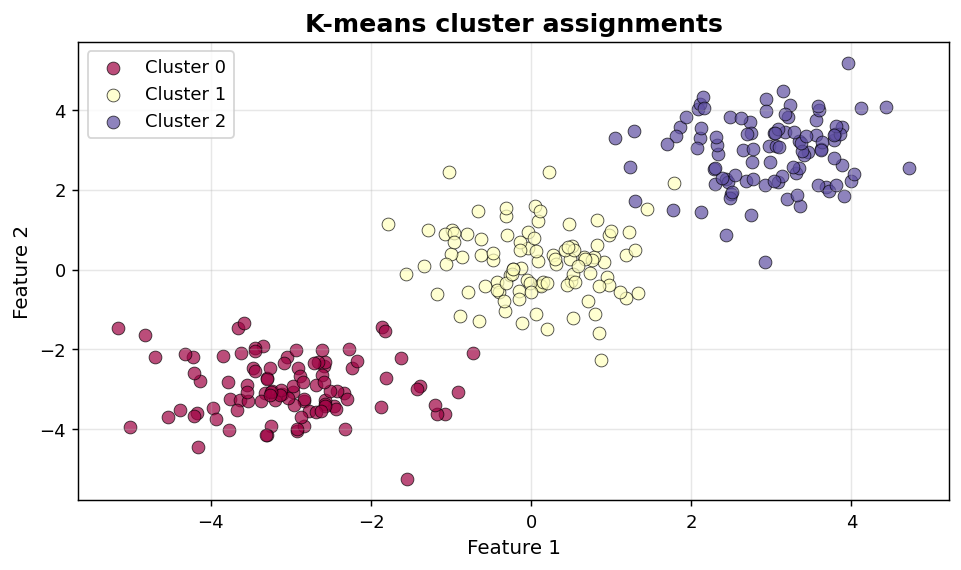
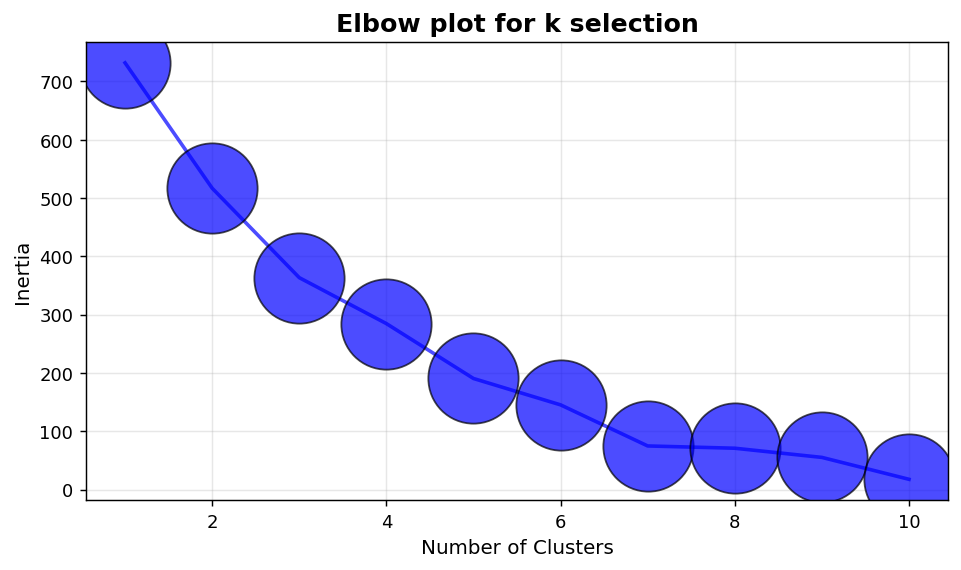

Clustering I: Cluster scatter and elbow
=======================================

Visual diagnostics for partitional clustering.

.. contents::
   :local:
   :depth: 1

Scatter plot of cluster assignments
-----------------------------------

:Function: ``dv.clustering.scatter_clusters_static``
:Example slug: ``clustering_scatter``

Situation
~~~~~~~~~

A clustering analyst visualises K-means assignments on a synthetic 3-cluster, 2-D dataset to inspect cluster separation and overlap.

Requirements
~~~~~~~~~~~~

* ``dataviz`` (this package)
* ``numpy``, ``pandas`` and ``matplotlib`` (installed as ``dataviz`` dependencies)
* No additional services or data files — the example uses a deterministic
  synthetic dataset generated from ``numpy.random.default_rng(0)``.

Code (copy-paste ready)
~~~~~~~~~~~~~~~~~~~~~~~

.. code-block:: python
   :linenos:

   import numpy as np
   import pandas as pd
   import matplotlib.pyplot as plt
   import dataviz as dv

   rng = np.random.default_rng(0)

   n = 300
   centers = [(-3, -3), (0, 0), (3, 3)]
   points, labels = [], []
   for i, (cx, cy) in enumerate(centers):
       pts = rng.normal(loc=(cx, cy), scale=0.8, size=(n // 3, 2))
       points.append(pts)
       labels.extend([i] * (n // 3))
   pts_arr = np.vstack(points)
   ax = dv.clustering.scatter_clusters_static(
       x=pts_arr[:, 0], y=pts_arr[:, 1], labels=np.array(labels),
       title="K-means cluster assignments")

   plt.show()

Sample chart
~~~~~~~~~~~~

Notes
~~~~~

For high-dimensional data, project to 2-D with PCA, t-SNE or UMAP before plotting.

Elbow plot for k selection
--------------------------

:Function: ``dv.clustering.elbow_plot_static``
:Example slug: ``clustering_elbow``

Situation
~~~~~~~~~

A practitioner sweeps K-means from k=1 to k=10 and uses the elbow of the inertia curve to pick a reasonable number of clusters.

Requirements
~~~~~~~~~~~~

* ``dataviz`` (this package)
* ``numpy``, ``pandas`` and ``matplotlib`` (installed as ``dataviz`` dependencies)
* No additional services or data files — the example uses a deterministic
  synthetic dataset generated from ``numpy.random.default_rng(0)``.

Code (copy-paste ready)
~~~~~~~~~~~~~~~~~~~~~~~

.. code-block:: python
   :linenos:

   import numpy as np
   import pandas as pd
   import matplotlib.pyplot as plt
   import dataviz as dv

   rng = np.random.default_rng(0)

   k = np.arange(1, 11)
   inertia = 1000 * np.exp(-k / 3) + rng.normal(scale=10, size=10)
   ax = dv.clustering.elbow_plot_static(k, inertia,
                                        title="Elbow plot for k selection")

   plt.show()

Sample chart
~~~~~~~~~~~~

Notes
~~~~~

The elbow heuristic is informal — complement it with silhouette scores or domain knowledge.

