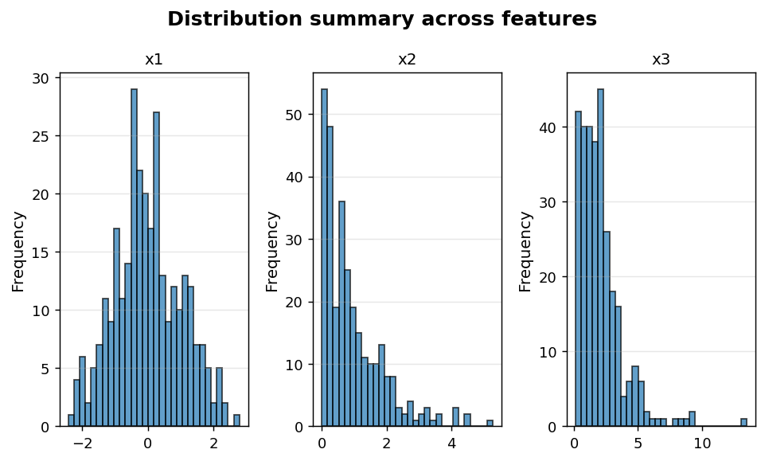
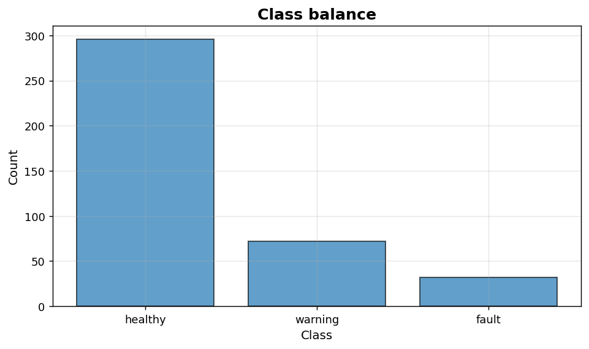

Exploratory data analysis: Distributions and class balance
==========================================================

Fast first-pass EDA helpers.

.. contents::
   :local:
   :depth: 1

Distribution summary across features
------------------------------------

:Function: ``dv.distribution_summary_static``
:Example slug: ``eda_distribution_summary``

Situation
~~~~~~~~~

An analyst inspects the shape of every numeric column in a fresh dataset on a single figure to identify skewed, multi-modal or bounded variables.

Requirements
~~~~~~~~~~~~

* ``dataviz``
* ``numpy``, ``pandas`` and ``matplotlib`` (installed as ``dataviz`` dependencies)
* No additional services or data files — the example uses a deterministic
  synthetic dataset generated from ``numpy.random.default_rng(0)``.

Code (copy-paste ready)
~~~~~~~~~~~~~~~~~~~~~~~

.. code-block:: python
   :linenos:

   import numpy as np
   import pandas as pd
   import matplotlib.pyplot as plt
   import dataviz as dv

   rng = np.random.default_rng(0)

   df = pd.DataFrame({
       "x1": rng.normal(0, 1, size=300),
       "x2": rng.exponential(1.0, size=300),
       "x3": rng.gamma(2.0, 1.0, size=300),
   })
   ax = dv.distribution_summary_static(df,
                                       title="Distribution summary across features")

   plt.show()

Sample chart
~~~~~~~~~~~~

Notes
~~~~~

Useful as a first-pass EDA step. Combine with ``dv.missing_data_plot_static`` to assess completeness alongside shape.

Class balance for classification
--------------------------------

:Function: ``dv.class_distribution_static``
:Example slug: ``eda_class_distribution``

Situation
~~~~~~~~~

An ML engineer audits the class distribution before training a classifier to decide whether resampling or class weights are required.

Requirements
~~~~~~~~~~~~

* ``dataviz``
* ``numpy``, ``pandas`` and ``matplotlib`` (installed as ``dataviz`` dependencies)
* No additional services or data files — the example uses a deterministic
  synthetic dataset generated from ``numpy.random.default_rng(0)``.

Code (copy-paste ready)
~~~~~~~~~~~~~~~~~~~~~~~

.. code-block:: python
   :linenos:

   import numpy as np
   import pandas as pd
   import matplotlib.pyplot as plt
   import dataviz as dv

   rng = np.random.default_rng(0)

   labels = pd.Series(rng.choice(["healthy", "warning", "fault"],
                                 size=400, p=[0.7, 0.2, 0.1]),
                      name="Status")
   ax = dv.class_distribution_static(labels, title="Class balance")

   plt.show()

Sample chart
~~~~~~~~~~~~

Notes
~~~~~

When the smallest class is below ~5 %, consider stratified sampling, SMOTE-style oversampling or class-weighted losses.

