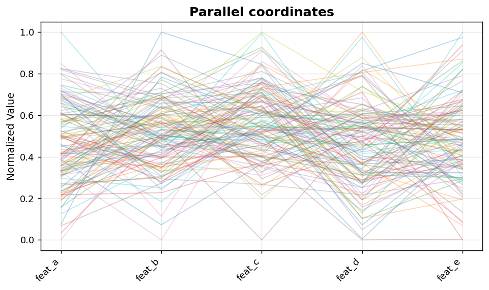
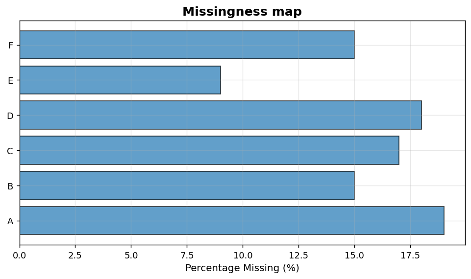

Multivariate and EDA: Parallel coordinates and missingness
==========================================================

High-dimensional line views and dataset-completeness audits.

.. contents::
   :local:
   :depth: 1

Parallel coordinates plot
-------------------------

:Function: ``dv.multivariate.parallel_coordinates_static``
:Example slug: ``multivariate_parallel``

Situation
~~~~~~~~~

A multivariate analyst inspects five features simultaneously across 120 observations to detect crossings and clusters that scatter plots cannot reveal.

Requirements
~~~~~~~~~~~~

* ``dataviz``
* ``numpy``, ``pandas`` and ``matplotlib`` (installed as ``dataviz`` dependencies)
* No additional services or data files — the example uses a deterministic
  synthetic dataset generated from ``numpy.random.default_rng(0)``.

Code (copy-paste ready)
~~~~~~~~~~~~~~~~~~~~~~~

.. code-block:: python
   :linenos:

   import numpy as np
   import pandas as pd
   import matplotlib.pyplot as plt
   import dataviz as dv

   rng = np.random.default_rng(0)

   df = pd.DataFrame(rng.normal(size=(120, 5)),
                     columns=["feat_a", "feat_b", "feat_c", "feat_d", "feat_e"])
   ax = dv.multivariate.parallel_coordinates_static(
       df, title="Parallel coordinates")

   plt.show()

Sample chart
~~~~~~~~~~~~

Notes
~~~~~

Reorder columns to place the most discriminating features adjacent to each other — this maximises information conveyed by the line crossings.

Missing-data map
----------------

:Function: ``dv.missing_data_plot_static``
:Example slug: ``eda_missing``

Situation
~~~~~~~~~

A data engineer audits a fresh extract by visualising the per-column and per-row pattern of missing values before deciding on imputation strategy.

Requirements
~~~~~~~~~~~~

* ``dataviz``
* ``numpy``, ``pandas`` and ``matplotlib`` (installed as ``dataviz`` dependencies)
* No additional services or data files — the example uses a deterministic
  synthetic dataset generated from ``numpy.random.default_rng(0)``.

Code (copy-paste ready)
~~~~~~~~~~~~~~~~~~~~~~~

.. code-block:: python
   :linenos:

   import numpy as np
   import pandas as pd
   import matplotlib.pyplot as plt
   import dataviz as dv

   rng = np.random.default_rng(0)

   df = pd.DataFrame(rng.normal(size=(100, 6)), columns=list("ABCDEF"))
   mask = rng.random(df.shape) < 0.15
   df = df.mask(mask)
   ax = dv.missing_data_plot_static(df, title="Missingness map")

   plt.show()

Sample chart
~~~~~~~~~~~~

Notes
~~~~~

Vertical stripes reveal columns with widespread missingness; horizontal stripes reveal rows that are systematically incomplete.

