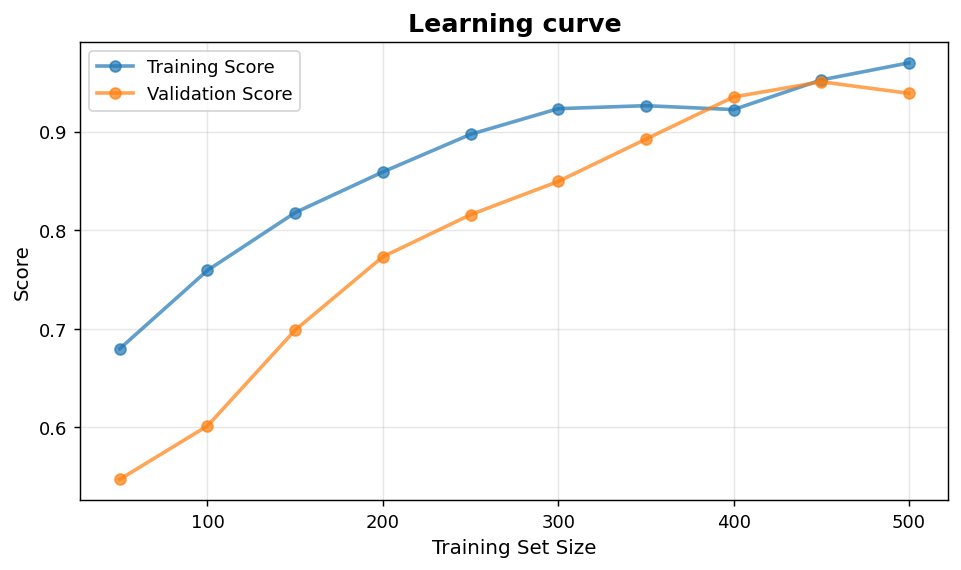
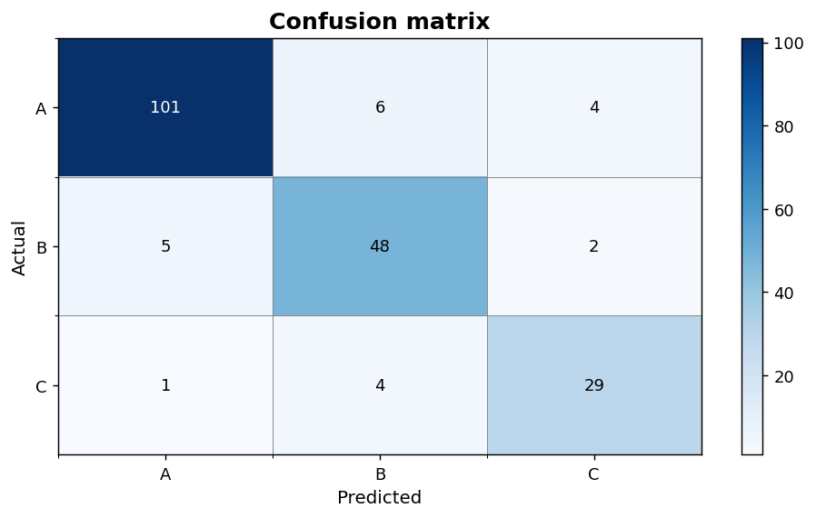

Regression and classification: Learning curve and confusion matrix
==================================================================

Model-quality views that span regression and classification workflows.

.. contents::
   :local:
   :depth: 1

Learning curve
--------------

:Function: ``dv.learning_curve_static``
:Example slug: ``regression_learning``

Situation
~~~~~~~~~

An ML engineer diagnoses whether a model would benefit from more training data by plotting train and validation scores against training-set size.

Requirements
~~~~~~~~~~~~

* ``dataviz`` (this package)
* ``numpy``, ``pandas`` and ``matplotlib`` (installed as ``dataviz`` dependencies)
* No additional services or data files — the example uses a deterministic
  synthetic dataset generated from ``numpy.random.default_rng(0)``.

Code (copy-paste ready)
~~~~~~~~~~~~~~~~~~~~~~~

.. code-block:: python
   :linenos:

   import numpy as np
   import pandas as pd
   import matplotlib.pyplot as plt
   import dataviz as dv

   rng = np.random.default_rng(0)

   sizes = np.linspace(50, 500, 10).astype(int)
   train = 1 - 0.4 * np.exp(-sizes / 200) + rng.normal(scale=0.01, size=10)
   val = 1 - 0.6 * np.exp(-sizes / 200) + rng.normal(scale=0.02, size=10)
   ax = dv.learning_curve_static(sizes, train, val, title="Learning curve")

   plt.show()

Sample chart
~~~~~~~~~~~~

Notes
~~~~~

A persistent gap between training and validation scores indicates overfitting; converging curves at a low score indicate underfitting.

Confusion matrix heatmap
------------------------

:Function: ``dv.confusion_matrix_plot_static``
:Example slug: ``classification_confusion``

Situation
~~~~~~~~~

An ML engineer evaluates a three-class classifier and inspects which class pairs are most often confused with each other.

Requirements
~~~~~~~~~~~~

* ``dataviz`` (this package)
* ``numpy``, ``pandas`` and ``matplotlib`` (installed as ``dataviz`` dependencies)
* No additional services or data files — the example uses a deterministic
  synthetic dataset generated from ``numpy.random.default_rng(0)``.

Code (copy-paste ready)
~~~~~~~~~~~~~~~~~~~~~~~

.. code-block:: python
   :linenos:

   import numpy as np
   import pandas as pd
   import matplotlib.pyplot as plt
   import dataviz as dv

   rng = np.random.default_rng(0)

   y_true = rng.choice([0, 1, 2], size=200, p=[0.5, 0.3, 0.2])
   y_pred = y_true.copy()
   flip = rng.random(200) < 0.15
   y_pred[flip] = rng.choice([0, 1, 2], size=flip.sum())
   cm = np.zeros((3, 3), dtype=int)
   for t, p in zip(y_true, y_pred):
       cm[t, p] += 1
   ax = dv.confusion_matrix_plot_static(cm, labels=["A", "B", "C"],
                                        title="Confusion matrix")

   plt.show()

Sample chart
~~~~~~~~~~~~

Notes
~~~~~

Pass a precomputed confusion matrix. Use ``sklearn.metrics.confusion_matrix(y_true, y_pred)`` when working with real predictions.

