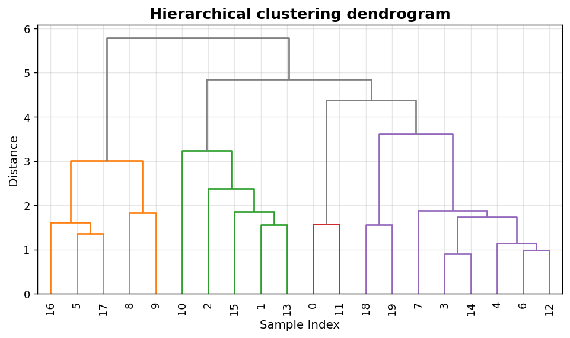
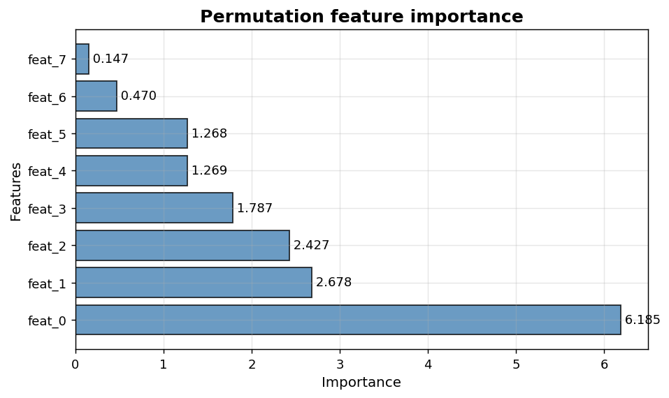

Clustering and XAI: Dendrogram and feature importance
=====================================================

Hierarchical clustering structure and interpretability rankings.

.. contents::
   :local:
   :depth: 1

Hierarchical clustering dendrogram
----------------------------------

:Function: ``dv.clustering.dendrogram_static``
:Example slug: ``clustering_dendrogram``

Situation
~~~~~~~~~

An analyst uses Ward linkage on a 20-observation, 4-feature dataset and inspects the dendrogram to choose a cut height that yields meaningful clusters.

Requirements
~~~~~~~~~~~~

* ``dataviz``
* ``numpy``, ``pandas`` and ``matplotlib`` (installed as ``dataviz`` dependencies)
* No additional services or data files — the example uses a deterministic
  synthetic dataset generated from ``numpy.random.default_rng(0)``.

Code (copy-paste ready)
~~~~~~~~~~~~~~~~~~~~~~~

.. code-block:: python
   :linenos:

   import numpy as np
   import pandas as pd
   import matplotlib.pyplot as plt
   import dataviz as dv

   rng = np.random.default_rng(0)

   from scipy.cluster.hierarchy import linkage
   data = rng.normal(size=(20, 4))
   Z = linkage(data, method="ward")
   ax = dv.clustering.dendrogram_static(Z,
                                        title="Hierarchical clustering dendrogram")

   plt.show()

Sample chart
~~~~~~~~~~~~

Notes
~~~~~

Requires ``scipy``. Different linkage methods (single, complete, average, ward) produce different tree structures — try several.

Feature importance ranking
--------------------------

:Function: ``dv.xai.feature_importance_static``
:Example slug: ``xai_feature_importance``

Situation
~~~~~~~~~

An interpretability lead presents the top-K most important features from a trained model to non-technical stakeholders.

Requirements
~~~~~~~~~~~~

* ``dataviz``
* ``numpy``, ``pandas`` and ``matplotlib`` (installed as ``dataviz`` dependencies)
* No additional services or data files — the example uses a deterministic
  synthetic dataset generated from ``numpy.random.default_rng(0)``.

Code (copy-paste ready)
~~~~~~~~~~~~~~~~~~~~~~~

.. code-block:: python
   :linenos:

   import numpy as np
   import pandas as pd
   import matplotlib.pyplot as plt
   import dataviz as dv

   rng = np.random.default_rng(0)

   features = [f"feat_{i}" for i in range(8)]
   importances = pd.Series(np.sort(rng.exponential(1.0, size=8))[::-1],
                           index=features, name="importance")
   ax = dv.xai.feature_importance_static(importances,
                                         title="Permutation feature importance")

   plt.show()

Sample chart
~~~~~~~~~~~~

Notes
~~~~~

The helper accepts a pandas ``Series`` indexed by feature name. For permutation importances, pass the mean of repeated permutations.

