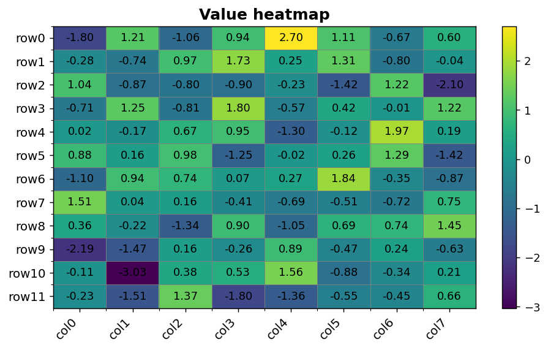
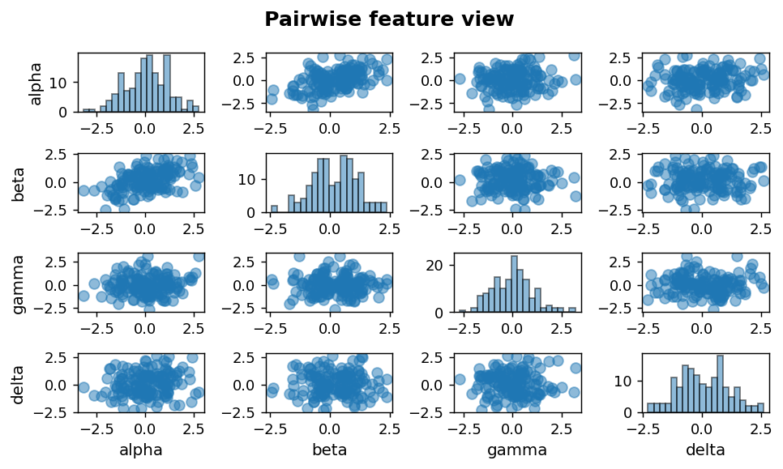

Multivariate I: Heatmap and pairplot
====================================

Matrix views and pairwise scatter for multi-feature exploration.

.. contents::
   :local:
   :depth: 1

Value heatmap of a matrix
-------------------------

:Function: ``dv.multivariate.heatmap_static``
:Example slug: ``multivariate_heatmap``

Situation
~~~~~~~~~

A geneticist visualises a 12 × 8 matrix of normalized expression values to spot row and column patterns at a glance.

Requirements
~~~~~~~~~~~~

* ``dataviz``
* ``numpy``, ``pandas`` and ``matplotlib`` (installed as ``dataviz`` dependencies)
* No additional services or data files — the example uses a deterministic
  synthetic dataset generated from ``numpy.random.default_rng(0)``.

Code (copy-paste ready)
~~~~~~~~~~~~~~~~~~~~~~~

.. code-block:: python
   :linenos:

   import numpy as np
   import pandas as pd
   import matplotlib.pyplot as plt
   import dataviz as dv

   rng = np.random.default_rng(0)

   df = pd.DataFrame(rng.normal(size=(12, 8)),
                     index=[f"row{i}" for i in range(12)],
                     columns=[f"col{i}" for i in range(8)])
   ax = dv.multivariate.heatmap_static(df, title="Value heatmap")

   plt.show()

Sample chart
~~~~~~~~~~~~

Notes
~~~~~

The diverging colormap defaults are tuned for centered-on-zero data; pass ``cmap='viridis'`` for non-negative matrices.

Pairwise scatter matrix
-----------------------

:Function: ``dv.multivariate.pairplot_static``
:Example slug: ``multivariate_pairplot``

Situation
~~~~~~~~~

An exploratory analyst inspects all pairwise relationships among four features in a 150-row dataset to identify candidates for modelling.

Requirements
~~~~~~~~~~~~

* ``dataviz``
* ``numpy``, ``pandas`` and ``matplotlib`` (installed as ``dataviz`` dependencies)
* No additional services or data files — the example uses a deterministic
  synthetic dataset generated from ``numpy.random.default_rng(0)``.

Code (copy-paste ready)
~~~~~~~~~~~~~~~~~~~~~~~

.. code-block:: python
   :linenos:

   import numpy as np
   import pandas as pd
   import matplotlib.pyplot as plt
   import dataviz as dv

   rng = np.random.default_rng(0)

   df = pd.DataFrame(rng.normal(size=(150, 4)),
                     columns=["alpha", "beta", "gamma", "delta"])
   df["alpha"] += df["beta"] * 0.5
   fig = dv.multivariate.pairplot_static(df, title="Pairwise feature view")

   plt.show()

Sample chart
~~~~~~~~~~~~

Notes
~~~~~

Pairplots scale quadratically in the number of features. Keep the feature count below ~8 or sample the data to keep the figure legible.

