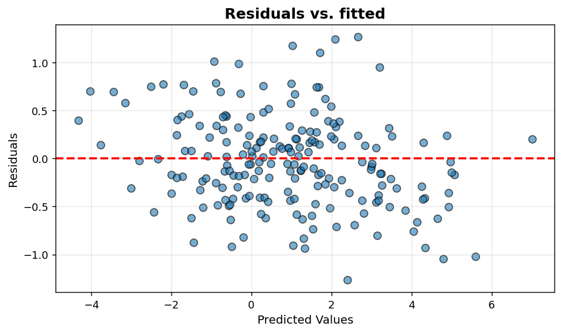
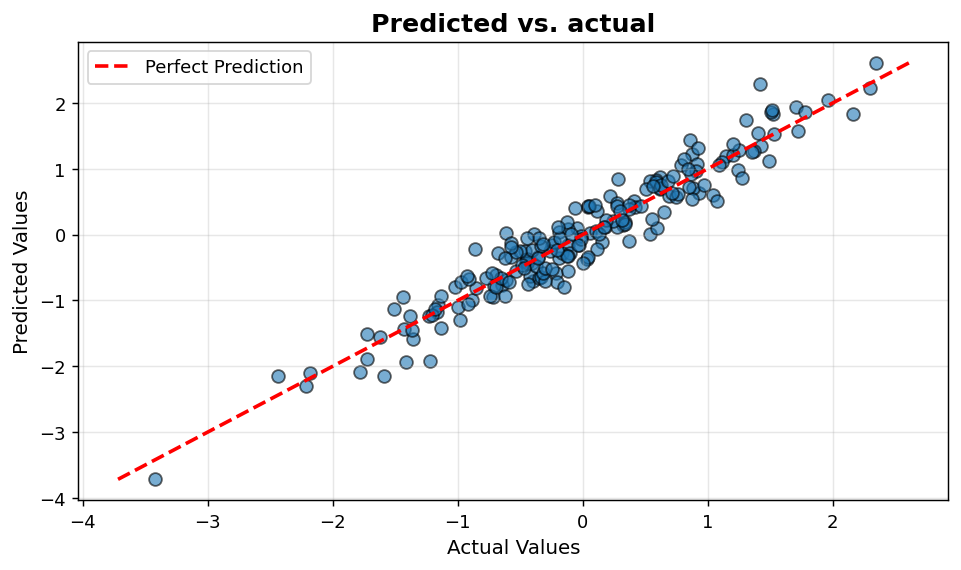

Regression diagnostics I: Residual and prediction
=================================================

Standard residual and calibration diagnostics for regression models.

.. contents::
   :local:
   :depth: 1

Residuals vs. fitted
--------------------

:Function: ``dv.residual_plot_static``
:Example slug: ``regression_residual``

Situation
~~~~~~~~~

A modeller inspects residuals against fitted values to check the linearity and homoscedasticity assumptions of a regression model.

Requirements
~~~~~~~~~~~~

* ``dataviz`` (this package)
* ``numpy``, ``pandas`` and ``matplotlib`` (installed as ``dataviz`` dependencies)
* No additional services or data files — the example uses a deterministic
  synthetic dataset generated from ``numpy.random.default_rng(0)``.

Code (copy-paste ready)
~~~~~~~~~~~~~~~~~~~~~~~

.. code-block:: python
   :linenos:

   import numpy as np
   import pandas as pd
   import matplotlib.pyplot as plt
   import dataviz as dv

   rng = np.random.default_rng(0)

   n = 200
   x = rng.normal(size=n)
   y_true = 2 * x + 1
   y_pred = y_true + rng.normal(scale=0.5, size=n)
   ax = dv.residual_plot_static(y_true, y_pred, title="Residuals vs. fitted")

   plt.show()

Sample chart
~~~~~~~~~~~~

Notes
~~~~~

A funnel or fan shape indicates heteroscedasticity; a U-shape indicates a missing non-linear term.

Predicted vs. actual
--------------------

:Function: ``dv.prediction_plot_static``
:Example slug: ``regression_prediction``

Situation
~~~~~~~~~

A team showcases the calibration of a regression model by plotting predicted values against ground truth alongside the ``y = x`` reference line.

Requirements
~~~~~~~~~~~~

* ``dataviz`` (this package)
* ``numpy``, ``pandas`` and ``matplotlib`` (installed as ``dataviz`` dependencies)
* No additional services or data files — the example uses a deterministic
  synthetic dataset generated from ``numpy.random.default_rng(0)``.

Code (copy-paste ready)
~~~~~~~~~~~~~~~~~~~~~~~

.. code-block:: python
   :linenos:

   import numpy as np
   import pandas as pd
   import matplotlib.pyplot as plt
   import dataviz as dv

   rng = np.random.default_rng(0)

   n = 200
   y_true = rng.normal(size=n)
   y_pred = y_true + rng.normal(scale=0.3, size=n)
   ax = dv.prediction_plot_static(y_true, y_pred, title="Predicted vs. actual")

   plt.show()

Sample chart
~~~~~~~~~~~~

Notes
~~~~~

A tight band around the 45-degree line indicates a well-calibrated model. Systematic departures suggest a misspecified or biased estimator.

