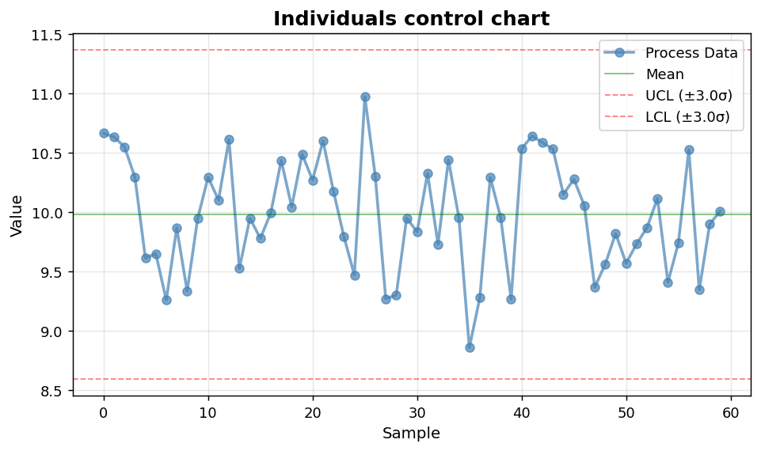
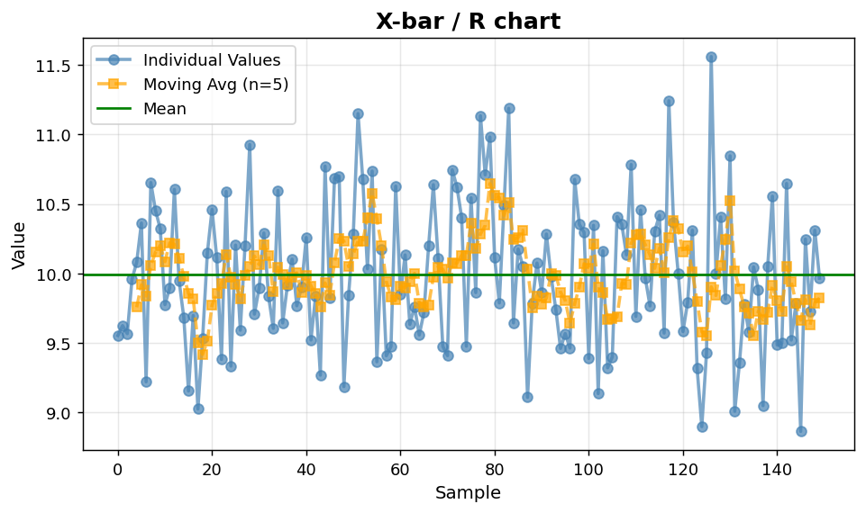

SPC I: Individuals and X-bar / R
================================

Foundational Shewhart charts for continuous data.

.. contents::
   :local:
   :depth: 1

Individuals (I) control chart
-----------------------------

:Function: ``dv.control_chart_static``
:Example slug: ``spc_control``

Situation
~~~~~~~~~

A quality engineer monitors the diameter of a machined part and wants to flag points outside the natural ±3-sigma control limits.

Requirements
~~~~~~~~~~~~

* ``dataviz``
* ``numpy``, ``pandas`` and ``matplotlib`` (installed as ``dataviz`` dependencies)
* No additional services or data files — the example uses a deterministic
  synthetic dataset generated from ``numpy.random.default_rng(0)``.

Code (copy-paste ready)
~~~~~~~~~~~~~~~~~~~~~~~

.. code-block:: python
   :linenos:

   import numpy as np
   import pandas as pd
   import matplotlib.pyplot as plt
   import dataviz as dv

   rng = np.random.default_rng(0)

   values = pd.Series(rng.normal(10, 0.5, size=60), name="Diameter (mm)")
   ax = dv.control_chart_static(values, title="Individuals control chart")

   plt.show()

Sample chart
~~~~~~~~~~~~

Notes
~~~~~

The helper computes control limits from the data itself. For ongoing monitoring, freeze the limits from a baseline period and reuse them.

X-bar / R chart for subgrouped data
-----------------------------------

:Function: ``dv.x_range_chart_static``
:Example slug: ``spc_x_range``

Situation
~~~~~~~~~

A manufacturing engineer groups 150 measurements into 30 subgroups of five and monitors both the subgroup mean (X-bar) and within-subgroup range (R).

Requirements
~~~~~~~~~~~~

* ``dataviz``
* ``numpy``, ``pandas`` and ``matplotlib`` (installed as ``dataviz`` dependencies)
* No additional services or data files — the example uses a deterministic
  synthetic dataset generated from ``numpy.random.default_rng(0)``.

Code (copy-paste ready)
~~~~~~~~~~~~~~~~~~~~~~~

.. code-block:: python
   :linenos:

   import numpy as np
   import pandas as pd
   import matplotlib.pyplot as plt
   import dataviz as dv

   rng = np.random.default_rng(0)

   values = pd.Series(rng.normal(10, 0.5, size=150), name="Measurement")
   ax = dv.x_range_chart_static(values, subgroup_size=5,
                                title="X-bar / R chart")

   plt.show()

Sample chart
~~~~~~~~~~~~

Notes
~~~~~

``subgroup_size`` should reflect the rational subgrouping of the process, typically 4-6 observations per subgroup.

