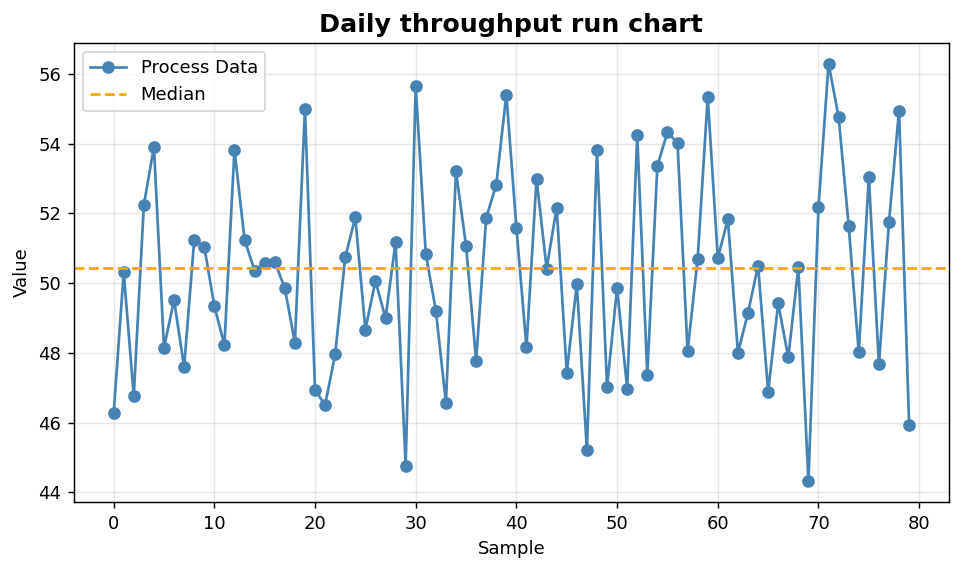
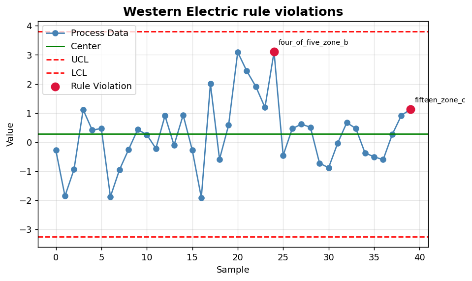

SPC II: Run charts and rule violations
======================================

Pre-control views and Western Electric pattern detection.

.. contents::
   :local:
   :depth: 1

Run chart of daily throughput
-----------------------------

:Function: ``dv.run_chart_static``
:Example slug: ``spc_run``

Situation
~~~~~~~~~

An operations lead reviews daily throughput and looks for runs, trends and cycles before computing formal control limits.

Requirements
~~~~~~~~~~~~

* ``dataviz``
* ``numpy``, ``pandas`` and ``matplotlib`` (installed as ``dataviz`` dependencies)
* No additional services or data files — the example uses a deterministic
  synthetic dataset generated from ``numpy.random.default_rng(0)``.

Code (copy-paste ready)
~~~~~~~~~~~~~~~~~~~~~~~

.. code-block:: python
   :linenos:

   import numpy as np
   import pandas as pd
   import matplotlib.pyplot as plt
   import dataviz as dv

   rng = np.random.default_rng(0)

   values = pd.Series(rng.normal(50, 3, size=80), name="Throughput")
   ax = dv.run_chart_static(values, title="Daily throughput run chart")

   plt.show()

Sample chart
~~~~~~~~~~~~

Notes
~~~~~

Run charts are a useful precursor to a control chart and require fewer distributional assumptions.

Western Electric rule violations
--------------------------------

:Function: ``dv.rule_violation_chart_static``
:Example slug: ``spc_rules``

Situation
~~~~~~~~~

A reliability engineer flags subtle process shifts that would not trigger a 3-sigma rule but match Western Electric patterns (e.g. eight points on one side of the mean).

Requirements
~~~~~~~~~~~~

* ``dataviz``
* ``numpy``, ``pandas`` and ``matplotlib`` (installed as ``dataviz`` dependencies)
* No additional services or data files — the example uses a deterministic
  synthetic dataset generated from ``numpy.random.default_rng(0)``.

Code (copy-paste ready)
~~~~~~~~~~~~~~~~~~~~~~~

.. code-block:: python
   :linenos:

   import numpy as np
   import pandas as pd
   import matplotlib.pyplot as plt
   import dataviz as dv

   rng = np.random.default_rng(0)

   values = pd.Series(rng.normal(0, 1, size=40))
   values.iloc[20:25] += 2.5
   ax = dv.rule_violation_chart_static(values,
                                       title="Western Electric rule violations")

   plt.show()

Sample chart
~~~~~~~~~~~~

Notes
~~~~~

The function highlights points that violate the standard pattern rules. Investigate clusters of violations rather than isolated ones.

