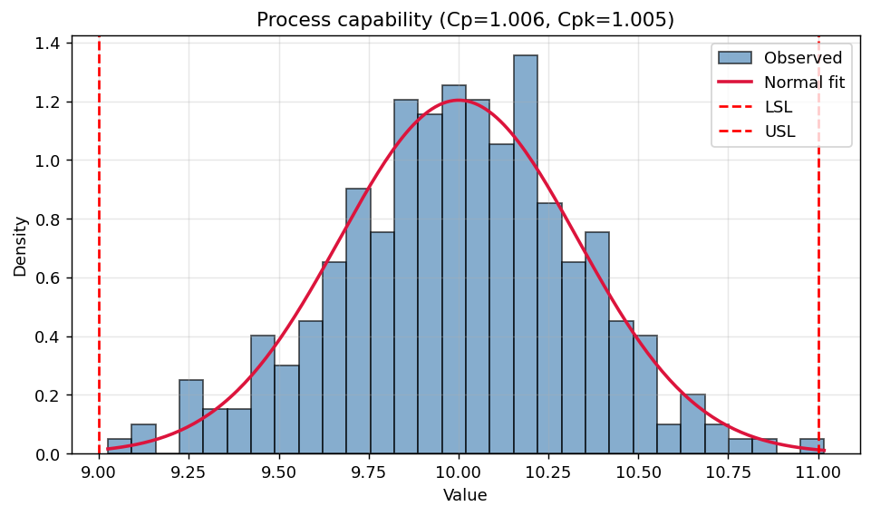
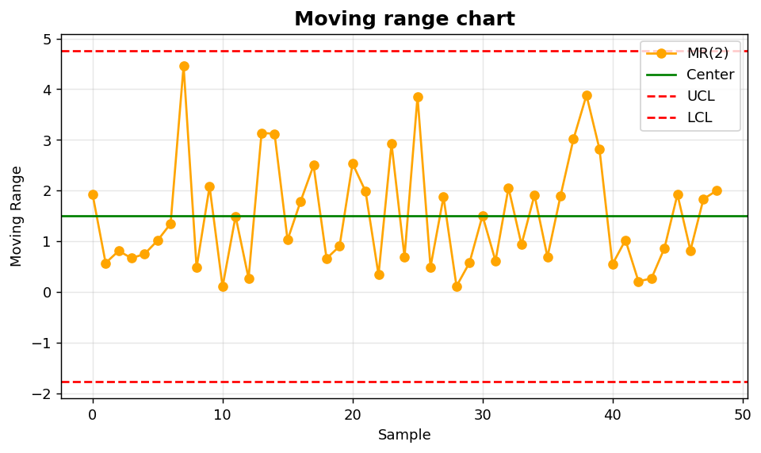

SPC III: Capability and moving range
====================================

Process capability assessment and short-term variation.

.. contents::
   :local:
   :depth: 1

Process capability histogram
----------------------------

:Function: ``dv.capability_histogram_static``
:Example slug: ``spc_capability``

Situation
~~~~~~~~~

A quality manager evaluates whether the process distribution fits within engineering specification limits (LSL, USL) and reports Cp / Cpk values.

Requirements
~~~~~~~~~~~~

* ``dataviz`` (this package)
* ``numpy``, ``pandas`` and ``matplotlib`` (installed as ``dataviz`` dependencies)
* No additional services or data files — the example uses a deterministic
  synthetic dataset generated from ``numpy.random.default_rng(0)``.

Code (copy-paste ready)
~~~~~~~~~~~~~~~~~~~~~~~

.. code-block:: python
   :linenos:

   import numpy as np
   import pandas as pd
   import matplotlib.pyplot as plt
   import dataviz as dv

   rng = np.random.default_rng(0)

   values = pd.Series(rng.normal(10, 0.3, size=300), name="Critical dimension")
   ax = dv.capability_histogram_static(values, lsl=9.0, usl=11.0,
                                       title="Process capability")

   plt.show()

Sample chart
~~~~~~~~~~~~

Notes
~~~~~

Capability indices assume an in-control, approximately normal process. Verify both assumptions with a control chart and a normality test before reporting.

Moving-range chart
------------------

:Function: ``dv.moving_range_chart_static``
:Example slug: ``spc_moving_range``

Situation
~~~~~~~~~

A process engineer monitors short-term variation in a continuous reading where natural subgrouping is not feasible.

Requirements
~~~~~~~~~~~~

* ``dataviz`` (this package)
* ``numpy``, ``pandas`` and ``matplotlib`` (installed as ``dataviz`` dependencies)
* No additional services or data files — the example uses a deterministic
  synthetic dataset generated from ``numpy.random.default_rng(0)``.

Code (copy-paste ready)
~~~~~~~~~~~~~~~~~~~~~~~

.. code-block:: python
   :linenos:

   import numpy as np
   import pandas as pd
   import matplotlib.pyplot as plt
   import dataviz as dv

   rng = np.random.default_rng(0)

   values = pd.Series(rng.normal(20, 1.5, size=50), name="Pressure (psi)")
   ax = dv.moving_range_chart_static(values, title="Moving range chart")

   plt.show()

Sample chart
~~~~~~~~~~~~

Notes
~~~~~

Use the moving-range chart together with an individuals chart (``dv.control_chart_static``) for full SPC coverage.

