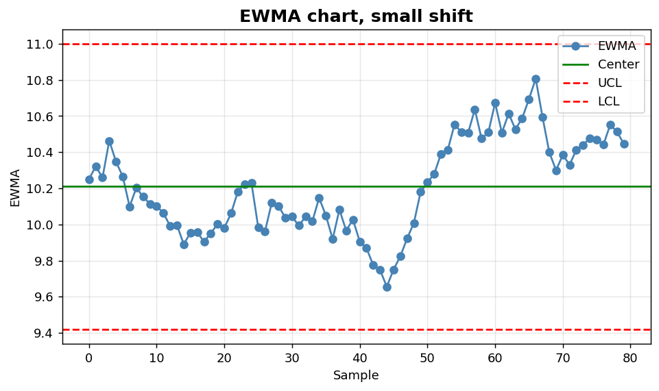
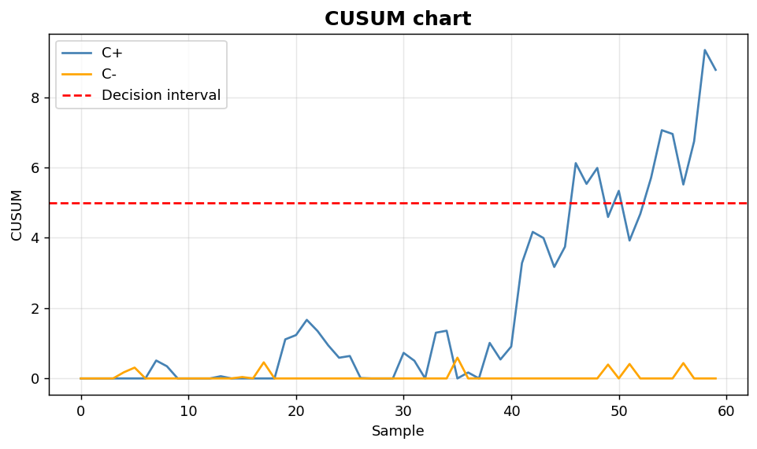

SPC IV: EWMA and CUSUM
======================

Memory-based charts for small process shifts.

.. contents::
   :local:
   :depth: 1

EWMA chart for small process shifts
-----------------------------------

:Function: ``dv.ewma_chart_static``
:Example slug: ``spc_ewma``

Situation
~~~~~~~~~

An engineer monitors a process where the shift of interest is small (< 1 sigma) and a standard control chart would react too slowly.

Requirements
~~~~~~~~~~~~

* ``dataviz``
* ``numpy``, ``pandas`` and ``matplotlib`` (installed as ``dataviz`` dependencies)
* No additional services or data files — the example uses a deterministic
  synthetic dataset generated from ``numpy.random.default_rng(0)``.

Code (copy-paste ready)
~~~~~~~~~~~~~~~~~~~~~~~

.. code-block:: python
   :linenos:

   import numpy as np
   import pandas as pd
   import matplotlib.pyplot as plt
   import dataviz as dv

   rng = np.random.default_rng(0)

   values = pd.Series(rng.normal(10, 0.5, size=80))
   values.iloc[50:] += 0.6
   ax = dv.ewma_chart_static(values, lambda_=0.2,
                             title="EWMA chart, small shift")

   plt.show()

Sample chart
~~~~~~~~~~~~

Notes
~~~~~

Smaller ``lambda_`` values increase sensitivity to small persistent shifts at the cost of reacting more slowly to large shocks.

CUSUM chart
-----------

:Function: ``dv.cusum_chart_static``
:Example slug: ``spc_cusum``

Situation
~~~~~~~~~

A reliability engineer accumulates deviations from a target value to detect small but persistent biases that would be missed by a standard control chart.

Requirements
~~~~~~~~~~~~

* ``dataviz``
* ``numpy``, ``pandas`` and ``matplotlib`` (installed as ``dataviz`` dependencies)
* No additional services or data files — the example uses a deterministic
  synthetic dataset generated from ``numpy.random.default_rng(0)``.

Code (copy-paste ready)
~~~~~~~~~~~~~~~~~~~~~~~

.. code-block:: python
   :linenos:

   import numpy as np
   import pandas as pd
   import matplotlib.pyplot as plt
   import dataviz as dv

   rng = np.random.default_rng(0)

   values = pd.Series(rng.normal(0, 1, size=60))
   values.iloc[30:] += 0.7
   ax = dv.cusum_chart_static(values, target=0.0, title="CUSUM chart")

   plt.show()

Sample chart
~~~~~~~~~~~~

Notes
~~~~~

CUSUM charts are reset whenever the cumulative sum touches zero or crosses the decision interval ``h``. Tune ``h`` and ``k`` for the target detection performance.

