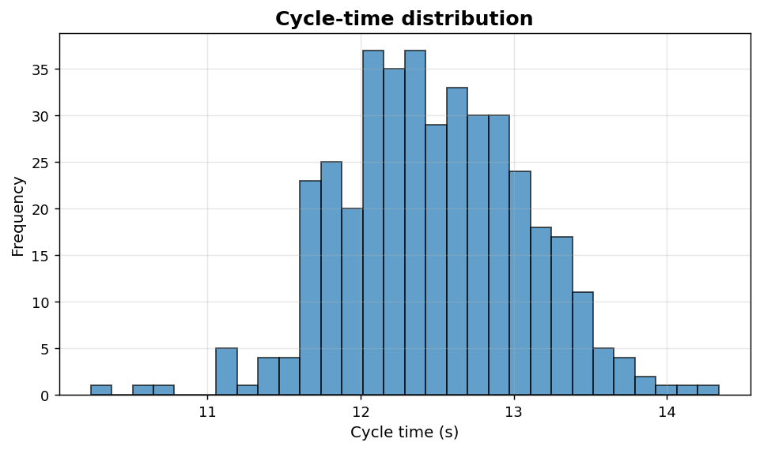
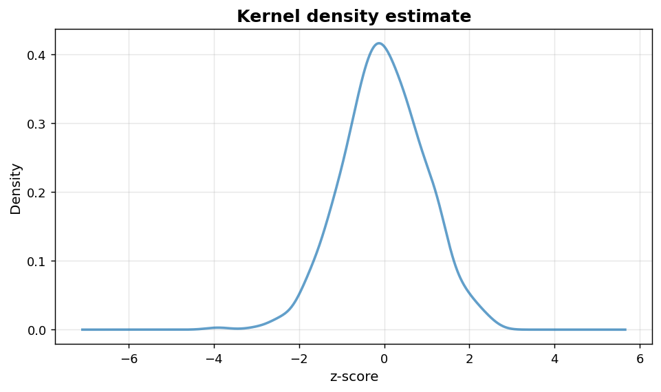

Univariate I: Histograms and densities
======================================

Quick-look distributional plots for a single numeric variable.

.. contents::
   :local:
   :depth: 1

Histogram of cycle times
------------------------

:Function: ``dv.histogram_static``
:Example slug: ``univariate_histogram``

Situation
~~~~~~~~~

A production engineer collects 400 cycle-time measurements from an assembly line and wants to inspect the spread, central tendency and skewness of the process at a glance.

Requirements
~~~~~~~~~~~~

* ``dataviz`` (this package)
* ``numpy``, ``pandas`` and ``matplotlib`` (installed as ``dataviz`` dependencies)
* No additional services or data files — the example uses a deterministic
  synthetic dataset generated from ``numpy.random.default_rng(0)``.

Code (copy-paste ready)
~~~~~~~~~~~~~~~~~~~~~~~

.. code-block:: python
   :linenos:

   import numpy as np
   import pandas as pd
   import matplotlib.pyplot as plt
   import dataviz as dv

   rng = np.random.default_rng(0)

   values = rng.normal(loc=12.5, scale=0.6, size=400)
   ax = dv.histogram_static(values, bins=30, title="Cycle-time distribution")
   ax.set_xlabel("Cycle time (s)")

   plt.show()

Sample chart
~~~~~~~~~~~~

Notes
~~~~~

Increase ``bins`` for high-resolution data; reduce it for small samples. The static version returns a matplotlib ``Axes`` so any subsequent customization (annotations, vertical lines for spec limits, etc.) can be applied directly.

Kernel density estimate
-----------------------

:Function: ``dv.density_static``
:Example slug: ``univariate_density``

Situation
~~~~~~~~~

An analyst wants a smooth, bin-free view of a continuous variable (here, standardized scores) to discuss its shape with stakeholders without committing to a specific bin width.

Requirements
~~~~~~~~~~~~

* ``dataviz`` (this package)
* ``numpy``, ``pandas`` and ``matplotlib`` (installed as ``dataviz`` dependencies)
* No additional services or data files — the example uses a deterministic
  synthetic dataset generated from ``numpy.random.default_rng(0)``.

Code (copy-paste ready)
~~~~~~~~~~~~~~~~~~~~~~~

.. code-block:: python
   :linenos:

   import numpy as np
   import pandas as pd
   import matplotlib.pyplot as plt
   import dataviz as dv

   rng = np.random.default_rng(0)

   values = pd.Series(rng.normal(loc=0, scale=1, size=500), name="z-score")
   ax = dv.density_static(values, fill=False, title="Kernel density estimate")

   plt.show()

Sample chart
~~~~~~~~~~~~

Notes
~~~~~

Pandas is required because ``density_static`` delegates to ``Series.plot.kde``. Pass ``fill=True`` to shade the area below the curve.

