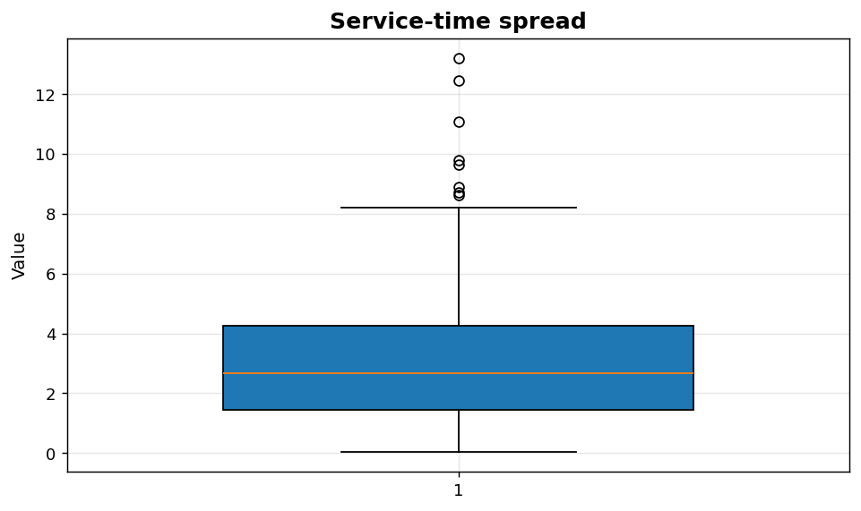
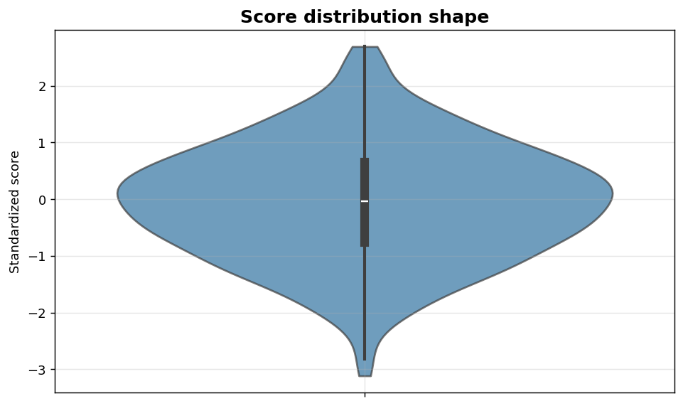

Univariate II: Box and violin plots
===================================

Robust summaries of spread and shape for a single variable.

.. contents::
   :local:
   :depth: 1

Box plot of service times
-------------------------

:Function: ``dv.box_plot_static``
:Example slug: ``univariate_box_plot``

Situation
~~~~~~~~~

A call-center supervisor needs a robust summary of service-time spread that emphasises medians and outliers rather than means, suitable for non-symmetric, right-skewed data.

Requirements
~~~~~~~~~~~~

* ``dataviz`` (this package)
* ``numpy``, ``pandas`` and ``matplotlib`` (installed as ``dataviz`` dependencies)
* No additional services or data files — the example uses a deterministic
  synthetic dataset generated from ``numpy.random.default_rng(0)``.

Code (copy-paste ready)
~~~~~~~~~~~~~~~~~~~~~~~

.. code-block:: python
   :linenos:

   import numpy as np
   import pandas as pd
   import matplotlib.pyplot as plt
   import dataviz as dv

   rng = np.random.default_rng(0)

   values = pd.Series(rng.gamma(2.0, 1.5, size=300), name="Service time (min)")
   ax = dv.box_plot_static(values, title="Service-time spread")

   plt.show()

Sample chart
~~~~~~~~~~~~

Notes
~~~~~

Box plots are robust to outliers but hide multi-modality. Combine with a violin or ridgeline plot when the underlying distribution may be multi-modal.

Violin plot of standardized scores
----------------------------------

:Function: ``dv.violin_plot_static``
:Example slug: ``univariate_violin_plot``

Situation
~~~~~~~~~

A data scientist wants to communicate both the spread and the density shape of a feature in a single visual, which a box plot alone cannot convey.

Requirements
~~~~~~~~~~~~

* ``dataviz`` (this package)
* ``numpy``, ``pandas`` and ``matplotlib`` (installed as ``dataviz`` dependencies)
* No additional services or data files — the example uses a deterministic
  synthetic dataset generated from ``numpy.random.default_rng(0)``.

Code (copy-paste ready)
~~~~~~~~~~~~~~~~~~~~~~~

.. code-block:: python
   :linenos:

   import numpy as np
   import pandas as pd
   import matplotlib.pyplot as plt
   import dataviz as dv

   rng = np.random.default_rng(0)

   values = pd.Series(rng.normal(0, 1, size=400), name="Standardized score")
   ax = dv.violin_plot_static(values, title="Score distribution shape")

   plt.show()

Sample chart
~~~~~~~~~~~~

Notes
~~~~~

Violin plots can be misleading on small samples (``n < 50``). Prefer a strip or dot plot when sample sizes are small.

