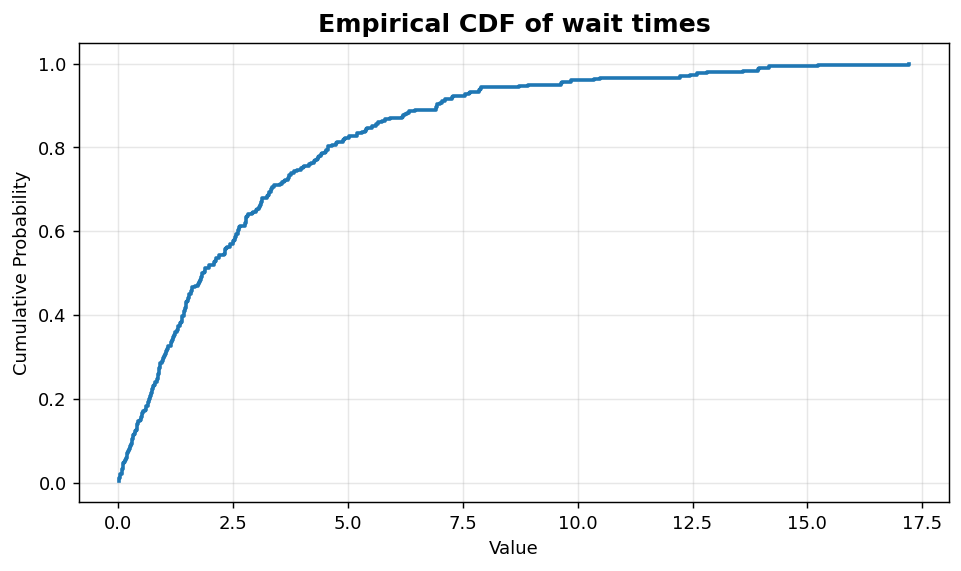
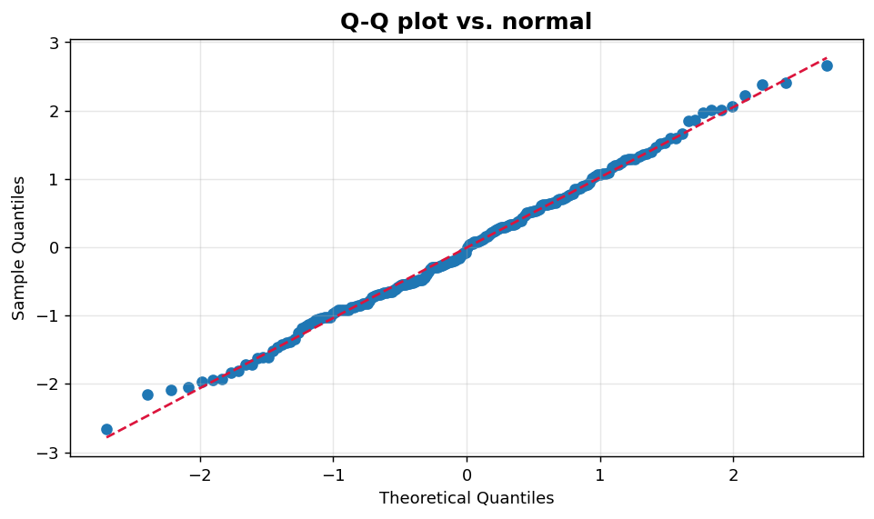

Univariate III: ECDF and Q-Q plot
=================================

Non-parametric and quantile-based views of a sample.

.. contents::
   :local:
   :depth: 1

Empirical cumulative distribution
---------------------------------

:Function: ``dv.ecdf_plot_static``
:Example slug: ``univariate_ecdf``

Situation
~~~~~~~~~

An SRE inspects a wait-time distribution and wants to read percentile thresholds (p50, p95, p99) directly off the chart without smoothing assumptions.

Requirements
~~~~~~~~~~~~

* ``dataviz``
* ``numpy``, ``pandas`` and ``matplotlib`` (installed as ``dataviz`` dependencies)
* No additional services or data files — the example uses a deterministic
  synthetic dataset generated from ``numpy.random.default_rng(0)``.

Code (copy-paste ready)
~~~~~~~~~~~~~~~~~~~~~~~

.. code-block:: python
   :linenos:

   import numpy as np
   import pandas as pd
   import matplotlib.pyplot as plt
   import dataviz as dv

   rng = np.random.default_rng(0)

   values = pd.Series(rng.exponential(scale=3, size=300), name="Wait time (min)")
   ax = dv.ecdf_plot_static(values, title="Empirical CDF of wait times")

   plt.show()

Sample chart
~~~~~~~~~~~~

Notes
~~~~~

ECDFs are non-parametric and well-suited to skewed or heavy-tailed data. They scale well to large samples.

Quantile-quantile plot vs. normal
---------------------------------

:Function: ``dv.qq_plot_static``
:Example slug: ``univariate_qq``

Situation
~~~~~~~~~

A statistician wants to assess whether a sample is plausibly normal before applying a Gaussian-assumption test (t-test, ANOVA, etc.).

Requirements
~~~~~~~~~~~~

* ``dataviz``
* ``numpy``, ``pandas`` and ``matplotlib`` (installed as ``dataviz`` dependencies)
* No additional services or data files — the example uses a deterministic
  synthetic dataset generated from ``numpy.random.default_rng(0)``.

Code (copy-paste ready)
~~~~~~~~~~~~~~~~~~~~~~~

.. code-block:: python
   :linenos:

   import numpy as np
   import pandas as pd
   import matplotlib.pyplot as plt
   import dataviz as dv

   rng = np.random.default_rng(0)

   values = pd.Series(rng.normal(0, 1, size=200), name="Sample")
   ax = dv.qq_plot_static(values, title="Q-Q plot vs. normal")

   plt.show()

Sample chart
~~~~~~~~~~~~

Notes
~~~~~

Points that depart from the reference line on the tails indicate non-normality. Pair with a formal test (Shapiro-Wilk, Anderson-Darling) for confirmation.

