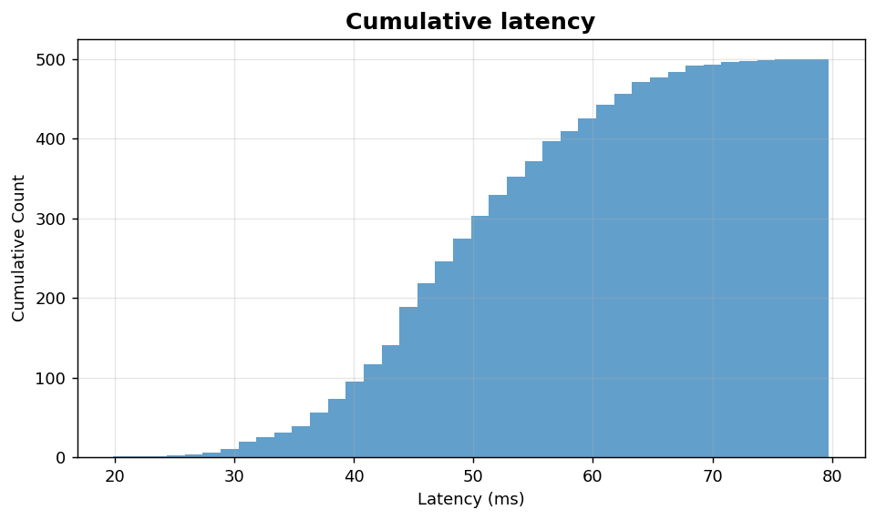
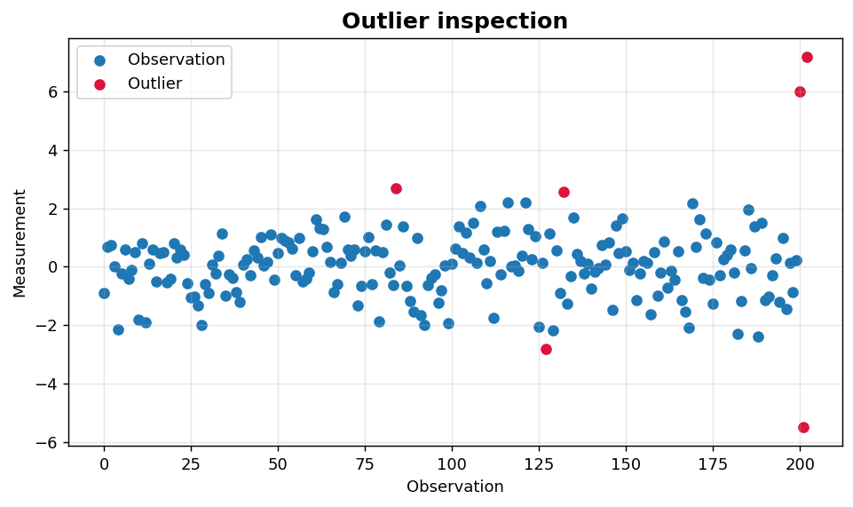

Univariate IV: Cumulative views and outliers
============================================

Cumulative summaries and outlier inspection for univariate data.

.. contents::
   :local:
   :depth: 1

Cumulative histogram of latencies
---------------------------------

:Function: ``dv.cumulative_histogram_static``
:Example slug: ``univariate_cumhist``

Situation
~~~~~~~~~

A platform engineer wants to estimate the proportion of requests below a target latency, e.g. ``P[latency < 60 ms]``, directly from a histogram.

Requirements
~~~~~~~~~~~~

* ``dataviz``
* ``numpy``, ``pandas`` and ``matplotlib`` (installed as ``dataviz`` dependencies)
* No additional services or data files — the example uses a deterministic
  synthetic dataset generated from ``numpy.random.default_rng(0)``.

Code (copy-paste ready)
~~~~~~~~~~~~~~~~~~~~~~~

.. code-block:: python
   :linenos:

   import numpy as np
   import pandas as pd
   import matplotlib.pyplot as plt
   import dataviz as dv

   rng = np.random.default_rng(0)

   values = pd.Series(rng.normal(50, 10, size=500), name="Latency (ms)")
   ax = dv.cumulative_histogram_static(values, bins=40, title="Cumulative latency")

   plt.show()

Sample chart
~~~~~~~~~~~~

Notes
~~~~~

Cumulative histograms are easier to read than ECDFs for audiences unfamiliar with statistics while preserving similar information.

Outlier inspection plot
-----------------------

:Function: ``dv.outlier_plot_static``
:Example slug: ``univariate_outlier``

Situation
~~~~~~~~~

A quality engineer suspects a small set of measurements deviates strongly from the bulk of the data and wants to visualize how many points exceed the typical range before deciding to remove or investigate them.

Requirements
~~~~~~~~~~~~

* ``dataviz``
* ``numpy``, ``pandas`` and ``matplotlib`` (installed as ``dataviz`` dependencies)
* No additional services or data files — the example uses a deterministic
  synthetic dataset generated from ``numpy.random.default_rng(0)``.

Code (copy-paste ready)
~~~~~~~~~~~~~~~~~~~~~~~

.. code-block:: python
   :linenos:

   import numpy as np
   import pandas as pd
   import matplotlib.pyplot as plt
   import dataviz as dv

   rng = np.random.default_rng(0)

   base = rng.normal(0, 1, size=200)
   outliers = np.array([6.0, -5.5, 7.2])
   values = pd.Series(np.concatenate([base, outliers]), name="Measurement")
   ax = dv.outlier_plot_static(values, title="Outlier inspection")

   plt.show()

Sample chart
~~~~~~~~~~~~

Notes
~~~~~

The helper flags points outside 1.5 * IQR by default. Always investigate flagged points before discarding — outliers may be the most informative observations.

