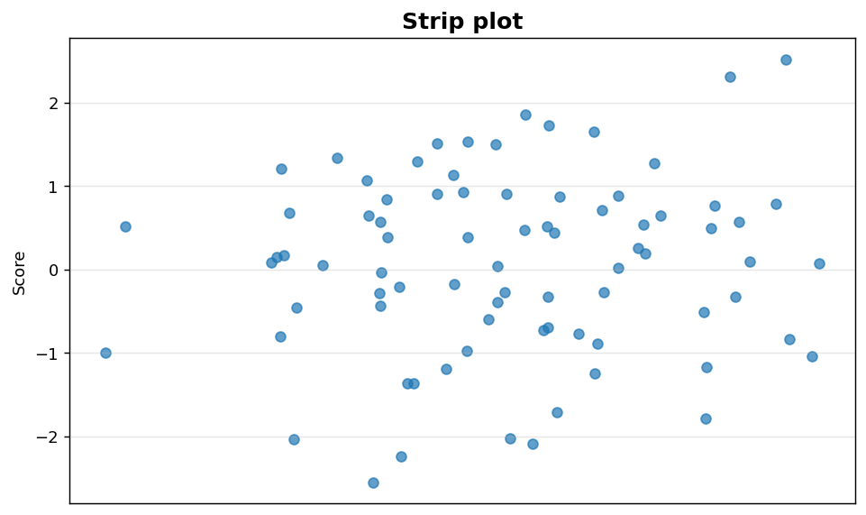
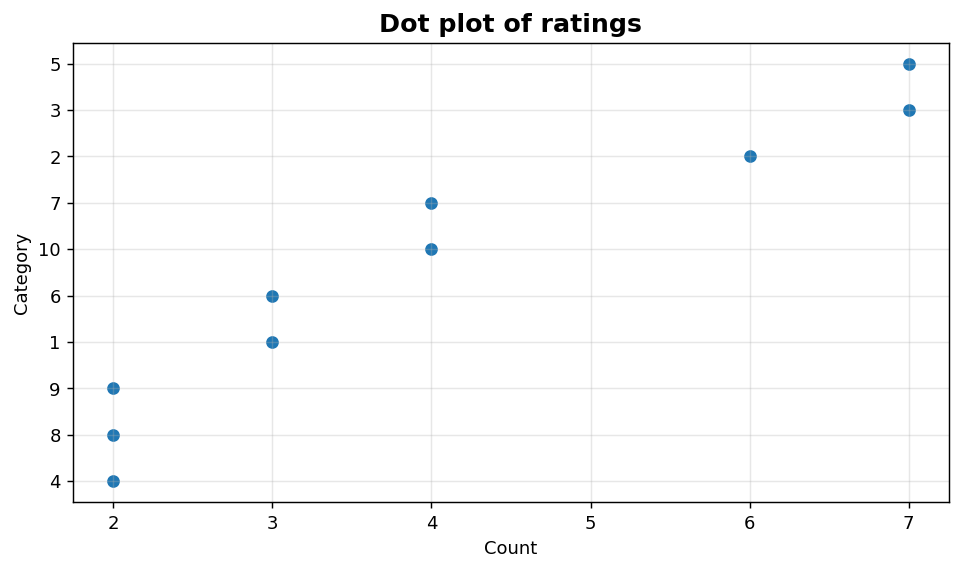

Univariate V: Strip and dot plots
=================================

Compact, observation-level views ideal for small samples.

.. contents::
   :local:
   :depth: 1

Strip plot for small samples
----------------------------

:Function: ``dv.strip_plot_static``
:Example slug: ``univariate_strip``

Situation
~~~~~~~~~

A researcher has a small sample (n = 80) and prefers to show every individual observation rather than smoothing it into a density or histogram.

Requirements
~~~~~~~~~~~~

* ``dataviz`` (this package)
* ``numpy``, ``pandas`` and ``matplotlib`` (installed as ``dataviz`` dependencies)
* No additional services or data files — the example uses a deterministic
  synthetic dataset generated from ``numpy.random.default_rng(0)``.

Code (copy-paste ready)
~~~~~~~~~~~~~~~~~~~~~~~

.. code-block:: python
   :linenos:

   import numpy as np
   import pandas as pd
   import matplotlib.pyplot as plt
   import dataviz as dv

   rng = np.random.default_rng(0)

   values = pd.Series(rng.normal(size=80), name="Score")
   ax = dv.strip_plot_static(values, title="Strip plot")

   plt.show()

Sample chart
~~~~~~~~~~~~

Notes
~~~~~

Strip plots avoid the binning artefacts of histograms and are ideal for n in the 10-200 range.

Dot plot of integer ratings
---------------------------

:Function: ``dv.dot_plot_static``
:Example slug: ``univariate_dot``

Situation
~~~~~~~~~

A UX team summarises survey ratings on a 1-10 integer scale and wants every observation to remain visible while emphasising frequency.

Requirements
~~~~~~~~~~~~

* ``dataviz`` (this package)
* ``numpy``, ``pandas`` and ``matplotlib`` (installed as ``dataviz`` dependencies)
* No additional services or data files — the example uses a deterministic
  synthetic dataset generated from ``numpy.random.default_rng(0)``.

Code (copy-paste ready)
~~~~~~~~~~~~~~~~~~~~~~~

.. code-block:: python
   :linenos:

   import numpy as np
   import pandas as pd
   import matplotlib.pyplot as plt
   import dataviz as dv

   rng = np.random.default_rng(0)

   values = pd.Series(rng.integers(1, 11, size=40), name="Rating")
   ax = dv.dot_plot_static(values, title="Dot plot of ratings")

   plt.show()

Sample chart
~~~~~~~~~~~~

Notes
~~~~~

Dot plots work best on discrete, low-cardinality values. They are a natural alternative to bar charts when sample sizes are modest.

