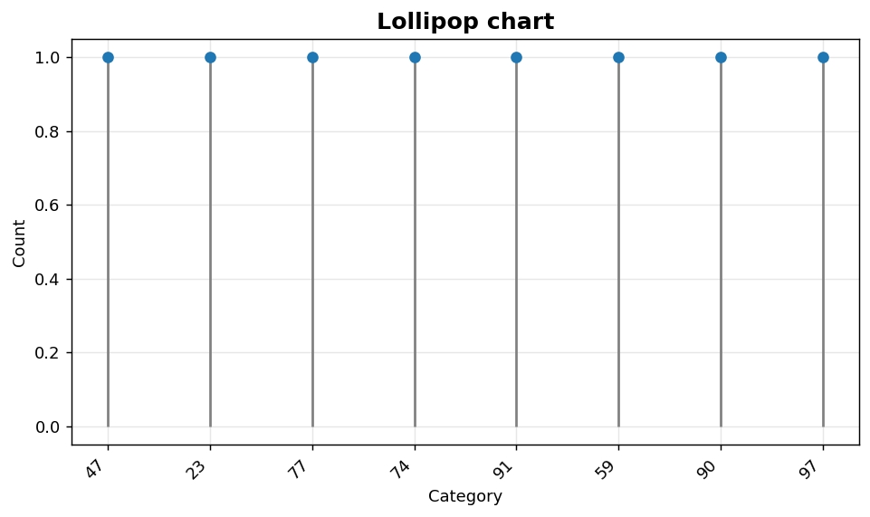
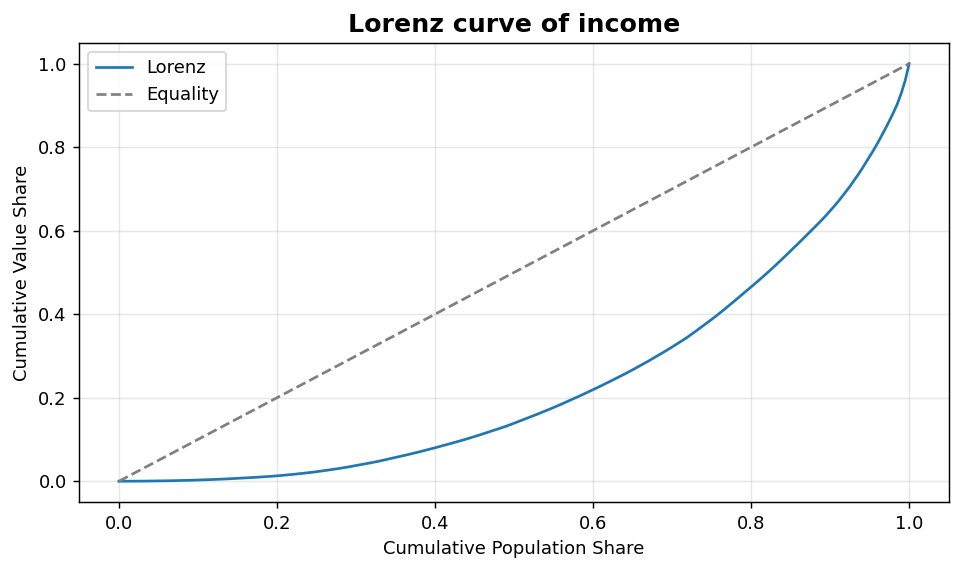

Univariate VI: Lollipop and Lorenz
==================================

Ranking and inequality views.

.. contents::
   :local:
   :depth: 1

Lollipop chart of item counts
-----------------------------

:Function: ``dv.lollipop_chart_static``
:Example slug: ``univariate_lollipop``

Situation
~~~~~~~~~

A product manager ranks items by count and wants a less visually heavy alternative to a bar chart that still emphasises differences in magnitude.

Requirements
~~~~~~~~~~~~

* ``dataviz`` (this package)
* ``numpy``, ``pandas`` and ``matplotlib`` (installed as ``dataviz`` dependencies)
* No additional services or data files — the example uses a deterministic
  synthetic dataset generated from ``numpy.random.default_rng(0)``.

Code (copy-paste ready)
~~~~~~~~~~~~~~~~~~~~~~~

.. code-block:: python
   :linenos:

   import numpy as np
   import pandas as pd
   import matplotlib.pyplot as plt
   import dataviz as dv

   rng = np.random.default_rng(0)

   s = pd.Series(rng.integers(10, 100, size=8),
                 index=[f"item{i}" for i in range(8)],
                 name="Count")
   ax = dv.lollipop_chart_static(s, title="Lollipop chart")

   plt.show()

Sample chart
~~~~~~~~~~~~

Notes
~~~~~

The input is expected to be a pandas ``Series`` indexed by category name. Sort it beforehand to make the ranking visually obvious.

Lorenz curve of income inequality
---------------------------------

:Function: ``dv.lorenz_curve_static``
:Example slug: ``univariate_lorenz``

Situation
~~~~~~~~~

An economist studies the distribution of incomes in a sample and wants a graphical view of inequality that can be paired with the Gini coefficient.

Requirements
~~~~~~~~~~~~

* ``dataviz`` (this package)
* ``numpy``, ``pandas`` and ``matplotlib`` (installed as ``dataviz`` dependencies)
* No additional services or data files — the example uses a deterministic
  synthetic dataset generated from ``numpy.random.default_rng(0)``.

Code (copy-paste ready)
~~~~~~~~~~~~~~~~~~~~~~~

.. code-block:: python
   :linenos:

   import numpy as np
   import pandas as pd
   import matplotlib.pyplot as plt
   import dataviz as dv

   rng = np.random.default_rng(0)

   values = pd.Series(rng.exponential(scale=10, size=200), name="Income")
   ax = dv.lorenz_curve_static(values, title="Lorenz curve of income")

   plt.show()

Sample chart
~~~~~~~~~~~~

Notes
~~~~~

A perfectly equal distribution traces the 45-degree diagonal. The further the curve bows below the diagonal, the greater the inequality.

