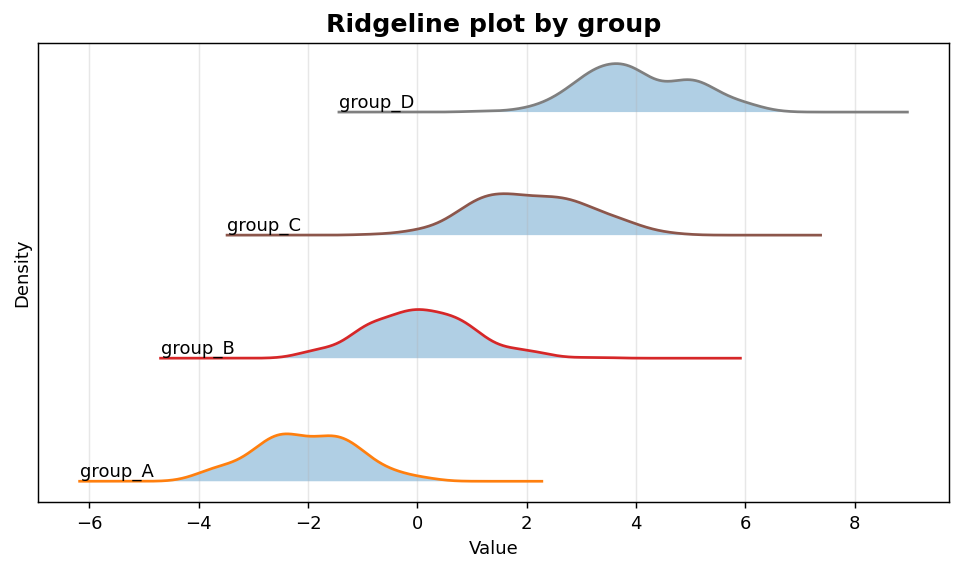
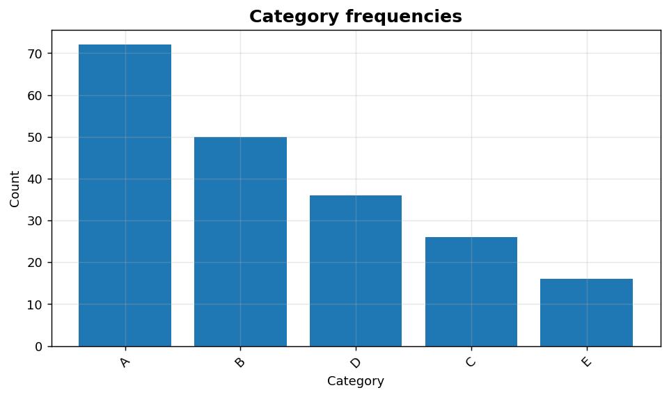

Univariate VII: Ridgeline and frequency bars
============================================

Group-wise distributional comparison and categorical frequencies.

.. contents::
   :local:
   :depth: 1

Ridgeline plot by group
-----------------------

:Function: ``dv.ridgeline_plot_static``
:Example slug: ``univariate_ridgeline``

Situation
~~~~~~~~~

An analyst compares the distributions of four product cohorts in a compact, visually engaging format that makes shifts in mean and shape easy to spot.

Requirements
~~~~~~~~~~~~

* ``dataviz``
* ``numpy``, ``pandas`` and ``matplotlib`` (installed as ``dataviz`` dependencies)
* No additional services or data files — the example uses a deterministic
  synthetic dataset generated from ``numpy.random.default_rng(0)``.

Code (copy-paste ready)
~~~~~~~~~~~~~~~~~~~~~~~

.. code-block:: python
   :linenos:

   import numpy as np
   import pandas as pd
   import matplotlib.pyplot as plt
   import dataviz as dv

   rng = np.random.default_rng(0)

   df = pd.DataFrame({
       "group_A": rng.normal(-2, 1, size=200),
       "group_B": rng.normal(0, 1, size=200),
       "group_C": rng.normal(2, 1, size=200),
       "group_D": rng.normal(4, 1, size=200),
   })
   ax = dv.ridgeline_plot_static(df, title="Ridgeline plot by group")

   plt.show()

Sample chart
~~~~~~~~~~~~

Notes
~~~~~

Each column of the input ``DataFrame`` becomes one ridge. Use a wide, long figure (``figsize=(10, 8)``) to keep the ridges legible.

Frequency bar chart for categories
----------------------------------

:Function: ``dv.frequency_bar_static``
:Example slug: ``univariate_frequency_bar``

Situation
~~~~~~~~~

A marketing analyst summarises the count of each product category in a transactional dataset and wants the bars ordered by frequency.

Requirements
~~~~~~~~~~~~

* ``dataviz``
* ``numpy``, ``pandas`` and ``matplotlib`` (installed as ``dataviz`` dependencies)
* No additional services or data files — the example uses a deterministic
  synthetic dataset generated from ``numpy.random.default_rng(0)``.

Code (copy-paste ready)
~~~~~~~~~~~~~~~~~~~~~~~

.. code-block:: python
   :linenos:

   import numpy as np
   import pandas as pd
   import matplotlib.pyplot as plt
   import dataviz as dv

   rng = np.random.default_rng(0)

   values = pd.Series(rng.choice(list("ABCDE"), size=200, p=[0.4, 0.25, 0.15, 0.12, 0.08]),
                      name="Category")
   ax = dv.frequency_bar_static(values, title="Category frequencies")

   plt.show()

Sample chart
~~~~~~~~~~~~

Notes
~~~~~

The chart works on raw labels; no aggregation is needed. For high-cardinality categories, truncate to the top-N before plotting.

