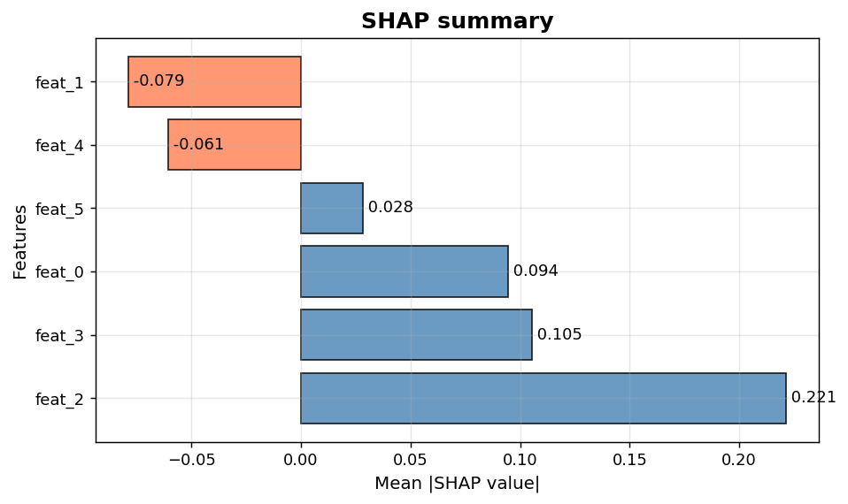
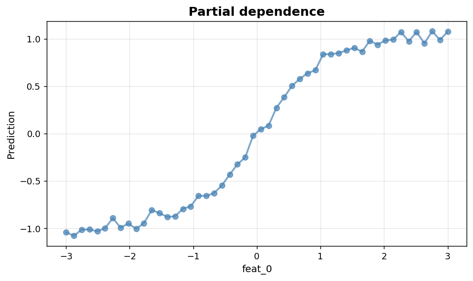

Explainable AI: SHAP and partial dependence
===========================================

Per-prediction and per-feature interpretability views.

.. contents::
   :local:
   :depth: 1

SHAP summary plot
-----------------

:Function: ``dv.xai.shap_plot_static``
:Example slug: ``xai_shap``

Situation
~~~~~~~~~

A data scientist summarises per-feature SHAP contributions across 80 test points to explain a tree-based classifier's predictions.

Requirements
~~~~~~~~~~~~

* ``dataviz`` (this package)
* ``numpy``, ``pandas`` and ``matplotlib`` (installed as ``dataviz`` dependencies)
* No additional services or data files — the example uses a deterministic
  synthetic dataset generated from ``numpy.random.default_rng(0)``.

Code (copy-paste ready)
~~~~~~~~~~~~~~~~~~~~~~~

.. code-block:: python
   :linenos:

   import numpy as np
   import pandas as pd
   import matplotlib.pyplot as plt
   import dataviz as dv

   rng = np.random.default_rng(0)

   features = [f"feat_{i}" for i in range(6)]
   shap_values = rng.normal(size=(80, 6))
   ax = dv.xai.shap_plot_static(shap_values, features, title="SHAP summary")

   plt.show()

Sample chart
~~~~~~~~~~~~

Notes
~~~~~

This helper renders a static summary view. For dot/swarm-style SHAP plots, use the ``shap`` library directly.

Partial dependence plot
-----------------------

:Function: ``dv.xai.partial_dependence_static``
:Example slug: ``xai_partial_dependence``

Situation
~~~~~~~~~

An interpretability analyst inspects how the model's predicted mean response changes as a single feature varies, marginalising over the others.

Requirements
~~~~~~~~~~~~

* ``dataviz`` (this package)
* ``numpy``, ``pandas`` and ``matplotlib`` (installed as ``dataviz`` dependencies)
* No additional services or data files — the example uses a deterministic
  synthetic dataset generated from ``numpy.random.default_rng(0)``.

Code (copy-paste ready)
~~~~~~~~~~~~~~~~~~~~~~~

.. code-block:: python
   :linenos:

   import numpy as np
   import pandas as pd
   import matplotlib.pyplot as plt
   import dataviz as dv

   rng = np.random.default_rng(0)

   grid = np.linspace(-3, 3, 50)
   pdp = np.tanh(grid) + rng.normal(scale=0.05, size=50)
   ax = dv.xai.partial_dependence_static(grid, pdp, feature_name="feat_0",
                                         title="Partial dependence")

   plt.show()

Sample chart
~~~~~~~~~~~~

Notes
~~~~~

Partial dependence assumes feature independence. When features are correlated, prefer accumulated local effects (ALE).

