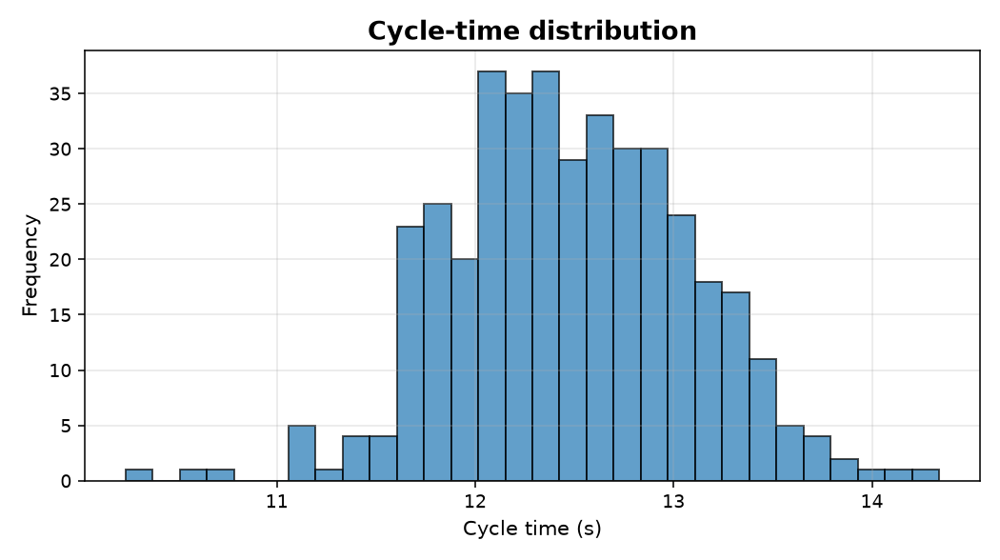

Getting started
===============

This page walks from a clean Python environment to a first rendered chart in
under a minute, then expands into installation options, the static/interactive
return contract, and common troubleshooting.

.. contents::
   :local:
   :depth: 2

Quickstart
----------

The snippet below installs DataViz into the active environment and produces
the histogram shown underneath.

.. code-block:: console

   $ python -m pip install -e .

.. code-block:: python

   import numpy as np
   import matplotlib.pyplot as plt
   import dataviz as dv

   rng = np.random.default_rng(0)
   values = rng.normal(loc=12.5, scale=0.6, size=400)

   ax = dv.histogram(values, bins=30, title="Cycle-time distribution")
   ax.set_xlabel("Cycle time (s)")
   ax.figure.tight_layout()
   plt.show()

Prerequisites
-------------

.. note::

   A dedicated virtual environment is strongly recommended so DataViz and its
   plotting backends do not collide with system packages.

* **Python**: 3.8 or newer (3.10+ is exercised in CI).
* **Operating systems**: Linux, macOS, and Windows.
* **Build tooling**: ``pip`` 21.3+ (for PEP 660 editable installs).

Create and activate a virtual environment before installing:

.. tab-set::

   .. tab-item:: Linux / macOS

      .. code-block:: console

         $ python -m venv .venv
         $ source .venv/bin/activate

   .. tab-item:: Windows (PowerShell)

      .. code-block:: console

         $ python -m venv .venv
         $ .\.venv\Scripts\Activate.ps1

   .. tab-item:: Conda

      .. code-block:: console

         $ conda create -n dataviz python=3.11 -y
         $ conda activate dataviz

Installation
------------

DataViz is currently distributed from source. Pick the option that matches
your workflow.

.. list-table::
   :header-rows: 1
   :widths: 25 40 35

   * - Use case
     - Command
     - Notes
   * - Library user
     - ``python -m pip install -e .``
     - Runtime dependencies only.
   * - Contributor
     - ``python -m pip install -e ".[dev]"``
     - Adds ``pytest``, ``black``, ``flake8``, ``mypy``.
   * - Docs author
     - ``python -m pip install -e ".[docs]"``
     - Adds Sphinx and the theme used to build this site.
   * - All extras
     - ``python -m pip install -e ".[dev,docs]"``
     - Full development setup.

Optional runtime extras
~~~~~~~~~~~~~~~~~~~~~~~

Some features require packages that ship with DataViz's core requirements but
are worth calling out:

* **scipy** (already a core dependency) powers hierarchical clustering and
  fitted-distribution overlays.
* **kaleido** is required to export Plotly figures to static image formats via
  :py:meth:`plotly.graph_objects.Figure.write_image`. Install on demand:

  .. code-block:: console

     $ python -m pip install kaleido

Verify the installation
-----------------------

Run a short import check to confirm the package and its backends are wired up:

.. code-block:: console

   $ python -c "import dataviz; print(dataviz.__version__)"
   0.1.0

If the command prints the version without raising, the static and interactive
APIs are ready to use.

Basic workflow
--------------

Every chart in DataViz exposes two entry points: a ``*_static`` function that
returns a :class:`matplotlib.axes.Axes`, and a ``*_interactive`` function that
returns a :class:`plotly.graph_objects.Figure`. The bare alias (for example,
``dv.histogram``) resolves to the static version.

.. code-block:: python
   :caption: Static and interactive variants of the same chart

   import numpy as np
   import matplotlib.pyplot as plt
   import dataviz as dv

   rng = np.random.default_rng(0)
   values = rng.normal(loc=12.5, scale=0.6, size=400)

   ax = dv.histogram(values, bins=30, title="Cycle-time distribution")
   ax.figure.tight_layout()
   plt.show()

   fig = dv.histogram_interactive(values, bins=30,
                                  title="Cycle-time distribution")
   fig.show()

Return-value contract
~~~~~~~~~~~~~~~~~~~~~

.. list-table::
   :header-rows: 1
   :widths: 30 35 35

   * - Suffix
     - Returns
     - Rendering backend
   * - ``*_static`` (and bare alias)
     - :class:`matplotlib.axes.Axes`
     - matplotlib / seaborn
   * - ``*_interactive``
     - :class:`plotly.graph_objects.Figure`
     - plotly

Saving output to disk
~~~~~~~~~~~~~~~~~~~~~

.. code-block:: python
   :caption: Persist both chart variants for reports and dashboards

   ax.figure.savefig("cycle_time.png", dpi=150, bbox_inches="tight")

   fig.write_html("cycle_time.html", include_plotlyjs="cdn")
   fig.write_image("cycle_time.png")  # requires `kaleido`

Import styles
-------------

DataViz supports both top-level convenience imports and explicit submodule
access. Both forms expose identical functions.

.. code-block:: python
   :caption: Two equivalent ways to reach the same scatter plot

   import numpy as np
   import dataviz as dv

   rng = np.random.default_rng(0)
   x = rng.normal(size=200)
   y = 2.0 * x + rng.normal(scale=0.5, size=200)

   ax = dv.scatter_plot(x, y)
   fig = dv.bivariate.scatter_plot_interactive(x, y)

Prefer explicit submodule access in larger applications: it makes API
ownership clear in code review, avoids name collisions with symbols re-exported
by ``seaborn`` or ``plotly.express``, and keeps editor autocomplete focused on
the chart family you are working in.

Using DataViz in Jupyter
------------------------

* ``plt.show()`` is implicit in classic notebooks and JupyterLab; calling it
  explicitly is still safe.
* ``fig.show()`` on a Plotly figure renders inline through the active renderer.
  In VS Code, set the renderer once per session if figures do not appear:

  .. code-block:: python

     import plotly.io as pio
     pio.renderers.default = "vscode"  # or "notebook", "browser", "iframe"

Troubleshooting
---------------

.. list-table::
   :header-rows: 1
   :widths: 35 65

   * - Symptom
     - Resolution
   * - ``RuntimeError: Invalid DISPLAY`` on a headless server
     - Set the Matplotlib backend before importing DataViz:
       ``export MPLBACKEND=Agg``.
   * - ``ValueError: Image export requires the kaleido package``
     - Install the extra: ``python -m pip install kaleido``.
   * - Plotly figures do not appear in VS Code notebooks
     - Set ``plotly.io.renderers.default = "vscode"`` (see above).
   * - ``ModuleNotFoundError: No module named 'dataviz'`` after install
     - Confirm the virtual environment is active and that the install command
       ran from the repository root.

Next steps
----------

* Read :doc:`user_guide` for module selection and return-value conventions.
* Try the complete snippets in :doc:`examples`.
* Browse :doc:`api/modules` for the generated API documentation.
* Review the :doc:`changelog` for recent changes.
* File issues or feature requests on the
  `GitHub tracker <https://github.com/anedezquerra/data-viz/issues>`_.
